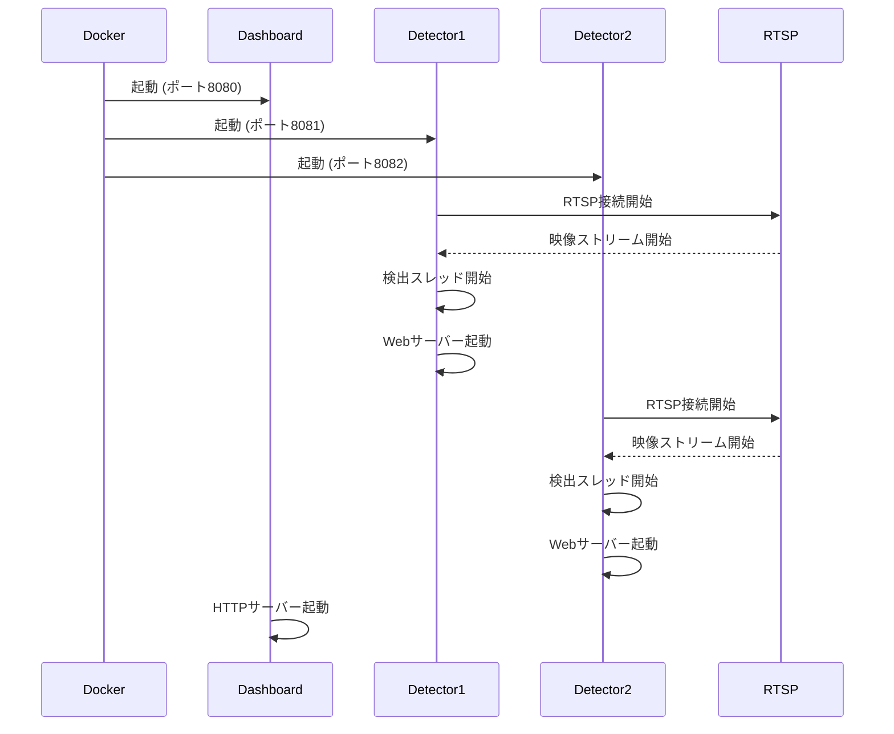
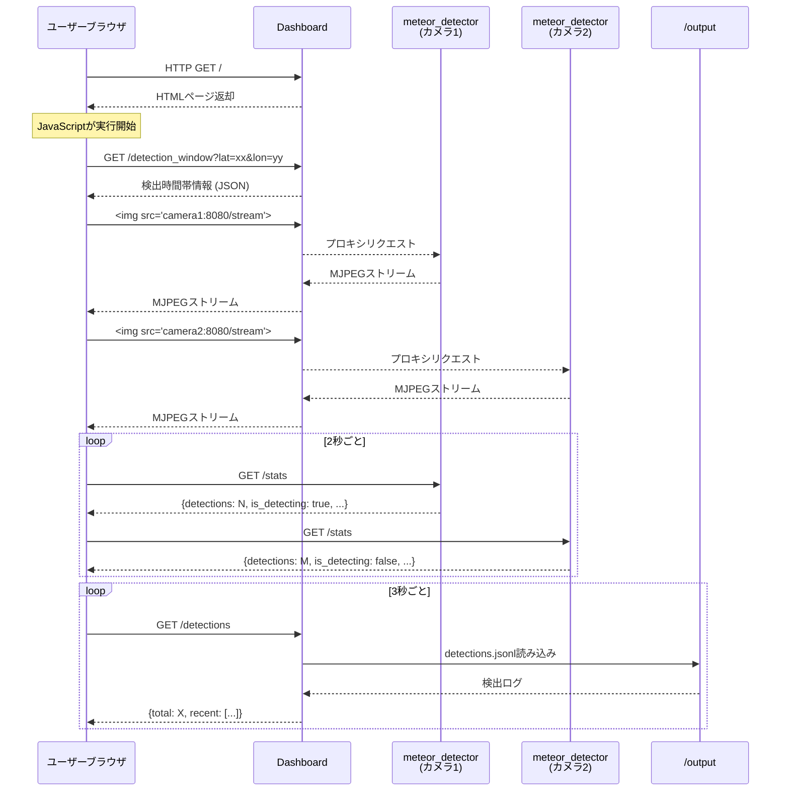
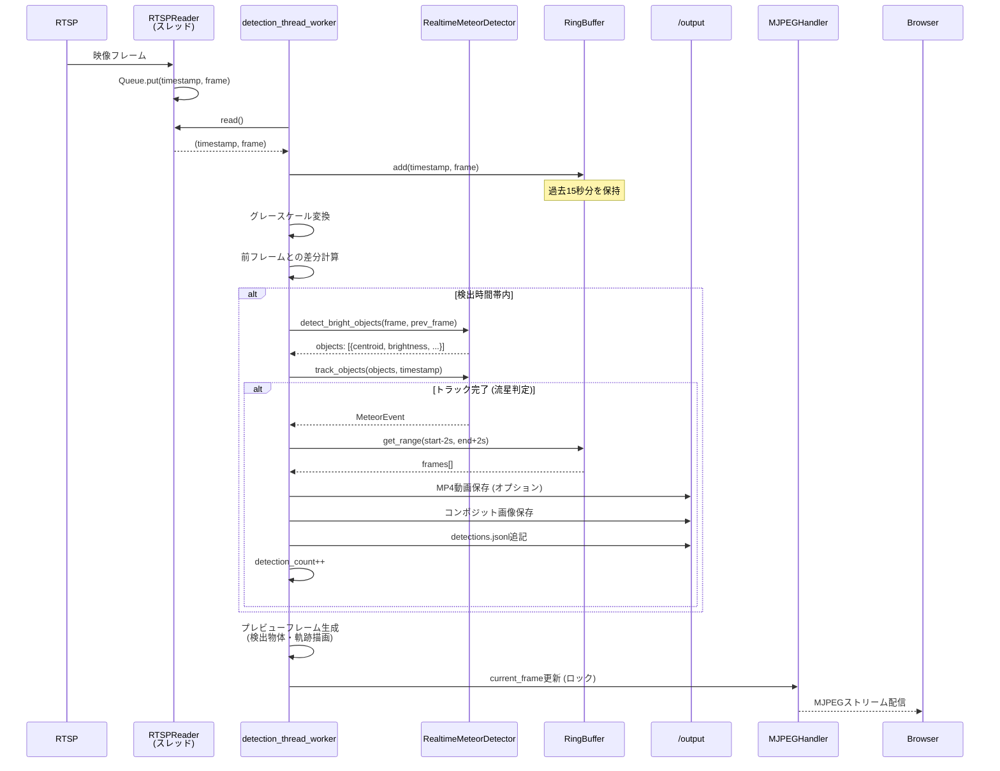
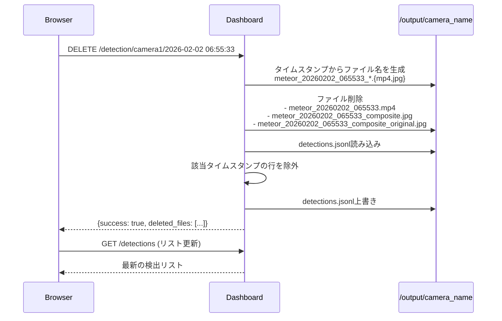

# アーキテクチャドキュメント

## システム構成

流星検出システムは、以下の2つの主要コンポーネントで構成されています：

1. **meteor_detector_rtsp_web.py** - 流星検出エンジン（個別カメラ用）
2. **dashboard.py** - 統合ダッシュボード（複数カメラ管理）

## コンポーネント間の関係

```mermaid
graph TB
    User["ユーザー<br/>ブラウザ"]
    Dashboard["dashboard.py<br/>ポート: 8080"]
    Detector1["meteor_detector_rtsp_web.py<br/>カメラ1 ポート: 8081"]
    Detector2["meteor_detector_rtsp_web.py<br/>カメラ2 ポート: 8082"]
    Detector3["meteor_detector_rtsp_web.py<br/>カメラ3 ポート: 8083"]
    RTSP1["RTSPストリーム1"]
    RTSP2["RTSPストリーム2"]
    RTSP3["RTSPストリーム3"]
    Storage["検出結果ストレージ<br/>/output/"]

    User -->|"HTTP GET /"| Dashboard
    Dashboard -->|"HTTP GET /stream"| Detector1
    Dashboard -->|"HTTP GET /stream"| Detector2
    Dashboard -->|"HTTP GET /stream"| Detector3
    Dashboard -->|"HTTP GET /stats"| Detector1
    Dashboard -->|"HTTP GET /stats"| Detector2
    Dashboard -->|"HTTP GET /stats"| Detector3
    Dashboard -->|"ファイル読み込み"| Storage

    Detector1 -->|"映像取得"| RTSP1
    Detector2 -->|"映像取得"| RTSP2
    Detector3 -->|"映像取得"| RTSP3

    Detector1 -->|"検出結果保存"| Storage
    Detector2 -->|"検出結果保存"| Storage
    Detector3 -->|"検出結果保存"| Storage

    style Dashboard fill:#1e2a4a
    style Detector1 fill:#16213e
    style Detector2 fill:#16213e
    style Detector3 fill:#16213e
    style Storage fill:#2a3f6f
```



## シーケンス図

### 1. システム起動シーケンス



### 2. ダッシュボード表示シーケンス



### 3. 流星検出シーケンス



### 4. 検出結果削除シーケンス



## データフロー

### 検出結果の保存形式

```
/output/
  ├── camera1_10.0.1.25/
  │   ├── detections.jsonl          # 検出ログ (1行1イベント)
  │   ├── meteor_20260202_065533.mp4
  │   ├── meteor_20260202_065533_composite.jpg
  │   └── meteor_20260202_065533_composite_original.jpg
  ├── camera2_10.0.1.3/
  │   └── ...
  └── camera3_10.0.1.11/
      └── ...
```

### detections.jsonl フォーマット

```json
{
  "timestamp": "2026-02-02T06:55:33.411811",
  "start_time": 125.340,
  "end_time": 125.780,
  "duration": 0.440,
  "start_point": [320, 180],
  "end_point": [450, 220],
  "length_pixels": 135.6,
  "peak_brightness": 245.3,
  "confidence": 0.87
}
```

## API仕様

### meteor_detector_rtsp_web.py のエンドポイント

| エンドポイント | メソッド | 説明 | レスポンス |
|--------------|---------|------|-----------|
| `/` | GET | プレビューHTML | `text/html` |
| `/stream` | GET | MJPEGストリーム | `multipart/x-mixed-replace` |
| `/stats` | GET | 統計情報 | `application/json` |

#### /stats レスポンス例

```json
{
  "detections": 5,
  "elapsed": 3600.5,
  "camera": "camera1_10.0.1.25",
  "settings": {
    "sensitivity": "medium",
    "scale": 0.5,
    "buffer": 15.0,
    "extract_clips": true,
    "exclude_bottom": 0.0625
  },
  "stream_alive": true,
  "time_since_last_frame": 0.03,
  "is_detecting": true
}
```

### dashboard.py のエンドポイント

| エンドポイント | メソッド | 説明 | レスポンス |
|--------------|---------|------|-----------|
| `/` | GET | ダッシュボードHTML | `text/html` |
| `/detection_window` | GET | 検出時間帯取得 | `application/json` |
| `/detections` | GET | 検出リスト取得 | `application/json` |
| `/image/{camera}/{filename}` | GET | 画像ファイル取得 | `image/jpeg` |
| `/detection/{camera}/{timestamp}` | DELETE | 検出結果削除 | `application/json` |
| `/changelog` | GET | CHANGELOG表示 | `text/plain` |

#### /detections レスポンス例

```json
{
  "total": 15,
  "recent": [
    {
      "time": "2026-02-02 06:55:33",
      "camera": "camera1_10.0.1.25",
      "confidence": "87%",
      "image": "camera1_10.0.1.25/meteor_20260202_065533_composite.jpg"
    }
  ]
}
```

## 設計のポイント

### 1. 疎結合アーキテクチャ
- ダッシュボードと検出器は独立して動作
- 各検出器は独自のHTTPサーバーを持つ
- 共有ストレージ (`/output`) を介してデータ連携

### 2. マルチスレッド構成（meteor_detector_rtsp_web.py）
- **RTSPReaderスレッド**: RTSP映像の読み込み専用
- **detection_thread_worker**: 流星検出処理専用
- **MJPEGHandlerスレッド**: Webストリーム配信専用

### 3. リングバッファ方式
- 常時15秒分のフレームをメモリに保持
- 流星検出時に前後2秒を含めて保存
- メモリ効率と検出精度のバランス

### 4. リアルタイム性
- ブラウザからの定期ポーリング（2-3秒間隔）
- MJPEGストリーミングによる低遅延プレビュー
- 検出処理と配信処理の分離

### 5. 位置情報ベースの時間帯制御
- ブラウザのGeolocation APIで自動取得
- 天文薄明時間帯の自動計算
- 検出時間の最適化

## 関連ファイル

- `docker-compose.yml`: コンテナオーケストレーション設定
- `astro_utils.py`: 天文計算ユーティリティ (検出時間帯判定)
- `CHANGELOG.md`: バージョン履歴
