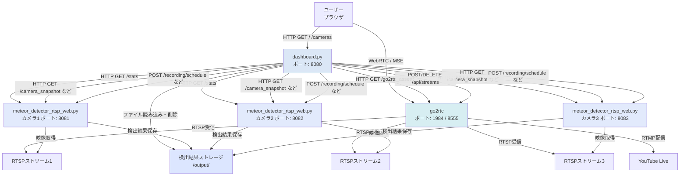
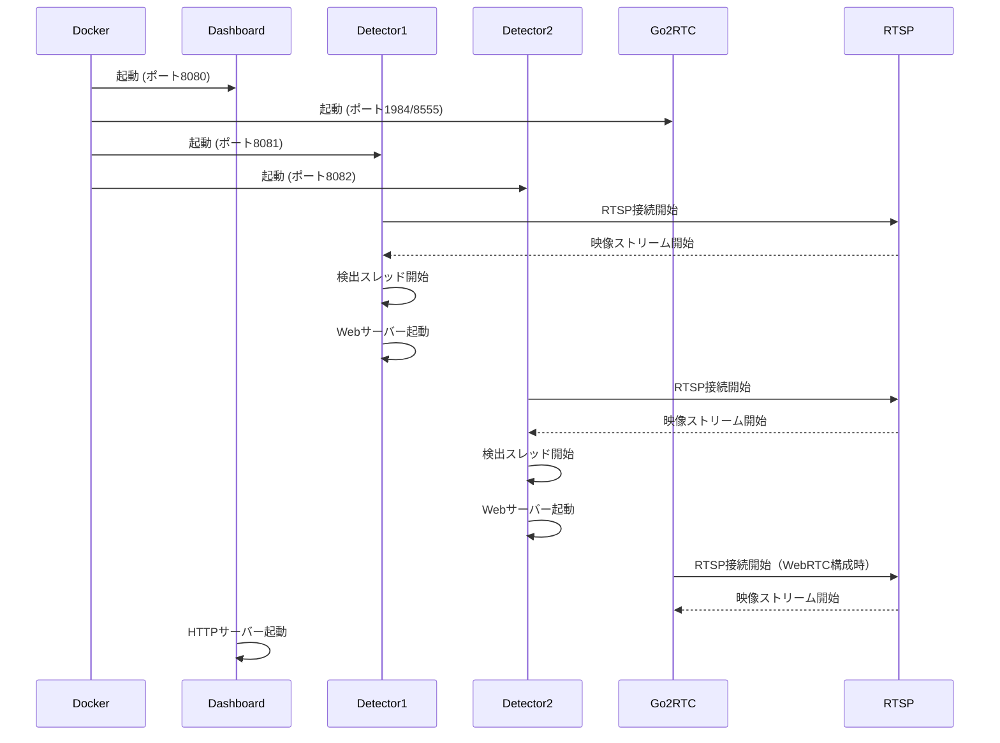
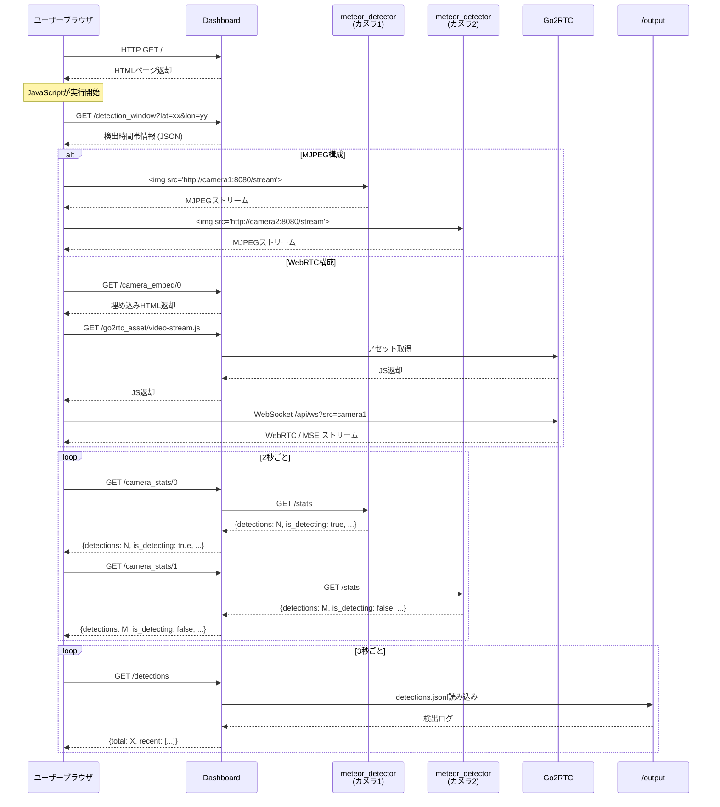
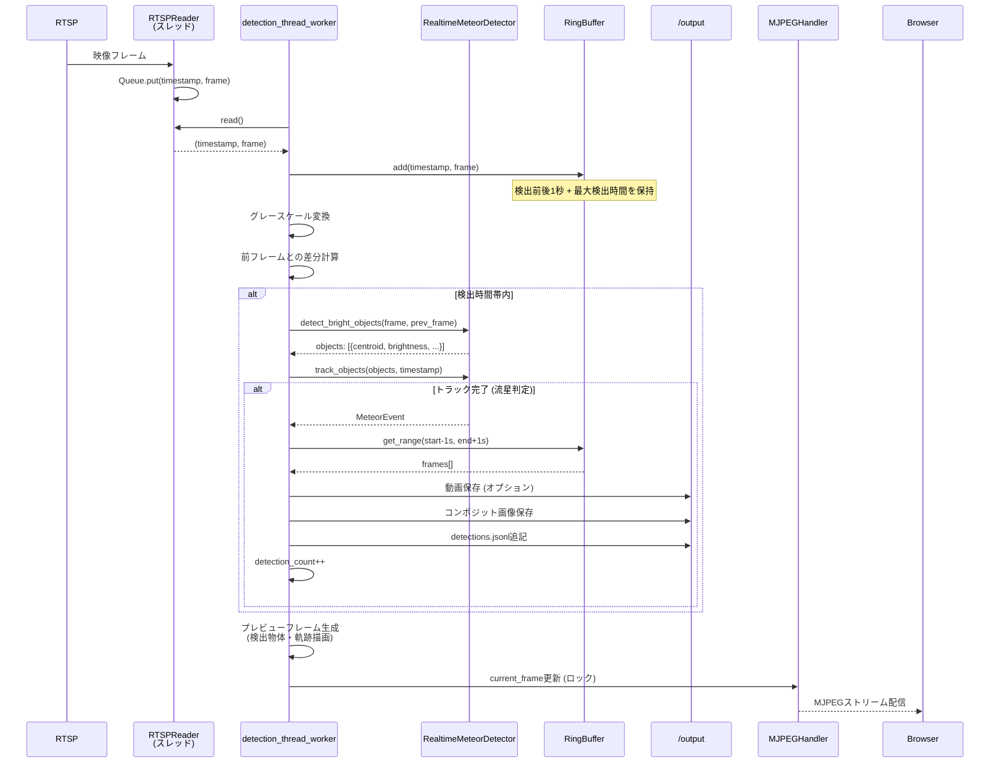
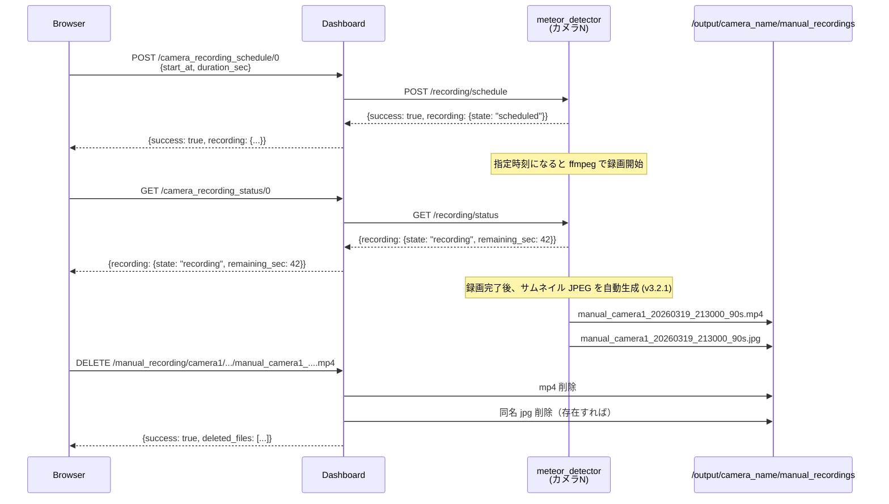
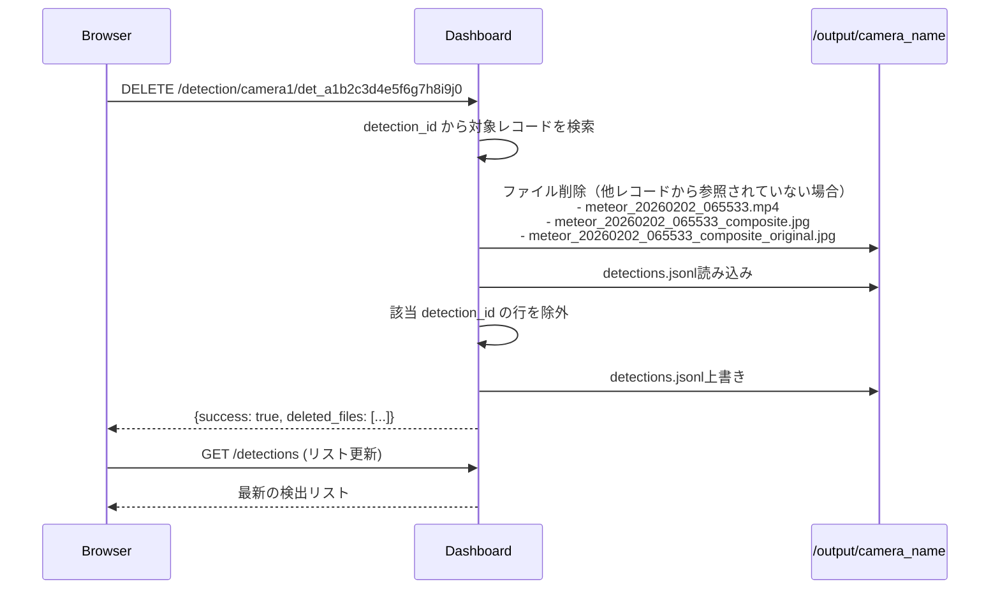

# アーキテクチャドキュメント

---

**Copyright (c) 2026 Masanori Sakai**

Licensed under the MIT License

---


## システム構成

流星検出システムは、以下の主要コンポーネントで構成されています：

1. **meteor_detector_rtsp_web.py** - 流星検出エンジン（個別カメラ用）
2. **dashboard.py** - 統合ダッシュボード（複数カメラ管理）
3. **go2rtc** - ブラウザ向け WebRTC / MSE 中継（WebRTC 構成時）

RTSP/MP4検出で共通化したロジックは `meteor_detector_common.py` に集約しています。

## コンポーネント間の関係


```mermaid
graph TB
    User["ユーザー<br/>ブラウザ"]
    Dashboard["dashboard.py<br/>ポート: 8080"]
    Go2RTC["go2rtc<br/>ポート: 1984 / 8555"]
    Detector1["meteor_detector_rtsp_web.py<br/>カメラ1 ポート: 8081"]
    Detector2["meteor_detector_rtsp_web.py<br/>カメラ2 ポート: 8082"]
    Detector3["meteor_detector_rtsp_web.py<br/>カメラ3 ポート: 8083"]
    RTSP1["RTSPストリーム1"]
    RTSP2["RTSPストリーム2"]
    RTSP3["RTSPストリーム3"]
    Storage["検出結果ストレージ<br/>/output/"]

    User -->|"HTTP GET / /cameras"| Dashboard
    User -->|"WebRTC / MSE"| Go2RTC
    Dashboard -->|"HTTP GET /stats"| Detector1
    Dashboard -->|"HTTP GET /stats"| Detector2
    Dashboard -->|"HTTP GET /stats"| Detector3
    Dashboard -->|"HTTP GET /camera_snapshot など"| Detector1
    Dashboard -->|"HTTP GET /camera_snapshot など"| Detector2
    Dashboard -->|"HTTP GET /camera_snapshot など"| Detector3
    Dashboard -->|"POST /recording/schedule など"| Detector1
    Dashboard -->|"POST /recording/schedule など"| Detector2
    Dashboard -->|"POST /recording/schedule など"| Detector3
    Dashboard -->|"HTTP GET /go2rtc_asset/*"| Go2RTC
    Dashboard -->|"POST/DELETE /api/streams"| Go2RTC
    Dashboard -->|"ファイル読み込み・削除"| Storage
    Go2RTC -->|"RTSP受信"| RTSP1
    Go2RTC -->|"RTSP受信"| RTSP2
    Go2RTC -->|"RTSP受信"| RTSP3
    Go2RTC -->|"RTMP配信"| YouTube["YouTube Live"]

    Detector1 -->|"映像取得"| RTSP1
    Detector2 -->|"映像取得"| RTSP2
    Detector3 -->|"映像取得"| RTSP3

    Detector1 -->|"検出結果保存"| Storage
    Detector2 -->|"検出結果保存"| Storage
    Detector3 -->|"検出結果保存"| Storage

    style Dashboard fill:#dbe7f6
    style Go2RTC fill:#d7eef2
    style Detector1 fill:#e2eafc
    style Detector2 fill:#e2eafc
    style Detector3 fill:#e2eafc
    style Storage fill:#dce6ff
```

## シーケンス図

### 1. システム起動シーケンス


```mermaid
sequenceDiagram
    participant Docker
    participant Dashboard
    participant Detector1
    participant Detector2
    participant Go2RTC
    participant RTSP

    Docker->>Dashboard: 起動 (ポート8080)
    Docker->>Go2RTC: 起動 (ポート1984/8555)
    Docker->>Detector1: 起動 (ポート8081)
    Docker->>Detector2: 起動 (ポート8082)

    Detector1->>RTSP: RTSP接続開始
    RTSP-->>Detector1: 映像ストリーム開始
    Detector1->>Detector1: 検出スレッド開始
    Detector1->>Detector1: Webサーバー起動

    Detector2->>RTSP: RTSP接続開始
    RTSP-->>Detector2: 映像ストリーム開始
    Detector2->>Detector2: 検出スレッド開始
    Detector2->>Detector2: Webサーバー起動

    Go2RTC->>RTSP: RTSP接続開始（WebRTC構成時）
    RTSP-->>Go2RTC: 映像ストリーム開始

    Dashboard->>Dashboard: HTTPサーバー起動
```

### 2. ダッシュボード表示シーケンス


```mermaid
sequenceDiagram
    participant Browser as ユーザーブラウザ
    participant Dashboard
    participant Detector1 as meteor_detector<br/>(カメラ1)
    participant Detector2 as meteor_detector<br/>(カメラ2)
    participant Go2RTC
    participant Storage as /output

    Browser->>Dashboard: HTTP GET /
    Dashboard-->>Browser: HTMLページ返却

    Note over Browser: JavaScriptが実行開始

    Browser->>Dashboard: GET /detection_window?lat=xx&lon=yy
    Dashboard-->>Browser: 検出時間帯情報 (JSON)

    alt MJPEG構成
        Browser->>Detector1: <img src="http://camera1:8080/stream">
        Detector1-->>Browser: MJPEGストリーム
        Browser->>Detector2: <img src="http://camera2:8080/stream">
        Detector2-->>Browser: MJPEGストリーム
    else WebRTC構成
        Browser->>Dashboard: GET /camera_embed/0
        Dashboard-->>Browser: 埋め込みHTML返却
        Browser->>Dashboard: GET /go2rtc_asset/video-stream.js
        Dashboard->>Go2RTC: アセット取得
        Go2RTC-->>Dashboard: JS返却
        Dashboard-->>Browser: JS返却
        Browser->>Go2RTC: WebSocket /api/ws?src=camera1
        Go2RTC-->>Browser: WebRTC / MSE ストリーム
    end

    loop 2秒ごと
        Browser->>Dashboard: GET /camera_stats/0
        Dashboard->>Detector1: GET /stats
        Detector1-->>Dashboard: {detections: N, is_detecting: true, ...}
        Dashboard-->>Browser: {detections: N, is_detecting: true, ...}
        Browser->>Dashboard: GET /camera_stats/1
        Dashboard->>Detector2: GET /stats
        Detector2-->>Dashboard: {detections: M, is_detecting: false, ...}
        Dashboard-->>Browser: {detections: M, is_detecting: false, ...}
    end

    loop 3秒ごと
        Browser->>Dashboard: GET /detections
        Dashboard->>Storage: detections.jsonl読み込み
        Storage-->>Dashboard: 検出ログ
        Dashboard-->>Browser: {total: X, recent: [...]}
    end
```

### 3. 流星検出シーケンス


```mermaid
sequenceDiagram
    participant RTSP
    participant Reader as RTSPReader<br/>(スレッド)
    participant DetectionThread as detection_thread_worker
    participant Detector as RealtimeMeteorDetector
    participant RingBuffer
    participant Storage as /output
    participant WebServer as MJPEGHandler

    RTSP->>Reader: 映像フレーム
    Reader->>Reader: Queue.put(timestamp, frame)

    DetectionThread->>Reader: read()
    Reader-->>DetectionThread: (timestamp, frame)

    DetectionThread->>RingBuffer: add(timestamp, frame)
    Note over RingBuffer: 検出前後1秒 + 最大検出時間を保持

    DetectionThread->>DetectionThread: グレースケール変換
    DetectionThread->>DetectionThread: 前フレームとの差分計算

    alt 検出時間帯内
        DetectionThread->>Detector: detect_bright_objects(frame, prev_frame)
        Detector-->>DetectionThread: objects: [{centroid, brightness, ...}]

        DetectionThread->>Detector: track_objects(objects, timestamp)

        alt トラック完了 (流星判定)
            Detector-->>DetectionThread: MeteorEvent

            DetectionThread->>RingBuffer: get_range(start-1s, end+1s)
            RingBuffer-->>DetectionThread: frames[]

            DetectionThread->>Storage: 動画保存 (オプション)
            DetectionThread->>Storage: コンポジット画像保存
            DetectionThread->>Storage: detections.jsonl追記

            DetectionThread->>DetectionThread: detection_count++
        end
    end

    DetectionThread->>DetectionThread: プレビューフレーム生成<br/>(検出物体・軌跡描画)
    DetectionThread->>WebServer: current_frame更新 (ロック)

    WebServer-->>Browser: MJPEGストリーム配信
```

### 4. 手動録画シーケンス（v3.2.0+）


```mermaid
sequenceDiagram
    participant Browser
    participant Dashboard
    participant Detector as meteor_detector<br/>(カメラN)
    participant Storage as /output/camera_name/manual_recordings

    Browser->>Dashboard: POST /camera_recording_schedule/0<br/>{start_at, duration_sec}
    Dashboard->>Detector: POST /recording/schedule
    Detector-->>Dashboard: {success: true, recording: {state: "scheduled"}}
    Dashboard-->>Browser: {success: true, recording: {...}}

    Note over Detector: 指定時刻になると ffmpeg で録画開始

    Browser->>Dashboard: GET /camera_recording_status/0
    Dashboard->>Detector: GET /recording/status
    Detector-->>Dashboard: {recording: {state: "recording", remaining_sec: 42}}
    Dashboard-->>Browser: {recording: {state: "recording", remaining_sec: 42}}

    Note over Detector: 録画完了後、サムネイル JPEG を自動生成 (v3.2.1)

    Detector->>Storage: manual_camera1_20260319_213000_90s.mp4
    Detector->>Storage: manual_camera1_20260319_213000_90s.jpg

    Browser->>Dashboard: DELETE /manual_recording/camera1/.../manual_camera1_....mp4
    Dashboard->>Storage: mp4 削除
    Dashboard->>Storage: 同名 jpg 削除（存在すれば）
    Dashboard-->>Browser: {success: true, deleted_files: [...]}
```

### 5. 検出結果削除シーケンス


```mermaid
sequenceDiagram
    participant Browser
    participant Dashboard
    participant Storage as /output/camera_name

    Browser->>Dashboard: DELETE /detection/camera1/det_a1b2c3d4e5f6g7h8i9j0

    Dashboard->>Dashboard: detection_id から対象レコードを検索

    Dashboard->>Storage: ファイル削除（他レコードから参照されていない場合）<br/>- meteor_20260202_065533.mp4<br/>- meteor_20260202_065533_composite.jpg<br/>- meteor_20260202_065533_composite_original.jpg

    Dashboard->>Storage: detections.jsonl読み込み
    Dashboard->>Dashboard: 該当 detection_id の行を除外
    Dashboard->>Storage: detections.jsonl上書き

    Dashboard-->>Browser: {success: true, deleted_files: [...]}

    Browser->>Dashboard: GET /detections (リスト更新)
    Dashboard-->>Browser: 最新の検出リスト
```

## データフロー

### 検出結果の保存形式

```
/output/
  ├── camera1_10_0_1_25/
  │   ├── detections.jsonl                   # 検出ログ (1行1イベント)
  │   ├── meteor_20260202_065533.mp4
  │   ├── meteor_20260202_065533_composite.jpg
  │   ├── meteor_20260202_065533_composite_original.jpg
  │   └── manual_recordings/                 # 手動録画保存先 (v3.2.0+)
  │       ├── manual_camera1_20260319_213000_90s.mp4
  │       └── manual_camera1_20260319_213000_90s.jpg  # サムネイル (v3.2.1+)
  ├── camera2_10_0_1_3/
  │   └── ...
  └── camera3_10_0_1_11/
      └── ...
```

### detections.jsonl フォーマット

```json
{
  "timestamp": "2026-02-02T06:55:33.411811",
  "start_time": 125.340,
  "end_time": 125.780,
  "duration": 0.440,
  "start_point": [320, 180],
  "end_point": [450, 220],
  "length_pixels": 135.6,
  "peak_brightness": 245.3,
  "confidence": 0.87
}
```

## API仕様

### meteor_detector_rtsp_web.py のエンドポイント

| エンドポイント | メソッド | 説明 | レスポンス |
|--------------|---------|------|-----------|
| `/` | GET | プレビューHTML | `text/html` |
| `/stream` | GET | MJPEGストリーム | `multipart/x-mixed-replace` |
| `/snapshot` | GET | 現在フレームJPEG取得 | `image/jpeg` |
| `/mask` | GET | マスク画像取得（`?pending=1` で保留中マスク） | `image/png` |
| `/stats` | GET | 統計情報（v3.2.0以降は `recording` フィールドを含む） | `application/json` |
| `/recording/status` | GET | 手動録画状態取得（v3.2.0+） | `application/json` |
| `/recording/schedule` | POST | 手動録画の予約/即時開始（v3.2.0+） | `application/json` |
| `/recording/stop` | POST | 手動録画の停止（v3.2.0+） | `application/json` |
| `/update_mask` | POST | 現在フレームからマスク更新 | `application/json` |
| `/confirm_mask_update` | POST | 保留中のマスク更新を確定 | `application/json` |
| `/discard_mask_update` | POST | 保留中のマスク更新を破棄 | `application/json` |
| `/apply_settings` | POST | 設定をランタイム反映（必要時自動再起動） | `application/json` |
| `/restart` | POST | プロセス再起動要求 | `application/json` |

#### /stats レスポンス例

```json
{
  "detections": 5,
  "elapsed": 3600.5,
  "camera": "camera1_10_0_1_25",
  "settings": {
    "sensitivity": "medium",
    "scale": 0.5,
    "buffer": 15.0,
    "extract_clips": true,
    "source_fps": 20.0,
    "exclude_bottom": 0.0625,
    "mask_image": "/app/mask_image.png",
    "mask_from_day": "",
    "mask_dilate": 5,
    "nuisance_overlap_threshold": 0.6,
    "nuisance_path_overlap_threshold": 0.7,
    "nuisance_mask_image": "",
    "nuisance_from_night": "",
    "nuisance_dilate": 3
  },
  "runtime_fps": 19.83,
  "stream_alive": true,
  "time_since_last_frame": 0.03,
  "is_detecting": true,
  "detection_status": "DETECTING",
  "detection_window_enabled": true,
  "detection_window_active": true,
  "detection_window_start": "18:00:00",
  "detection_window_end": "05:00:00",
  "mask_active": true,
  "mask_update_pending": false,
  "recording": {
    "supported": true,
    "state": "idle",
    "start_at": "",
    "duration_sec": 0,
    "remaining_sec": 0,
    "output_path": "",
    "error": ""
  }
}
```

`recording` フィールドは v3.2.0 で追加されました。`state` は `idle` / `scheduled` / `recording` / `completed` / `stopped` のいずれかです。

### dashboard.py のエンドポイント

| エンドポイント | メソッド | 説明 | レスポンス |
|--------------|---------|------|-----------|
| `/health` | GET | ダッシュボードヘルスチェック | `application/json` |
| `/` | GET | ダッシュボードHTML（検出一覧） | `text/html` |
| `/cameras` | GET | カメラライブ画面HTML | `text/html` |
| `/settings` | GET | 全カメラ設定ページ | `text/html` |
| `/detection_window` | GET | 検出時間帯取得 | `application/json` |
| `/detections` | GET | 検出リスト取得 | `application/json` |
| `/detections_mtime` | GET | 検出ログ更新時刻取得 | `application/json` |
| `/dashboard_stats` | GET | ダッシュボードCPU統計取得 | `application/json` |
| `/camera_stats/{index}` | GET | カメラ統計情報取得 | `application/json` |
| `/camera_embed/{index}` | GET | WebRTC 埋め込みページ（v3.1.0+） | `text/html` |
| `/go2rtc_asset/{name}` | GET | go2rtc フロント資産プロキシ（v3.1.0+） | `application/javascript` |
| `/camera_recording_status/{index}` | GET | カメラ手動録画状態取得（v3.2.0+） | `application/json` |
| `/camera_recording_schedule/{index}` | POST | カメラ手動録画の予約/即時開始（v3.2.0+） | `application/json` |
| `/camera_recording_stop/{index}` | POST | カメラ手動録画の停止（v3.2.0+） | `application/json` |
| `/camera_settings/current` | GET | 設定の現在値取得 | `application/json` |
| `/camera_settings/apply_all` | POST | 設定を全カメラへ一括反映 | `application/json` |
| `/camera_mask/{index}` | GET/POST | カメラマスクの取得/更新 | `application/json` |
| `/camera_mask_confirm/{index}` | POST | マスク更新を確定 | `application/json` |
| `/camera_mask_discard/{index}` | POST | マスク更新を破棄 | `application/json` |
| `/camera_mask_image/{index}` | GET | マスク画像取得 | `image/jpeg` |
| `/camera_snapshot/{index}` | GET | カメラスナップショット取得（`?download=1` でDL） | `image/jpeg` |
| `/camera_restart/{index}` | POST | カメラ再起動要求 | `application/json` |
| `/image/{camera}/{filename}` | GET | 画像ファイル取得 | `image/jpeg` |
| `/detection/{camera}/{timestamp}` | DELETE | 検出結果削除 | `application/json` |
| `/manual_recording/{path}` | DELETE | 手動録画ファイル削除（v3.2.1+） | `application/json` |
| `/detection_label` | POST | 検出ラベル設定 | `application/json` |
| `/bulk_delete_non_meteor/{camera_name}` | POST | 非流星検出一括削除 | `application/json` |
| `/changelog` | GET | CHANGELOG表示 | `text/plain` |

#### /detections レスポンス例

```json
{
  "total": 15,
  "recent": [
    {
      "id": "det_a1b2c3d4e5f6g7h8i9j0",
      "time": "2026-02-02 06:55:33",
      "camera": "camera1_10_0_1_25",
      "camera_display": "カメラ1",
      "confidence": "87%",
      "image": "camera1_10_0_1_25/meteor_20260202_065533_composite.jpg",
      "mp4": "camera1_10_0_1_25/meteor_20260202_065533.mp4",
      "composite_original": "camera1_10_0_1_25/meteor_20260202_065533_composite_original.jpg",
      "label": "detected",
      "source_type": "manual_recording"
    }
  ]
}
```

`id` は検出エントリの一意識別子（SHA-1 ダイジェスト）です。`source_type` は手動録画エントリの場合のみ `"manual_recording"` が設定されます。

## 設計のポイント

### 1. 疎結合アーキテクチャ
- ダッシュボードと検出器は独立して動作
- 各検出器は独自のHTTPサーバーを持つ
- 共有ストレージ (`/output`) を介してデータ連携

### 2. マルチスレッド構成（meteor_detector_rtsp_web.py）
- **RTSPReaderスレッド**: RTSP映像の読み込み専用
- **detection_thread_worker**: 流星検出処理専用
- **MJPEGHandlerスレッド**: Webストリーム配信専用

### 3. リングバッファ方式
- 最大検出時間 + 2秒分（検出前後1秒）をメモリに保持
- 流星検出時に前後1秒を含めて保存
- メモリ効率と検出精度のバランス

### 4. リアルタイム性
- ブラウザからの定期ポーリング（2-3秒間隔）
- MJPEGストリーミングによる低遅延プレビュー
- 検出処理と配信処理の分離

### 5. サーバー座標ベースの時間帯制御
- サーバー設定（`LATITUDE` / `LONGITUDE` / `TIMEZONE`）を使用
- 天文薄明時間帯の自動計算
- 検出時間の最適化

### 6. 設定反映アーキテクチャ（再ビルド不要）
- ダッシュボード `/settings` から全カメラへ一括設定を送信
- ダッシュボードは各カメラの `POST /apply_settings` を呼び出し
- 即時反映可能項目はその場で更新
- `sensitivity` / `scale` / `buffer` など起動時依存項目は自動再起動で反映
- 起動時依存項目は `output/runtime_settings/<camera>.json` に保存し、再起動後も維持

### 7. 手動録画アーキテクチャ（v3.2.0+）
- ダッシュボードが `POST /camera_recording_schedule/{index}` を受け付け、カメラコンテナの `POST /recording/schedule` へ中継
- カメラコンテナが `ffmpeg` で RTSP 入力を MP4 に変換して `manual_recordings/<camera>/` へ保存
- v3.2.1 以降、録画完了後にサムネイル JPEG を自動生成し、ダッシュボードの検出一覧に手動録画も表示
- 削除は `DELETE /manual_recording/{path}` で MP4 と同名 JPEG をまとめて削除
- パストラバーサル対策として、パスが `manual_recordings` ディレクトリ配下かつ拡張子 `.mp4` であることを必須確認

### 8. WebRTC ライブ表示アーキテクチャ（v3.1.0+）
- `CAMERA*_STREAM_KIND=webrtc` 設定時、ダッシュボードは `/camera_embed/{index}` でブラウザ向け埋め込みページを生成
- 埋め込みページは `/go2rtc_asset/video-stream.js` を読み込み、`go2rtc` の WebSocket API へ直接接続
- Docker 内でループバックアドレスが指定された場合、ダッシュボードは `go2rtc` コンテナ名で名前解決してアセット取得
- `go2rtc.yaml` の `webrtc.candidates` にブラウザから到達可能なホスト側 IP を設定する必要がある（`generate_compose.py --streaming-mode webrtc` で自動設定）

## 関連ファイル

- `docker-compose.yml`: コンテナオーケストレーション設定
- `generate_compose.py`: docker-compose.yml / go2rtc.yaml 生成スクリプト
- `go2rtc.yaml`: go2rtc WebRTC 候補アドレス・ストリーム定義・YouTube配信設定
- `astro_utils.py`: 天文計算ユーティリティ (検出時間帯判定)
- `dashboard_config.py`: カメラ設定・バージョン定義
- `dashboard_routes.py`: ルートハンドラ（検出監視・カメラ監視を含む）
- `dashboard_camera_handlers.py`: カメラ操作系ハンドラ（スナップショット・マスク・再起動・YouTube配信）
- `dashboard_templates.py`: HTMLテンプレート生成
- `CHANGELOG.md`: バージョン履歴
- `API_REFERENCE.md`: API 仕様の詳細ドキュメント
- `DETECTOR_COMPONENTS.md`: 検出エンジンの内部構造詳細
- `CONFIGURATION_GUIDE.md`: 環境変数と設定項目のガイド
