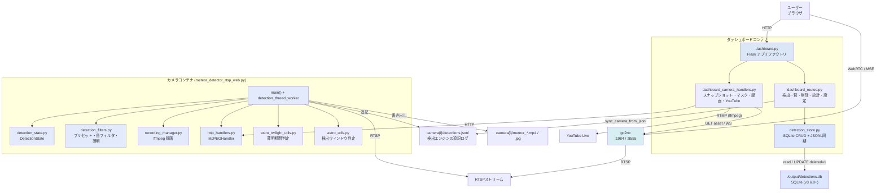
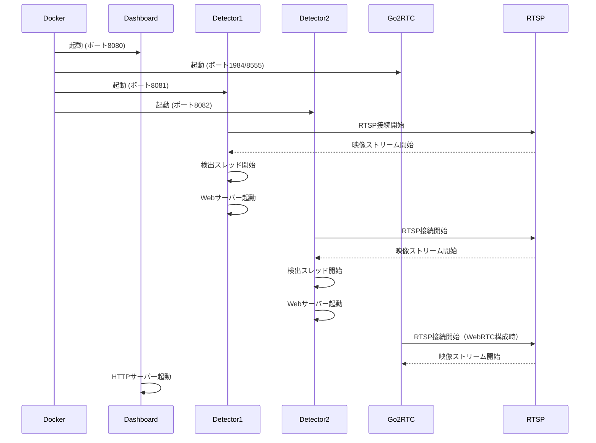
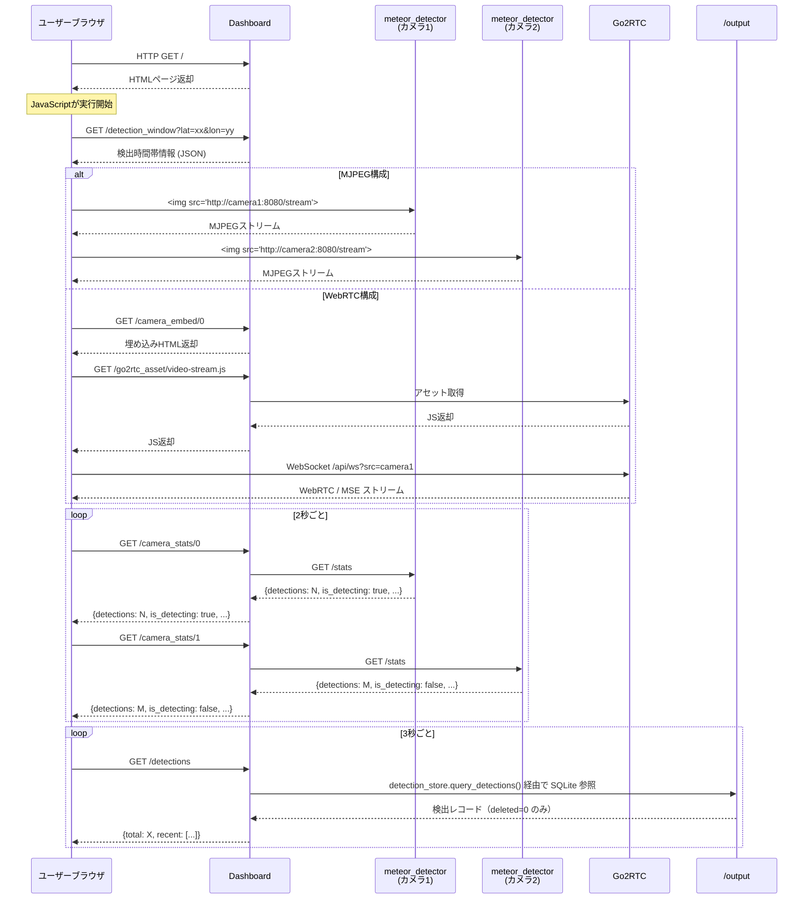
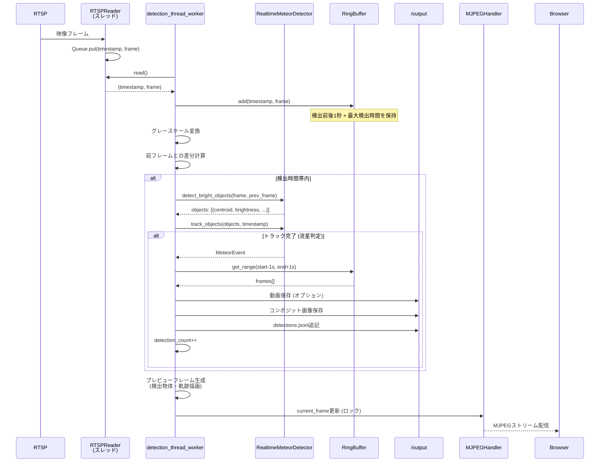
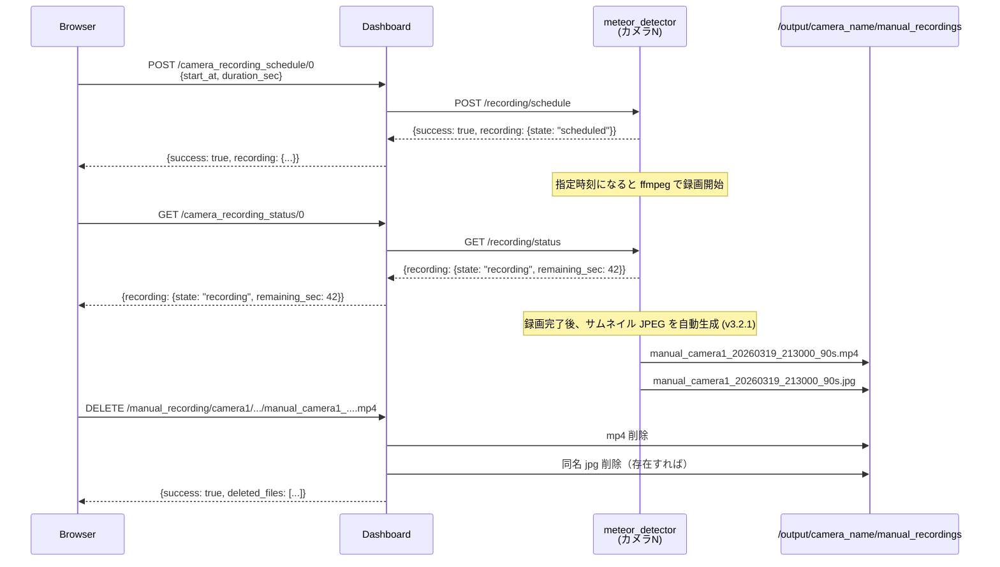
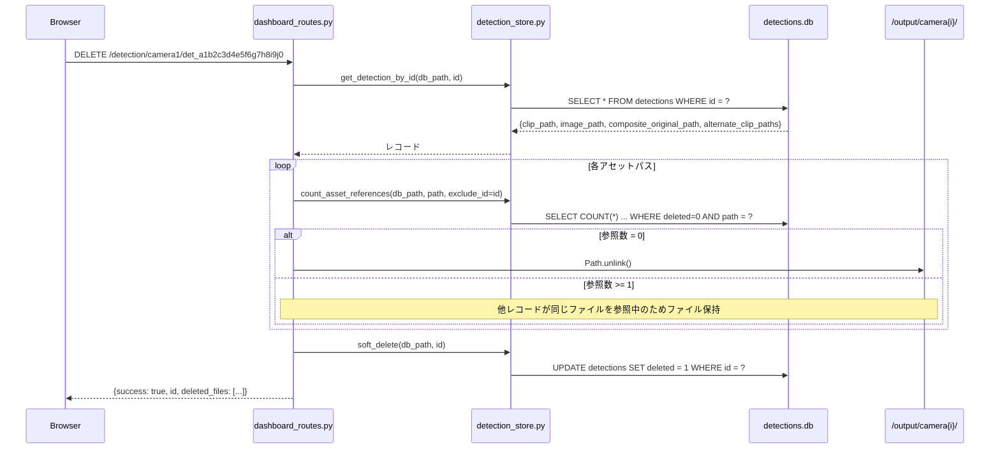

# アーキテクチャドキュメント

**バージョン: v3.11.1**

---

**Copyright (c) 2026 Masanori Sakai**

Licensed under the MIT License

---


## システム構成

流星検出システムは、以下の主要コンポーネントで構成されています：

1. **カメラコンテナ**（`meteor_detector_rtsp_web.py`）: 個別カメラごとの流星検出エンジン。v3.6.2 のリファクタリングで以下のモジュールに責務分割されている
   - `detection_state.py`: グローバル状態（`DetectionState` dataclass）
   - `detection_filters.py`: 感度プリセット・鳥フィルタ・薄明パラメータ
   - `recording_manager.py`: ffmpeg ベース手動録画のジョブ管理
   - `http_handlers.py`: `MJPEGHandler` / ThreadedHTTPServer
   - `astro_twilight_utils.py`: 薄明期間（civil / nautical / astronomical）判定
   - `astro_utils.py`: 検出ウィンドウ（日没〜日出）判定
2. **ダッシュボードコンテナ**（`dashboard.py`）: Flask アプリ + ハンドラ群（`dashboard_routes.py` / `dashboard_camera_handlers.py`）。検出結果は `detection_store.py`（SQLite）を介して参照する
3. **go2rtc コンテナ**: ブラウザ向け WebRTC / MSE / HLS 中継（WebRTC 構成時）

RTSP/MP4 検出で共通化したロジックは `meteor_detector_common.py` / `meteor_detector_realtime.py` に集約しています。

## コンポーネント間の関係


```mermaid
graph TB
    User["ユーザー<br/>ブラウザ"]

    subgraph "ダッシュボードコンテナ"
        FlaskApp["dashboard.py<br/>Flask アプリファクトリ"]
        Routes["dashboard_routes.py<br/>検出一覧・削除・統計・設定"]
        CamHandlers["dashboard_camera_handlers.py<br/>スナップショット・マスク・録画・YouTube"]
        Store["detection_store.py<br/>SQLite CRUD + JSONL同期"]
    end

    Go2RTC["go2rtc<br/>:1984 / :8555"]

    subgraph "カメラコンテナ (meteor_detector_rtsp_web.py)"
        DetEntry["main() + detection_thread_worker"]
        DetState["detection_state.py<br/>DetectionState"]
        DetFilter["detection_filters.py<br/>プリセット・鳥フィルタ・薄明"]
        Rec["recording_manager.py<br/>ffmpeg 録画"]
        HTTP["http_handlers.py<br/>MJPEGHandler"]
        Twilight["astro_twilight_utils.py<br/>薄明期間判定"]
        AstroWin["astro_utils.py<br/>検出ウィンドウ判定"]
    end

    RTSP["RTSPストリーム"]
    SQLiteDB["/output/detections.db<br/>SQLite (v3.6.0+)"]
    JSONL["camera{i}/detections.jsonl<br/>検出エンジンの追記ログ"]
    Media["camera{i}/meteor_*.mp4 / .jpg"]

    User -->|"HTTP"| FlaskApp
    User -->|"WebRTC / MSE"| Go2RTC
    FlaskApp --> Routes
    FlaskApp --> CamHandlers
    Routes --> Store
    Store -->|"read / UPDATE deleted=1"| SQLiteDB
    Routes -->|"sync_camera_from_jsonl"| JSONL
    CamHandlers -->|"HTTP"| HTTP
    CamHandlers -->|"RTMP (ffmpeg)"| YouTube["YouTube Live"]
    CamHandlers -->|"GET asset / WS"| Go2RTC

    DetEntry --> DetState
    DetEntry --> DetFilter
    DetEntry --> Rec
    DetEntry --> HTTP
    DetEntry --> Twilight
    DetEntry --> AstroWin
    DetEntry -->|"追記"| JSONL
    DetEntry -->|"書き出し"| Media

    Go2RTC -->|"RTSP"| RTSP
    DetEntry -->|"RTSP"| RTSP

    style FlaskApp fill:#dbe7f6
    style Store fill:#dce6ff
    style Go2RTC fill:#d7eef2
    style DetEntry fill:#e2eafc
    style DetState fill:#e2eafc
    style DetFilter fill:#e2eafc
    style Rec fill:#e2eafc
    style HTTP fill:#e2eafc
    style SQLiteDB fill:#dce6ff
```

!!! note "ダッシュボードの内部構造"
    `dashboard.py` は Flask アプリファクトリであり、ルートの実装は `dashboard_routes.py`（検出一覧・削除・統計・設定等）と `dashboard_camera_handlers.py`（カメラスナップショット・マスク更新・手動録画・YouTube 配信）に分離されている。SQLite アクセスは `detection_store.py` モジュールを通じて行う（詳細は [DETECTION_STORE.md](DETECTION_STORE.md) 参照）。

## シーケンス図

### 1. システム起動シーケンス


```mermaid
sequenceDiagram
    participant Docker
    participant Dashboard
    participant Detector1
    participant Detector2
    participant Go2RTC
    participant RTSP

    Docker->>Dashboard: 起動 (ポート8080)
    Docker->>Go2RTC: 起動 (ポート1984/8555)
    Docker->>Detector1: 起動 (ポート8081)
    Docker->>Detector2: 起動 (ポート8082)

    Detector1->>RTSP: RTSP接続開始
    RTSP-->>Detector1: 映像ストリーム開始
    Detector1->>Detector1: 検出スレッド開始
    Detector1->>Detector1: Webサーバー起動

    Detector2->>RTSP: RTSP接続開始
    RTSP-->>Detector2: 映像ストリーム開始
    Detector2->>Detector2: 検出スレッド開始
    Detector2->>Detector2: Webサーバー起動

    Go2RTC->>RTSP: RTSP接続開始（WebRTC構成時）
    RTSP-->>Go2RTC: 映像ストリーム開始

    Dashboard->>Dashboard: HTTPサーバー起動
```

### 2. ダッシュボード表示シーケンス


```mermaid
sequenceDiagram
    participant Browser as ユーザーブラウザ
    participant Dashboard
    participant Detector1 as meteor_detector<br/>(カメラ1)
    participant Detector2 as meteor_detector<br/>(カメラ2)
    participant Go2RTC
    participant Storage as /output

    Browser->>Dashboard: HTTP GET /
    Dashboard-->>Browser: HTMLページ返却

    Note over Browser: JavaScriptが実行開始

    Browser->>Dashboard: GET /detection_window?lat=xx&lon=yy
    Dashboard-->>Browser: 検出時間帯情報 (JSON)

    alt MJPEG構成
        Browser->>Detector1: <img src="http://camera1:8080/stream">
        Detector1-->>Browser: MJPEGストリーム
        Browser->>Detector2: <img src="http://camera2:8080/stream">
        Detector2-->>Browser: MJPEGストリーム
    else WebRTC構成
        Browser->>Dashboard: GET /camera_embed/0
        Dashboard-->>Browser: 埋め込みHTML返却
        Browser->>Dashboard: GET /go2rtc_asset/video-stream.js
        Dashboard->>Go2RTC: アセット取得
        Go2RTC-->>Dashboard: JS返却
        Dashboard-->>Browser: JS返却
        Browser->>Go2RTC: WebSocket /api/ws?src=camera1
        Go2RTC-->>Browser: WebRTC / MSE ストリーム
    end

    loop 2秒ごと
        Browser->>Dashboard: GET /camera_stats/0
        Dashboard->>Detector1: GET /stats
        Detector1-->>Dashboard: {detections: N, is_detecting: true, ...}
        Dashboard-->>Browser: {detections: N, is_detecting: true, ...}
        Browser->>Dashboard: GET /camera_stats/1
        Dashboard->>Detector2: GET /stats
        Detector2-->>Dashboard: {detections: M, is_detecting: false, ...}
        Dashboard-->>Browser: {detections: M, is_detecting: false, ...}
    end

    loop 3秒ごと
        Browser->>Dashboard: GET /detections
        Dashboard->>Storage: detection_store.query_detections() 経由で SQLite 参照
        Storage-->>Dashboard: 検出レコード（deleted=0 のみ）
        Dashboard-->>Browser: {total: X, recent: [...]}
    end
```

### 3. 流星検出シーケンス


```mermaid
sequenceDiagram
    participant RTSP
    participant Reader as RTSPReader<br/>(スレッド)
    participant DetectionThread as detection_thread_worker
    participant Detector as RealtimeMeteorDetector
    participant RingBuffer
    participant Storage as /output
    participant WebServer as MJPEGHandler

    RTSP->>Reader: 映像フレーム
    Reader->>Reader: Queue.put(timestamp, frame)

    DetectionThread->>Reader: read()
    Reader-->>DetectionThread: (timestamp, frame)

    DetectionThread->>RingBuffer: add(timestamp, frame)
    Note over RingBuffer: 検出前後1秒 + 最大検出時間を保持

    DetectionThread->>DetectionThread: グレースケール変換
    DetectionThread->>DetectionThread: 前フレームとの差分計算

    alt 検出時間帯内
        DetectionThread->>Detector: detect_bright_objects(frame, prev_frame)
        Detector-->>DetectionThread: objects: [{centroid, brightness, ...}]

        DetectionThread->>Detector: track_objects(objects, timestamp)

        alt トラック完了 (流星判定)
            Detector-->>DetectionThread: MeteorEvent

            DetectionThread->>RingBuffer: get_range(start-1s, end+1s)
            RingBuffer-->>DetectionThread: frames[]

            DetectionThread->>Storage: 動画保存 (オプション)
            DetectionThread->>Storage: コンポジット画像保存
            DetectionThread->>Storage: detections.jsonl追記

            DetectionThread->>DetectionThread: detection_count++
        end
    end

    DetectionThread->>DetectionThread: プレビューフレーム生成<br/>(検出物体・軌跡描画)
    DetectionThread->>WebServer: current_frame更新 (ロック)

    WebServer-->>Browser: MJPEGストリーム配信
```

### 4. 手動録画シーケンス（v3.2.0+）


```mermaid
sequenceDiagram
    participant Browser
    participant Dashboard
    participant Detector as meteor_detector<br/>(カメラN)
    participant Storage as /output/camera_name/manual_recordings

    Browser->>Dashboard: POST /camera_recording_schedule/0<br/>{start_at, duration_sec}
    Dashboard->>Detector: POST /recording/schedule
    Detector-->>Dashboard: {success: true, recording: {state: "scheduled"}}
    Dashboard-->>Browser: {success: true, recording: {...}}

    Note over Detector: 指定時刻になると ffmpeg で録画開始

    Browser->>Dashboard: GET /camera_recording_status/0
    Dashboard->>Detector: GET /recording/status
    Detector-->>Dashboard: {recording: {state: "recording", remaining_sec: 42}}
    Dashboard-->>Browser: {recording: {state: "recording", remaining_sec: 42}}

    Note over Detector: 録画完了後、サムネイル JPEG を自動生成 (v3.2.1)

    Detector->>Storage: manual_camera1_20260319_213000_90s.mp4
    Detector->>Storage: manual_camera1_20260319_213000_90s.jpg

    Browser->>Dashboard: DELETE /manual_recording/camera1/.../manual_camera1_....mp4
    Dashboard->>Storage: mp4 削除
    Dashboard->>Storage: 同名 jpg 削除（存在すれば）
    Dashboard-->>Browser: {success: true, deleted_files: [...]}
```

### 5. 検出結果削除シーケンス（v3.6.0+ SQLite ベース）

v3.6.0 以降、検出結果の削除は SQLite の論理削除（`deleted = 1`）で行います。`detections.jsonl` は書き換えません。


```mermaid
sequenceDiagram
    participant Browser
    participant Routes as dashboard_routes.py
    participant Store as detection_store.py
    participant DB as detections.db
    participant FS as /output/camera{i}/

    Browser->>Routes: DELETE /detection/camera1/det_a1b2c3d4e5f6g7h8i9j0
    Routes->>Store: get_detection_by_id(db_path, id)
    Store->>DB: SELECT * FROM detections WHERE id = ?
    DB-->>Store: {clip_path, image_path, composite_original_path, alternate_clip_paths}
    Store-->>Routes: レコード

    loop 各アセットパス
        Routes->>Store: count_asset_references(db_path, path, exclude_id=id)
        Store->>DB: SELECT COUNT(*) ... WHERE deleted=0 AND path = ?
        alt 参照数 = 0
            Routes->>FS: Path.unlink()
        else 参照数 >= 1
            Note over Routes,FS: 他レコードが同じファイルを参照中のためファイル保持
        end
    end

    Routes->>Store: soft_delete(db_path, id)
    Store->>DB: UPDATE detections SET deleted = 1 WHERE id = ?

    Routes-->>Browser: {success: true, id, deleted_files: [...]}
```

特徴:

- **JSONL は不変**: 検出エンジンの追記ログはそのまま残り、再同期時に再挿入されないよう `INSERT OR IGNORE` で衝突回避
- **参照カウントによる安全なファイル削除**: 同一メディアを複数の検出が指している場合（例: 結合イベント）、最後の参照が消えるまで物理削除しない
- **ロールバック**: 誤削除時は `detections.db` を削除して `python scripts/migrate_jsonl_to_sqlite.py` を再実行すれば、JSONL から再構築できる

## データフロー

### SQLite 同期フロー（v3.6.0+）

検出エンジンは引き続き JSONL ファイルへ追記する。ダッシュボードは `detection_store.py` を通じて新規行だけを SQLite へ取り込み、読み取りは SQLite を正とする。

```
検出エンジン → detections.jsonl 追記
                        ↓ 増分同期（detection_store.sync_camera_from_jsonl）
                  detections.db（SQLite）
                        ↓
               ダッシュボード（dashboard.py）
```

- JSONL ファイルはロールバック用に残す（自動削除されない）
- 初回導入時は `python scripts/migrate_jsonl_to_sqlite.py` で既存 JSONL を移行する

### 検出結果の保存形式

```
/output/
  ├── detections.db                          # SQLite DB（検出データ正本 v3.6.0+）
  ├── camera1/
  │   ├── detections.jsonl                   # 検出ログ (1行1イベント、検出エンジン書き込み)
  │   ├── meteor_20260202_065533.mp4
  │   ├── meteor_20260202_065533_composite.jpg
  │   ├── meteor_20260202_065533_composite_original.jpg
  │   └── manual_recordings/                 # 手動録画保存先 (v3.2.0+)
  │       ├── manual_camera1_20260319_213000_90s.mp4
  │       └── manual_camera1_20260319_213000_90s.jpg  # サムネイル (v3.2.1+)
  ├── camera2/
  │   └── ...
  └── camera3/
      └── ...
```

### detections.jsonl フォーマット

検出エンジンが 1 行 1 イベントで追記する JSON Lines 形式。v1.24.0 以降は ID ベースの管理に移行し、各エントリにファイルパスと `id` を含みます。

JSONL はあくまで検出エンジン側の追記専用ログであり、`clip_path` / `image_path` / `composite_original_path` は**ファイル名のみ**（カメラ名プレフィックスなし）で保存されます。カメラディレクトリ相対パス化・`alternate_clip_paths`・`label` の付与はダッシュボード側の SQLite 取り込み時（`_normalize_detection_record()`）に行われます。

**JSONL 側で検出エンジンが書き出すフィールド**（実装: `meteor_detector_realtime.py:save_meteor_event`）:

```json
{
  "id": "det_a1b2c3d4e5f6g7h8i9j0",
  "base_name": "meteor_20260202_065533",
  "timestamp": "2026-02-02T06:55:33.411811",
  "start_time": 125.340,
  "end_time": 125.780,
  "duration": 0.440,
  "start_point": [320, 180],
  "end_point": [450, 220],
  "length_pixels": 135.6,
  "peak_brightness": 245.3,
  "confidence": 0.87,
  "clip_path": "meteor_20260202_065533.mp4",
  "image_path": "meteor_20260202_065533_composite.jpg",
  "composite_original_path": "meteor_20260202_065533_composite_original.jpg"
}
```

**SQLite 取り込み時に付与されるフィールド**（実装: `dashboard_routes._normalize_detection_record`）:

| フィールド | 説明 |
|---|---|
| `clip_path` / `image_path` / `composite_original_path` | カメラディレクトリ相対パス（例: `camera1/meteor_...mp4`）に正規化 |
| `camera` / `camera_display` | カメラ内部名・表示名を追加 |
| `alternate_clip_paths` | 同名別拡張子の既存ファイル（`.mov` 等）を検索して補完（既定は空配列） |
| `label` | 外部 `detection_labels.json` をマージ（既定は空文字列） |
| `time` | UI 表示用の `YYYY-MM-DD HH:MM:SS` 形式 |

ダッシュボードは `detection_store.sync_camera_from_jsonl()` で**新規行のみ**を SQLite (`detections.db`) に取り込み、以降の読み取り・削除・ラベル更新は SQLite 上で行います。JSONL は検出エンジン側の追記専用ログとしてそのまま保持されます。

## API 仕様

HTTP エンドポイントの完全仕様は [API_REFERENCE.md](API_REFERENCE.md) を参照してください。ここではアーキテクチャ上のポイントのみ記載します。

- **カメラコンテナ側**: `/stream` (MJPEG)、`/stats`、`/recording/*`、`/update_mask` / `/confirm_mask_update` / `/discard_mask_update`、`/apply_settings`。実装は `http_handlers.py` の `MJPEGHandler` クラス。
- **ダッシュボード側**: `/health`、`/detections`、`/detection/{camera}/{id}` (DELETE)、`/detection_label`、`/stats`、`/stats_data`、`/camera_stats/{index}`、`/camera_recording_*`、`/camera_embed/{index}`、`/go2rtc_asset/{name}`、`/youtube_start|stop|status/{index}`、`/bulk_delete_non_meteor/{camera_name}` など。実装は `dashboard_routes.py` / `dashboard_camera_handlers.py`。

なお、ダッシュボードの検出 API（`/detections` / `/detection/{camera}/{id}` / `/detection_label`）は SQLite (`detection_store.py`) を介して動作し、論理削除と参照カウントベースのファイル削除を行います（「検出結果削除シーケンス」節参照）。

## 設計のポイント

### 1. 疎結合アーキテクチャ
- ダッシュボードと検出器は独立して動作
- 各検出器は独自のHTTPサーバーを持つ
- 共有ストレージ (`/output`) を介してデータ連携

### 2. マルチスレッド構成（meteor_detector_rtsp_web.py）
- **RTSPReaderスレッド**: RTSP映像の読み込み専用
- **detection_thread_worker**: 流星検出処理専用
- **MJPEGHandlerスレッド**: Webストリーム配信専用

### 3. リングバッファ方式
- 最大検出時間 + 2秒分（検出前後1秒）をメモリに保持
- 流星検出時に前後1秒を含めて保存
- メモリ効率と検出精度のバランス

### 4. リアルタイム性
- ブラウザからの定期ポーリング（2-3秒間隔）
- MJPEGストリーミングによる低遅延プレビュー
- 検出処理と配信処理の分離

### 5. サーバー座標ベースの時間帯制御
- サーバー設定（`LATITUDE` / `LONGITUDE` / `TIMEZONE`）を使用
- 天文薄明時間帯の自動計算
- 検出時間の最適化

### 6. 設定反映アーキテクチャ（再ビルド不要）
- ダッシュボード `/settings` から全カメラへ一括設定を送信
- ダッシュボードは各カメラの `POST /apply_settings` を呼び出し
- 即時反映可能項目はその場で更新
- `sensitivity` / `scale` / `buffer` など起動時依存項目は自動再起動で反映
- 起動時依存項目は `output/runtime_settings/<camera>.json` に保存し、再起動後も維持

### 7. 手動録画アーキテクチャ（v3.2.0+）
- ダッシュボードが `POST /camera_recording_schedule/{index}` を受け付け、カメラコンテナの `POST /recording/schedule` へ中継
- カメラコンテナが `ffmpeg` で RTSP 入力を MP4 に変換して `manual_recordings/<camera>/` へ保存
- v3.2.1 以降、録画完了後にサムネイル JPEG を自動生成し、ダッシュボードの検出一覧に手動録画も表示
- 削除は `DELETE /manual_recording/{path}` で MP4 と同名 JPEG をまとめて削除
- パストラバーサル対策として、パスが `manual_recordings` ディレクトリ配下かつ拡張子 `.mp4` であることを必須確認

### 8. WebRTC ライブ表示アーキテクチャ（v3.1.0+）
- `CAMERA*_STREAM_KIND=webrtc` 設定時、ダッシュボードは `/camera_embed/{index}` でブラウザ向け埋め込みページを生成
- 埋め込みページは `/go2rtc_asset/video-stream.js` を読み込み、`go2rtc` の WebSocket API へ直接接続
- Docker 内でループバックアドレスが指定された場合、ダッシュボードは `go2rtc` コンテナ名で名前解決してアセット取得
- `go2rtc.yaml` の `webrtc.candidates` にブラウザから到達可能なホスト側 IP を設定する必要がある（`generate_compose.py --streaming-mode webrtc` で自動設定）

## マスクライフサイクル

マスク画像は「ビルド時マスク」と「ランタイムマスク」の2段階で管理されます。

```
ビルド時（ホスト側）
  masks/camera1_mask.png          ← generate_compose.py が生成・管理
  masks/.generated_hashes.json    ← 生成ハッシュ記録（手動更新検出用）

          ↓ Docker イメージ内にコピー（Dockerfile MASK_IMAGE ビルド引数）

ランタイム（コンテナ内）
  /app/mask_image.png             ← イメージ内の固定マスク（MASK_IMAGE 環境変数で指定）
  /output/masks/<camera>_mask.png ← ダッシュボード「マスク更新」で永続化されるマスク
  /app/masks_build/               ← ./masks をマウントしたパス（MASK_BUILD_DIR 環境変数で指定）
```

### ダッシュボードからのマスク更新フロー

1. ユーザーがダッシュボードの「マスク更新」ボタンを押す
2. `/confirm_mask_update` が呼ばれ、コンテナ内の実行中検出器に新マスクを反映する
3. `/output/masks/<camera>_mask.png` へ保存（ランタイム永続化）
4. `MASK_BUILD_DIR` が設定されている場合、`./masks/<camera>_mask.png`（ホスト側）にも書き込む
5. ホスト側マスクのハッシュが `masks/.generated_hashes.json` の記録と一致しなくなるため、次回 `generate_compose.py` を実行してもそのマスクは上書きされない

## 関連ファイル

- `docker-compose.yml`: コンテナオーケストレーション設定
- `generate_compose.py`: docker-compose.yml / go2rtc.yaml 生成スクリプト
- `go2rtc.yaml`: go2rtc WebRTC 候補アドレス・ストリーム定義・YouTube配信設定
- `astro_utils.py`: 天文計算ユーティリティ (検出時間帯判定)
- `dashboard_config.py`: カメラ設定・バージョン定義
- `dashboard_routes.py`: ルートハンドラ（検出監視・カメラ監視を含む）
- `dashboard_camera_handlers.py`: カメラ操作系ハンドラ（スナップショット・マスク・再起動・YouTube配信）
- `dashboard_templates.py`: HTMLテンプレート生成
- `detection_store.py`: SQLite操作・JSONL増分同期
- `CHANGELOG.md`: バージョン履歴
- `API_REFERENCE.md`: API 仕様の詳細ドキュメント
- `DETECTOR_COMPONENTS.md`: 検出エンジンの内部構造詳細
- `CONFIGURATION_GUIDE.md`: 環境変数と設定項目のガイド
