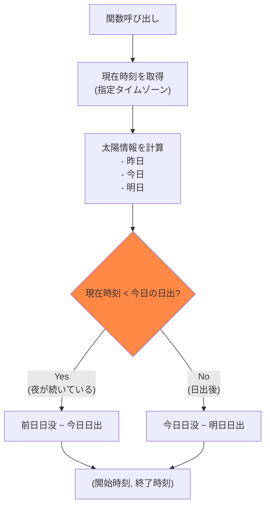
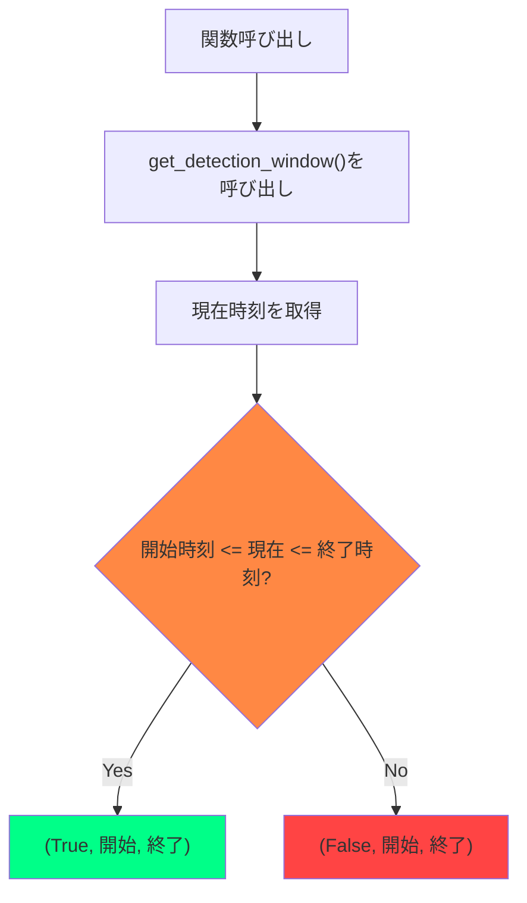
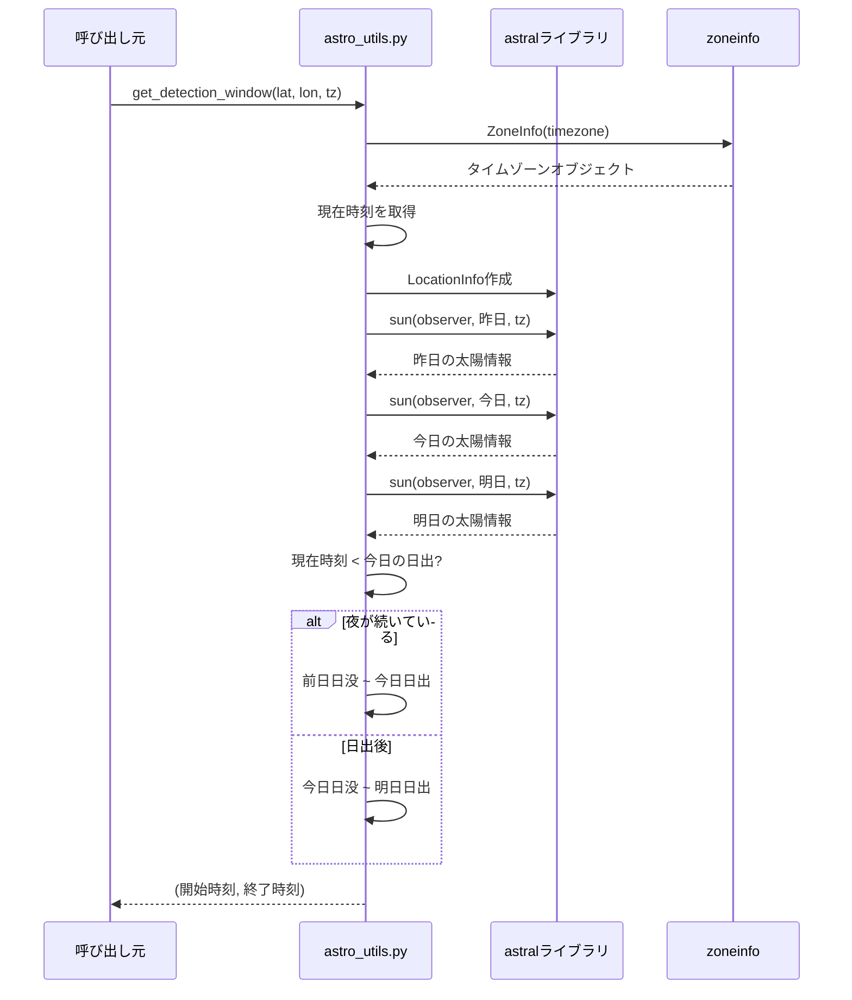

# 天文計算モジュール仕様 (Astronomical Utilities)

## 概要

`astro_utils.py` は、天文薄暮期間の計算と検出時間帯の判定を行うモジュールです。

## 目次

- [モジュール概要](#モジュール概要)
- [関数リファレンス](#関数リファレンス)
- [天文薄暮とは](#天文薄暮とは)
- [使用例](#使用例)
- [計算原理](#計算原理)
- [タイムゾーン処理](#タイムゾーン処理)

---

## モジュール概要

### 依存ライブラリ

```python
from datetime import datetime, timedelta
from typing import Tuple
from astral import LocationInfo
from astral.sun import sun
from zoneinfo import ZoneInfo
```

**外部依存**:
- `astral`: 太陽・月の位置計算ライブラリ
- `zoneinfo`: Python 3.9+ 標準ライブラリ

**インストール**:
```bash
pip install astral
```

---

### ファイル構成

```
astro_utils.py (82行)
├── get_detection_window()  # 検出時間帯を取得
└── is_detection_active()   # 現在が検出時間内か判定
```

---

## 関数リファレンス

### get_detection_window()

**シグネチャ**:
```python
def get_detection_window(
    latitude: float = 35.3606,
    longitude: float = 138.7274,
    timezone: str = "Asia/Tokyo"
) -> Tuple[datetime, datetime]:
```

**説明**: 天文薄暮期間（前日の日没から翌日の日出まで）を計算

**パラメータ**:

| 名前 | 型 | デフォルト | 説明 |
|-----|-----|-----------|------|
| `latitude` | float | `35.3606` | 観測地の緯度（度） |
| `longitude` | float | `138.7274` | 観測地の経度（度） |
| `timezone` | str | `"Asia/Tokyo"` | タイムゾーン名 |

**戻り値**:
- `Tuple[datetime, datetime]`: (検出開始時刻, 検出終了時刻)
- 両方ともタイムゾーン付きdatetimeオブジェクト

**動作**:


**使用例**:
```python
from astro_utils import get_detection_window

# デフォルト座標（富士山頂）
start, end = get_detection_window()
print(f"検出期間: {start} ~ {end}")
# 出力例: 検出期間: 2026-02-01 16:45:23+09:00 ~ 2026-02-02 06:12:45+09:00

# 東京
start, end = get_detection_window(
    latitude=35.6762,
    longitude=139.6503,
    timezone="Asia/Tokyo"
)

# ニューヨーク
start, end = get_detection_window(
    latitude=40.7128,
    longitude=-74.0060,
    timezone="America/New_York"
)
```

---

### is_detection_active()

**シグネチャ**:
```python
def is_detection_active(
    latitude: float = 35.3606,
    longitude: float = 138.7274,
    timezone: str = "Asia/Tokyo"
) -> Tuple[bool, datetime, datetime]:
```

**説明**: 現在が検出時間帯内かどうかを判定

**パラメータ**:

| 名前 | 型 | デフォルト | 説明 |
|-----|-----|-----------|------|
| `latitude` | float | `35.3606` | 観測地の緯度 |
| `longitude` | float | `138.7274` | 観測地の経度 |
| `timezone` | str | `"Asia/Tokyo"` | タイムゾーン名 |

**戻り値**:
- `Tuple[bool, datetime, datetime]`:
  - `bool`: 検出時間内かどうか
  - `datetime`: 検出開始時刻
  - `datetime`: 検出終了時刻

**動作**:


**使用例**:
```python
from astro_utils import is_detection_active

# 現在が検出時間内か確認
is_active, start, end = is_detection_active()

if is_active:
    print(f"検出期間中です: {start} ~ {end}")
else:
    print(f"検出期間外です。次回: {start} ~ {end}")

# 使用例: meteor_detector_rtsp_web.pyでの使用
if is_detection_active and is_detection_active(latitude, longitude, timezone)[0]:
    objects = detector.detect_bright_objects(gray, prev_gray)
    is_detecting_now = True
else:
    objects = []
    is_detecting_now = False
```

---

## 天文薄暮とは

### 定義

**天文薄暮（Astronomical Twilight）**: 太陽が地平線下6度～18度の時間帯

```mermaid
graph TD
    subgraph "太陽の高度と時間帯"
        Day["昼間<br/>太陽高度 > 0°"]
        Civil["市民薄明<br/>0° ~ -6°"]
        Nautical["航海薄明<br/>-6° ~ -12°"]
        Astro["天文薄明<br/>-12° ~ -18°"]
        Night["完全な夜<br/>< -18°"]
    end

    Day --> Civil
    Civil --> Nautical
    Nautical --> Astro
    Astro --> Night

    style Day fill:#ffff00
    style Civil fill:#ffcc66
    style Nautical fill:#ff9933
    style Astro fill:#6666ff
    style Night fill:#000066
```



### 流星観測に適した時間帯

| 時間帯 | 太陽高度 | 流星観測 | 本システムでの扱い |
|-------|---------|---------|------------------|
| 昼間 | > 0° | 不可 | 検出OFF |
| 市民薄明 | 0° ~ -6° | 困難 | 検出OFF |
| 航海薄明 | -6° ~ -12° | やや困難 | 検出OFF |
| 天文薄明 | -12° ~ -18° | 可能 | 検出OFF |
| 完全な夜 | < -18° | 最適 | 検出ON |

**本システムの実装**:
- **簡略化**: 日没（sunset）～日出（sunrise）を検出期間とする
- **理由**: 実用上十分な精度、計算が簡単

---

### 検出期間の例（東京、2026年2月2日）

```
2026-02-01
  16:45  前日の日没 ← 検出開始
  17:15  市民薄明終了
  17:45  航海薄明終了
  18:15  天文薄明終了 ← 完全な夜

2026-02-02
  05:30  天文薄明開始 ← 完全な夜終了
  06:00  航海薄明開始
  06:30  市民薄明開始
  06:55  日出 ← 検出終了
```

**検出期間**: 前日16:45 ~ 当日06:55（約14時間10分）

---

## 使用例

### 基本的な使い方

```python
from astro_utils import get_detection_window, is_detection_active

# 東京での検出時間帯を取得
start, end = get_detection_window(
    latitude=35.6762,
    longitude=139.6503,
    timezone="Asia/Tokyo"
)

print(f"検出期間: {start.strftime('%H:%M')} ~ {end.strftime('%H:%M')}")
# 出力: 検出期間: 16:45 ~ 06:55

# 現在が検出時間内か確認
is_active, _, _ = is_detection_active(35.6762, 139.6503, "Asia/Tokyo")
print(f"検出可能: {'はい' if is_active else 'いいえ'}")
```

---

### meteor_detector_rtsp_web.py での使用

```python
# meteor_detector_rtsp_web.py (抜粋)
from astro_utils import is_detection_active

# 環境変数から設定を取得
enable_time_window = os.environ.get('ENABLE_TIME_WINDOW', 'false').lower() == 'true'
latitude = float(os.environ.get('LATITUDE', '35.3606'))
longitude = float(os.environ.get('LONGITUDE', '138.7274'))
timezone = os.environ.get('TIMEZONE', 'Asia/Tokyo')

# 検出ループ内
if enable_time_window and is_detection_active:
    # 1分ごとに検出時間をチェック
    if (current_time - last_time_check) > 60:
        is_detection_time, _, _ = is_detection_active(latitude, longitude, timezone)
        last_time_check = current_time

    if is_detection_time:
        # 検出処理を実行
        objects = detector.detect_bright_objects(gray, prev_gray)
        is_detecting_now = True
    else:
        # 検出処理をスキップ
        objects = []
        is_detecting_now = False
else:
    # 時間帯制限なし（常時検出）
    objects = detector.detect_bright_objects(gray, prev_gray)
    is_detecting_now = True
```

---

### dashboard.py での使用

```python
# dashboard.py (抜粋)
from astro_utils import get_detection_window

def do_GET(self):
    if self.path.startswith('/detection_window'):
        # ブラウザから送信された座標を取得
        from urllib.parse import urlparse, parse_qs
        query = parse_qs(urlparse(self.path).query)

        latitude = float(query.get('lat', [35.3606])[0])
        longitude = float(query.get('lon', [138.7274])[0])
        timezone = 'Asia/Tokyo'

        try:
            start, end = get_detection_window(latitude, longitude, timezone)
            result = {
                'start': start.strftime('%Y-%m-%d %H:%M:%S'),
                'end': end.strftime('%Y-%m-%d %H:%M:%S'),
                'enabled': os.environ.get('ENABLE_TIME_WINDOW', 'false').lower() == 'true',
                'latitude': latitude,
                'longitude': longitude
            }
        except Exception as e:
            result = {
                'error': str(e)
            }

        self.wfile.write(json.dumps(result).encode('utf-8'))
```

---

## 計算原理

### Astralライブラリの使用

```python
from astral import LocationInfo
from astral.sun import sun

# 観測地点の情報を作成
location = LocationInfo(
    name="Observer",
    region="",
    timezone="Asia/Tokyo",
    latitude=35.6762,
    longitude=139.6503
)

# 今日の太陽情報を取得
from zoneinfo import ZoneInfo
tz = ZoneInfo("Asia/Tokyo")
today = datetime.now(tz).date()

sun_info = sun(location.observer, date=today, tzinfo=tz)

# 取得できる情報
print(sun_info['sunrise'])    # 日出
print(sun_info['sunset'])     # 日没
print(sun_info['dawn'])       # 明け方（市民薄明開始）
print(sun_info['dusk'])       # 夕方（市民薄明終了）
```

---

### 計算フロー



---

### 太陽位置の計算式

Astralライブラリ内部では以下の計算を行っています:

1. **ユリウス日の計算**
2. **太陽の赤経・赤緯の計算**
3. **時角の計算**
4. **高度角の計算**

詳細は[Astralドキュメント](https://astral.readthedocs.io/)を参照

---

## タイムゾーン処理

### サポートされるタイムゾーン

Python 3.9+の`zoneinfo`がサポートする全タイムゾーン:

```python
from zoneinfo import available_timezones

# 利用可能なタイムゾーン一覧
print(list(available_timezones())[:10])
# ['Africa/Abidjan', 'Africa/Accra', 'Africa/Addis_Ababa', ...]
```

### 主要なタイムゾーン

| 地域 | タイムゾーン | UTC offset |
|-----|------------|-----------|
| 日本 | `Asia/Tokyo` | +09:00 |
| 韓国 | `Asia/Seoul` | +09:00 |
| 中国 | `Asia/Shanghai` | +08:00 |
| アメリカ東部 | `America/New_York` | -05:00/-04:00 |
| アメリカ西部 | `America/Los_Angeles` | -08:00/-07:00 |
| イギリス | `Europe/London` | +00:00/+01:00 |
| オーストラリア | `Australia/Sydney` | +10:00/+11:00 |

---

### 夏時間（DST）の処理

```python
from zoneinfo import ZoneInfo
from datetime import datetime

# ニューヨーク（夏時間あり）
tz = ZoneInfo("America/New_York")

# 冬（標準時）
winter = datetime(2026, 1, 1, 12, 0, 0, tzinfo=tz)
print(winter.strftime('%Z %z'))  # EST -0500

# 夏（夏時間）
summer = datetime(2026, 7, 1, 12, 0, 0, tzinfo=tz)
print(summer.strftime('%Z %z'))  # EDT -0400
```

**Astralライブラリの対応**:
- 自動的に夏時間を考慮
- タイムゾーンを正しく指定すれば自動処理

---

### タイムゾーン変換

```python
from datetime import datetime
from zoneinfo import ZoneInfo

# 東京時間で取得
tokyo_tz = ZoneInfo("Asia/Tokyo")
start, end = get_detection_window(35.6762, 139.6503, "Asia/Tokyo")

print(f"東京: {start.strftime('%Y-%m-%d %H:%M %Z')}")
# 出力: 東京: 2026-02-01 16:45 JST

# ニューヨーク時間に変換
ny_tz = ZoneInfo("America/New_York")
start_ny = start.astimezone(ny_tz)

print(f"NY: {start_ny.strftime('%Y-%m-%d %H:%M %Z')}")
# 出力: NY: 2026-02-01 02:45 EST
```

---

## エラーハンドリング

### よくあるエラー

#### 1. 無効なタイムゾーン

```python
# エラー
try:
    start, end = get_detection_window(timezone="Invalid/Timezone")
except ZoneInfoNotFoundError as e:
    print(f"エラー: {e}")
```

**対策**:
```python
from zoneinfo import ZoneInfo, available_timezones

def validate_timezone(tz: str) -> bool:
    return tz in available_timezones()

# 使用前にチェック
if validate_timezone("Asia/Tokyo"):
    start, end = get_detection_window(timezone="Asia/Tokyo")
```

---

#### 2. 極地での計算

極地（北緯66.5度以北、南緯66.5度以南）では白夜・極夜が発生:

```python
# 北極圏（白夜の時期）
try:
    start, end = get_detection_window(
        latitude=80.0,  # 北極圏
        longitude=0.0,
        timezone="UTC"
    )
except ValueError as e:
    print(f"エラー: {e}")
    # エラー: Sun never sets on this day
```

**対策**:
```python
from astral import AstralError

try:
    start, end = get_detection_window(latitude, longitude, timezone)
except AstralError as e:
    print(f"極地エラー: {e}")
    # フォールバック: 24時間検出
    start = datetime.now(ZoneInfo(timezone))
    end = start + timedelta(days=1)
```

---

## パフォーマンス

### 計算時間

```python
import time
from astro_utils import get_detection_window

# ベンチマーク
start_time = time.time()
for _ in range(1000):
    get_detection_window()
elapsed = time.time() - start_time

print(f"1000回の計算: {elapsed:.3f}秒")
print(f"1回あたり: {elapsed/1000*1000:.3f}ミリ秒")

# 出力例:
# 1000回の計算: 0.523秒
# 1回あたり: 0.523ミリ秒
```

**結論**: 非常に高速（1回あたり約0.5ms）

---

### キャッシング

頻繁に呼び出す場合はキャッシュを推奨:

```python
from functools import lru_cache
from datetime import datetime, timedelta

@lru_cache(maxsize=128)
def cached_detection_window(date_str: str, lat: float, lon: float, tz: str):
    """日付ベースでキャッシュ"""
    return get_detection_window(lat, lon, tz)

# 使用例
today = datetime.now().date().isoformat()
start, end = cached_detection_window(today, 35.6762, 139.6503, "Asia/Tokyo")
```

---

## テストケース

```python
import unittest
from datetime import datetime
from zoneinfo import ZoneInfo
from astro_utils import get_detection_window, is_detection_active

class TestAstroUtils(unittest.TestCase):
    def test_get_detection_window_tokyo(self):
        """東京での検出時間帯を取得"""
        start, end = get_detection_window(35.6762, 139.6503, "Asia/Tokyo")

        # 検証
        self.assertIsInstance(start, datetime)
        self.assertIsInstance(end, datetime)
        self.assertLess(start, end)  # 開始 < 終了
        self.assertEqual(start.tzinfo, ZoneInfo("Asia/Tokyo"))

    def test_is_detection_active(self):
        """検出時間の判定"""
        is_active, start, end = is_detection_active()

        # 検証
        self.assertIsInstance(is_active, bool)
        self.assertIsInstance(start, datetime)
        self.assertIsInstance(end, datetime)

    def test_different_timezones(self):
        """異なるタイムゾーンでの動作"""
        timezones = ["Asia/Tokyo", "America/New_York", "Europe/London"]

        for tz in timezones:
            start, end = get_detection_window(35.0, 139.0, tz)
            self.assertEqual(start.tzinfo, ZoneInfo(tz))

if __name__ == '__main__':
    unittest.main()
```

---

## 関連ドキュメント

- [CONFIGURATION_GUIDE.md](CONFIGURATION_GUIDE.md) - 天文薄暮時間帯設定の詳細
- [DETECTOR_COMPONENTS.md](DETECTOR_COMPONENTS.md) - 検出エンジンでの使用方法
- [API_REFERENCE.md](API_REFERENCE.md) - `/detection_window` APIの詳細

## 外部リンク

- [Astral Documentation](https://astral.readthedocs.io/)
- [Python zoneinfo Documentation](https://docs.python.org/3/library/zoneinfo.html)
- [IANA Time Zone Database](https://www.iana.org/time-zones)
