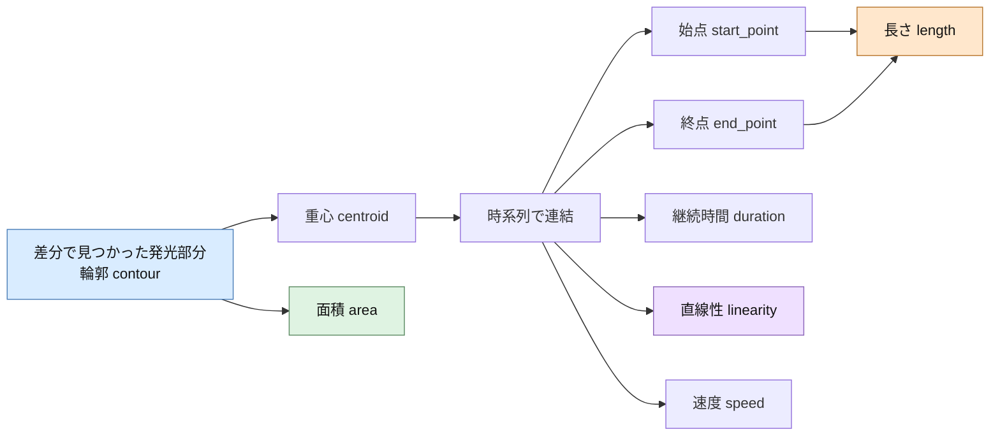
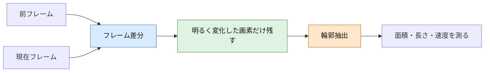
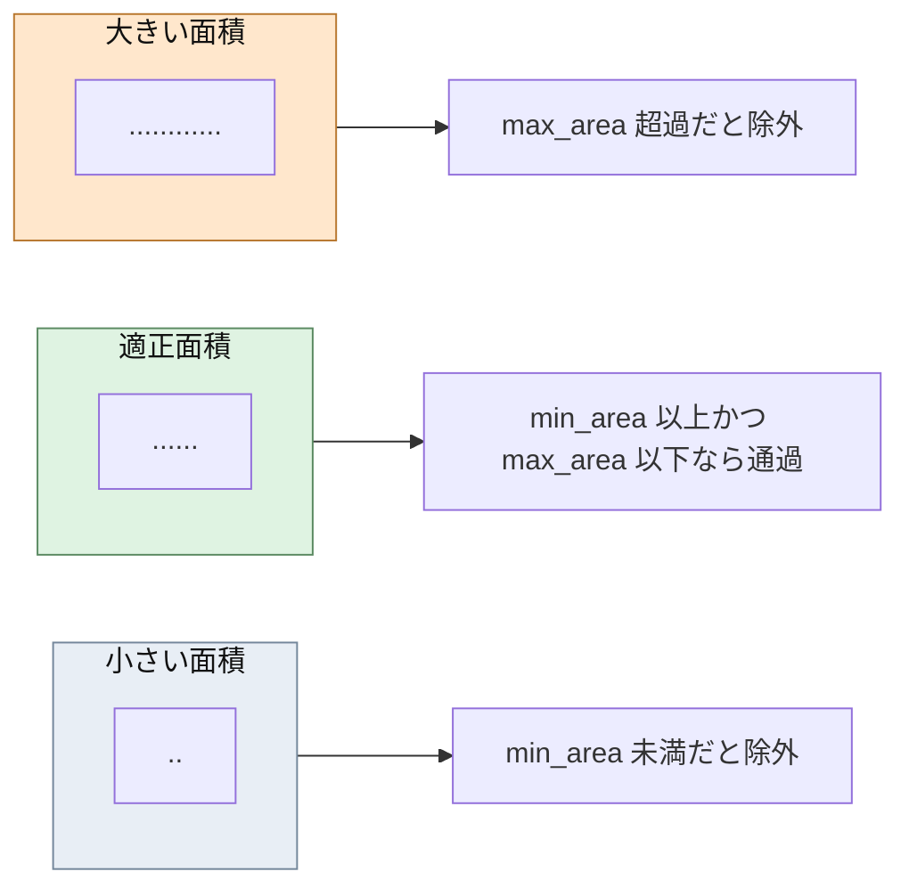
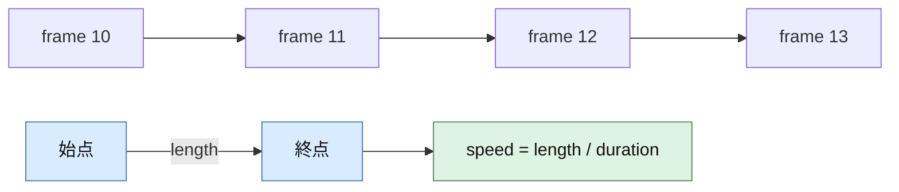
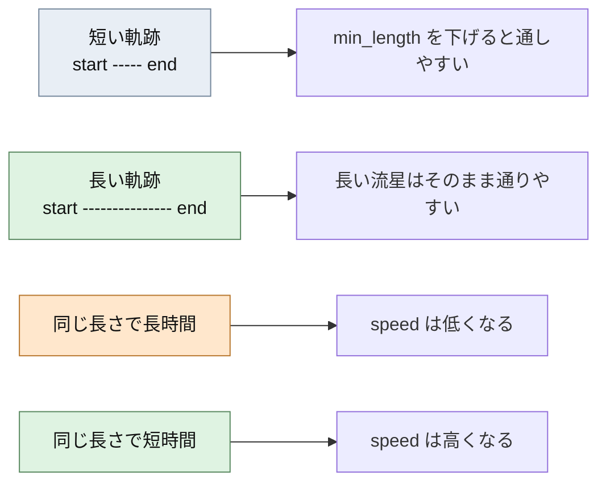
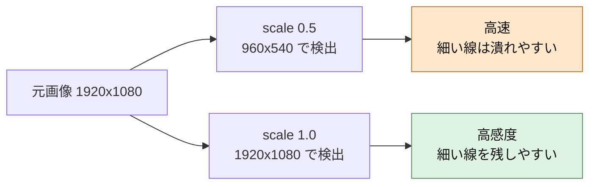
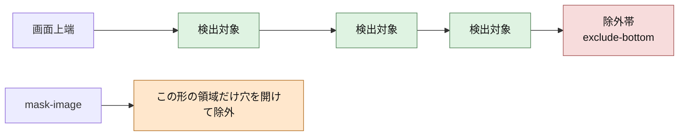
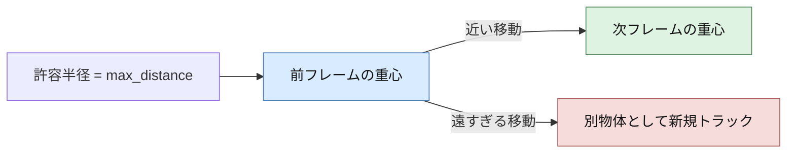
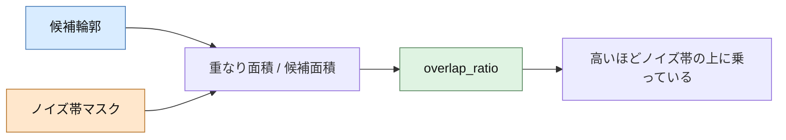
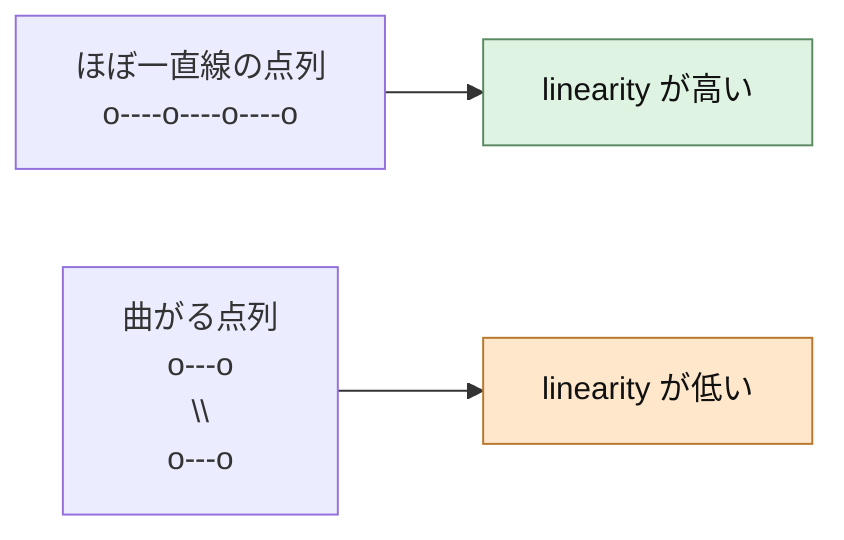

# 検出感度チューニングガイド (Detection Tuning Guide)

---

**Copyright (c) 2026 Masanori Sakai**

Licensed under the MIT License

---

## 目的

「流星が検出されない」場合に、現場で調整すべきパラメータと手順を整理します。
本ガイドは **見逃しを減らす方向の調整** にフォーカスしています。

## まず確認すること（調整前チェック）

1. **ストリーム入力が安定しているか**
   - `stream_alive` が `true` か、フレームが途切れていないかを確認。
2. **検出時間帯の制限**
   - `ENABLE_TIME_WINDOW=true` の場合、時間外は検出されません。
3. **除外マスク**
   - `--mask-image` や `--mask-from-day` により、流星が写る領域を除外していないか。
4. **除外範囲**
   - `--exclude-bottom` が大きすぎると低空の流星が消えます。

## 最初に試す基本調整（見逃し対策）

### 1. 感度プリセットを上げる

**MP4 / RTSP 共通**
```bash
--sensitivity high
```

**短く暗い流星を優先**
```bash
--sensitivity faint
```

`faint` は現行実装で `diff_threshold=16`、`min_brightness=150`、`min_area=5`、`max_distance=90` を起点に調整されます。RTSP Web では追跡中のみ `min_brightness_tracking=120` が自動適用されます。

**火球向け**
```bash
--sensitivity fireball
```

### 2. 解像度スケールを上げる（RTSPで重要）

`--scale` を 1.0 にすると検出は有利になります（処理負荷は増加）。

```bash
--scale 1.0
```

### 3. 除外範囲を狭くする

```bash
--exclude-bottom 0.02
```

## パラメータの幾何的な意味

ここでは「画面上で何を測っているか」を図で示します。



要点:
- `min_area` は 1 フレーム内の発光領域の大きさです。
- `max_distance` は前フレームの重心と次フレームの重心を、同じ物体としてつなぐ許容距離です。
- `min_length` は軌跡の始点と終点の直線距離です。
- `min_speed` は `length / duration` で計算されます。
- `min_linearity` は軌跡点列がどれだけ一直線に並ぶかを表します。

## MP4検出の詳細調整

MP4検出では以下のパラメータを直接調整できます。

| パラメータ | 下げるとどうなるか | 目安 |
|-----------|--------------------|------|
| `--diff-threshold` | 小さな変化も検出しやすくなる | 30 → 20 |
| `--min-brightness` | 暗い流星も拾いやすくなる | 200 → 180 |
| `--min-length` | 短い痕跡でも検出しやすくなる | 20 → 15 |
| `--min-speed` | 遅い流星も検出しやすくなる | 5.0 → 3.0 |

### MP4主要パラメータの図解

#### `--diff-threshold` と `--min-brightness`

どちらも幾何量ではありませんが、どの発光部分を候補として形状計測の対象にするかを決めます。



`min_brightness` を下げると暗い候補も残りやすくなり、後段の `area` や `length` の計測対象が増えます。

#### `--min-area` と `--max-area`

1 フレーム内で見えた発光部分の大きさです。コード上では輪郭面積 `cv2.contourArea(contour)` を使っています。



目安:
- `min_area` を下げると、細くて小さい発光点も候補に入りやすくなります。
- `max_area` を上げると、大きく膨らんだ火球やハレーション気味の発光も残しやすくなります。

#### `--min-length` と `--min-speed`

`length` は軌跡の始点と終点の直線距離、`speed` はその距離を継続フレーム数または継続時間で割ったものです。





**例**
```bash
python meteor_detector.py input.mp4 \
  --sensitivity high \
  --diff-threshold 20 \
  --min-brightness 180 \
  --min-length 15 \
  --min-speed 3.0
```

## RTSP検出の調整ポイント

RTSP版は CLI から調整できる項目が限定されています。
また、ダッシュボードの `/settings` から全カメラへ一括設定することも可能です。

**有効な調整**
- `--sensitivity`（low / medium / high / faint / fireball）
- `--scale`（処理解像度）
- `--exclude-bottom`（画面下部の除外率）
- マスク関連 (`--mask-image`, `--mask-from-day`)
- ノイズ帯マスク関連 (`--nuisance-mask-image`, `--nuisance-from-night`, `--nuisance-dilate`)
- ノイズ帯重なり閾値 (`--nuisance-overlap-threshold`)

### RTSP主要パラメータの図解

#### `--scale`

`--scale` は「どの解像度で検出処理するか」を決めます。大きいほど細い流星に有利ですが、CPU負荷は増えます。



#### `--exclude-bottom` とマスク

これらは「検出対象に含める画面領域」を変えます。



`exclude-bottom` は画面の下端から一定比率を帯状に切り捨てます。`mask-image` は任意形状で除外できます。

#### `max_distance`

追跡中の物体について、前回の重心位置と今回の重心位置がどれくらい離れていても同一物体とみなすか、という距離です。



`max_distance` を上げると、フレーム間で大きく飛んだ軌跡もつながりやすくなりますが、別ノイズを誤って連結しやすくなります。

**例**
```bash
python meteor_detector_rtsp_web.py rtsp://... \
  --sensitivity high \
  --scale 1.0 \
  --exclude-bottom 0.02 \
  --nuisance-from-night ./night_reference.jpg \
  --nuisance-dilate 3 \
  --nuisance-overlap-threshold 0.60
```

## 誤検出（電線・部分照明）を減らす調整

夜間の電線や電柱付近が車のヘッドライトで一時的に光るケース向けに、
RTSP版には以下の抑制が追加されています。

- 小さい候補がノイズ帯マスクと大きく重なる場合に除外
- 追跡点数が少ないトラックを除外
- 連続点の移動が少ない（ほぼ静止）トラックを除外
- トラック軌跡がノイズ帯と強く重なる場合に除外

### 推奨手順

1. `--nuisance-from-night` で夜間基準画像からノイズ帯マスクを自動生成
2. 電柱・電線が多い場合は `--nuisance-mask-image` で手動マスクを併用
3. 誤検出が多い場合は `--nuisance-overlap-threshold` を `0.55` へ下げる
4. 見逃しが増える場合は `--nuisance-overlap-threshold` を `0.65` へ上げる

### `--nuisance-overlap-threshold` の見方

ノイズ帯マスクと候補輪郭の面積がどれだけ重なっているかの比率です。



調整の方向:
- `0.60 → 0.55` に下げる: 電線・照明由来の誤検出は減りやすいが、流星も巻き込んで除外しやすくなります。
- `0.60 → 0.65` に上げる: 見逃しは減りやすいが、ノイズ帯近傍の誤検出が増えやすくなります。

#### `min_linearity`

軌跡点が一直線に並んでいる度合いです。1.0 に近いほど直線的です。



`min_linearity` を下げると、少し曲がった軌跡やノイズを含んだ軌跡も通しやすくなります。

## ダッシュボード一括設定での反映タイミング

`/settings` で反映する場合、項目によって適用タイミングが異なります。

- 即時反映（再起動不要）:
  - `diff_threshold`, `min_brightness`, `min_linearity`
  - `nuisance_overlap_threshold`, `nuisance_path_overlap_threshold`
  - `min_track_points`, `max_stationary_ratio`, `small_area_threshold`
  - `mask_dilate`, `nuisance_dilate`, `mask_image`, `mask_from_day`, `nuisance_mask_image`, `nuisance_from_night`
- 自動再起動で反映（再ビルド不要）:
  - `sensitivity`, `scale`, `buffer`, `extract_clips`

起動時設定は `output/runtime_settings/<camera>.json` に保存されるため、
コンテナ再起動後も有効です。

## Docker環境での調整例

`generate_compose.py` で設定を変更して再生成してください。

```bash
python3 generate_compose.py \
  --sensitivity high \
  --scale 1.0 \
  --exclude-bottom 0.02
docker compose up -d
```

## それでも検出されない場合（コード調整）

さらに追い込む場合は `DetectionParams` を直接調整します。

- `meteor_detector.py` の `DetectionParams`
- `meteor_detector_rtsp_web.py` の `DetectionParams`

例:
- `min_duration` を下げる（短時間の流星を拾う）
- `min_linearity` を下げる（曲がった軌道を許容）
- `max_gap_frames` を増やす（明滅に強くする）

コード変更後のみ `./meteor-docker.sh rebuild` が必要です。
設定値の変更だけであれば、`/settings` または `/apply_settings` で再ビルド不要で反映できます。

## よくあるパターン

- **暗い流星が検出されない**: `min_brightness` を下げる、`--scale` を上げる
- **短い流星が検出されない**: `min_length` を下げる、`min_duration` を下げる
- **低空の流星が検出されない**: `--exclude-bottom` を小さくする
- **瞬間的な流星が検出されない**: `--skip` を 1 に戻す（MP4）

## 鳥シルエット誤検出を減らす（v3.5.0+）

夜明け前・日没直後の薄明時間帯は空が少し明るいため、鳥が「黒い塊（シルエット）」として差分検出にかかることがあります。`detection_filters.filter_dark_objects()` が平均輝度の低い候補を除外する機能を提供しています。

なお v3.6.1 では通常夜間用の `BIRD_FILTER_ENABLED` の既定値や閾値の扱いを見直した細かな修正が入っています。詳細は [CHANGELOG.md](https://github.com/Masakai/meteo/blob/master/CHANGELOG.md) の v3.6.1 項を参照してください。

### 関連環境変数

| 変数 | デフォルト | 意味 |
|---|---|---|
| `TWILIGHT_BIRD_FILTER_ENABLED` | `true` | 薄明時の鳥フィルタ有効化（opt-out、既定有効） |
| `TWILIGHT_BIRD_MIN_BRIGHTNESS` | `80` | 薄明時に除外する平均輝度のしきい値（0-255） |
| `BIRD_FILTER_ENABLED` | `false` | 通常夜間時間帯にも適用（opt-in、既定無効） |
| `BIRD_MIN_BRIGHTNESS` | `80` | 通常時に除外する平均輝度のしきい値 |

### チューニング指針

- **薄明時に鳥が検出されやすい**: `TWILIGHT_BIRD_MIN_BRIGHTNESS` を `100` 程度まで上げる（**注意**: 120 以上は暗い流星も巻き込みやすい）
- **通常夜間にも鳥・蝙蝠が写る環境**: `BIRD_FILTER_ENABLED=true` に設定し、段階的に `BIRD_MIN_BRIGHTNESS` を調整
- **`faint` プリセット使用時**: 暗い流星を拾うため閾値は低めに（60 前後）推奨

### 動作原理

候補オブジェクトの平均輝度が閾値を下回ったものを除外します。流星は差分で「明るく」現れるため閾値より高い輝度になり、影として差分に現れる鳥は閾値未満で除外される、という違いを利用しています。

## 薄明時の感度低減（v3.5.0+）

薄明期間中は背景ノイズが増えるため、プリセットとは別の動作モードで感度を落とす仕組みが入っています。[CONFIGURATION_GUIDE.md の「薄明動作モード」節](CONFIGURATION_GUIDE.md#薄明動作モードv350) に合わせて調整します。

### モード切替の推奨

| 状況 | 推奨設定 |
|---|---|
| 薄明中も明るい流星だけ拾いたい（デフォルト） | `TWILIGHT_DETECTION_MODE=reduce`、`TWILIGHT_SENSITIVITY=low`、`TWILIGHT_MIN_SPEED=200` |
| 薄明中の誤検出を完全に避ける | `TWILIGHT_DETECTION_MODE=skip` |
| 薄明の定義を厳しく（より狭い区間に限定） | `TWILIGHT_TYPE=civil`（6°のみ薄明扱い） |
| 薄明の定義を緩く（広く薄明扱い） | `TWILIGHT_TYPE=astronomical`（18° まで薄明扱い） |

### `reduce` モードで見逃しが増えた場合

- `TWILIGHT_SENSITIVITY` を `medium` に引き上げる
- `TWILIGHT_MIN_SPEED` を `150` まで下げる（ただし鳥・航空機の混入が増える）

### `reduce` モードで誤検出が多い場合

- `TWILIGHT_BIRD_FILTER_ENABLED=true`（デフォルト有効）を維持
- `TWILIGHT_MIN_SPEED` を `250` 前後に引き上げる
- ノイズ帯マスクも併用する

## 注意点

- 見逃しを減らすと **誤検出は増えやすくなります**。
- 調整は一度に1つずつ変えて、効果を確認してください。
