# meteor_detector_rtsp_web.py - 内部コンポーネント仕様書

---

**Copyright (c) 2026 Masanori Sakai**

Licensed under the MIT License

---


## 概要

`meteor_detector_rtsp_web.py` は、RTSPストリームから流星を検出し、Webプレビューを提供するリアルタイム検出エンジンです。

## アーキテクチャ

### 全体構成図

```mermaid
graph TB
    RTSP["RTSP映像ソース"]
    Reader["RTSPReader<br/>スレッド1"]
    Queue["Queue<br/>maxsize=30"]
    DetectionWorker["detection_thread_worker<br/>スレッド2"]
    RingBuffer["RingBuffer<br/>15秒分のフレーム"]
    Detector["RealtimeMeteorDetector<br/>検出ロジック"]
    Storage["ファイルシステム<br/>/output/"]
    WebServer["ThreadedHTTPServer<br/>MJPEGHandler"]
    Browser["Webブラウザ"]

    RTSP -->|"フレーム取得"| Reader
    Reader -->|"Queue.put"| Queue
    Queue -->|"Queue.get"| DetectionWorker
    DetectionWorker -->|"add(frame)"| RingBuffer
    DetectionWorker -->|"detect_bright_objects"| Detector
    DetectionWorker -->|"track_objects"| Detector
    Detector -->|"MeteorEvent"| DetectionWorker
    DetectionWorker -->|"get_range"| RingBuffer
    DetectionWorker -->|"保存"| Storage
    DetectionWorker -->|"current_frame更新"| WebServer
    WebServer -->|"MJPEGストリーム"| Browser
    Browser -->|"HTTP GET /stats"| WebServer

    style Reader fill:#16213e
    style DetectionWorker fill:#16213e
    style WebServer fill:#16213e
    style Detector fill:#2a3f6f
    style RingBuffer fill:#2a3f6f
```

## コアコンポーネント

### 1. RTSPReader

**責務**: RTSPストリームからフレームを読み込み、キューに供給する

#### クラス定義

```python
class RTSPReader:
    def __init__(self, url: str, reconnect_delay: float = 5.0)
    def start(self) -> RTSPReader
    def read(self) -> Tuple[bool, float, Optional[np.ndarray]]
    def stop(self)
    def _read_loop(self)  # 内部スレッド
```

#### 状態管理

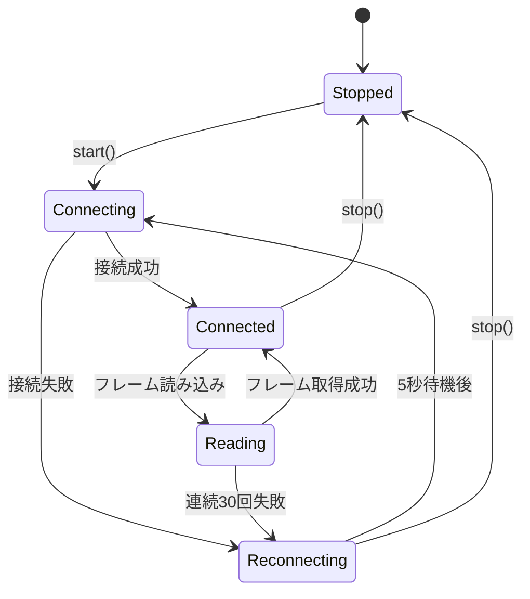

#### 主要メソッド

| メソッド | 説明 | 戻り値 |
|---------|------|--------|
| `start()` | RTSPリーダースレッドを起動 | `self` |
| `read()` | キューからフレームを取得（タイムアウト1秒） | `(success, timestamp, frame)` |
| `stop()` | スレッドを停止 | なし |
| `_read_loop()` | 内部ループ（別スレッド） | なし |

#### プロパティ

| プロパティ | 型 | 説明 |
|-----------|-----|------|
| `queue` | `Queue[Tuple[float, np.ndarray]]` | フレームキュー（最大30フレーム） |
| `stopped` | `Event` | 停止フラグ |
| `connected` | `Event` | 接続状態フラグ |
| `fps` | `float` | ストリームのFPS |
| `width`, `height` | `int` | フレーム解像度 |

#### シーケンス図

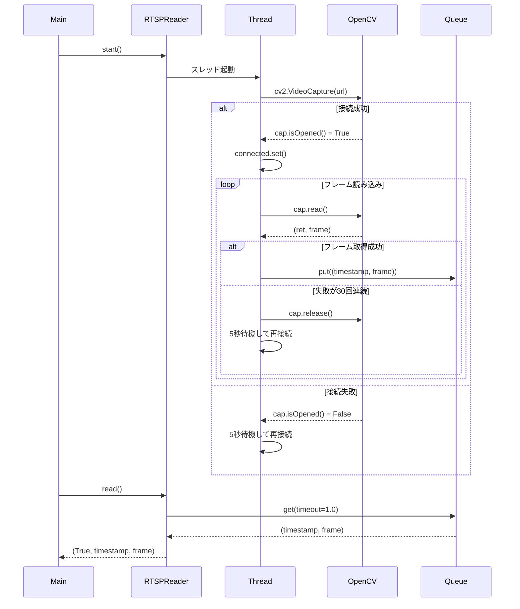

---

### 2. RingBuffer

**責務**: 過去N秒分のフレームをメモリに保持し、流星検出時に前後のフレームを提供

#### クラス定義

```python
class RingBuffer:
    def __init__(self, max_seconds: float, fps: float = 30)
    def add(self, timestamp: float, frame: np.ndarray)
    def get_range(self, start_time: float, end_time: float) -> List[Tuple[float, np.ndarray]]
```

#### データ構造

```mermaid
graph LR
    subgraph "RingBuffer (maxlen=360 for 12秒@30fps)"
        F1["(t=0.00, frame1)"]
        F2["(t=0.03, frame2)"]
        F3["(t=0.07, frame3)"]
        Dots["..."]
        F360["(t=11.97, frame360)"]
    end

    F1 --> F2
    F2 --> F3
    F3 --> Dots
    Dots --> F360
    F360 -.->|"新フレーム追加で<br/>古いフレーム削除"| F1

    style F1 fill:#16213e
    style F360 fill:#2a3f6f
```

#### メソッド

| メソッド | 説明 | 戻り値 |
|---------|------|--------|
| `add(timestamp, frame)` | フレームを追加（スレッドセーフ） | なし |
| `get_range(start, end)` | 指定時間範囲のフレームを取得 | `List[Tuple[float, np.ndarray]]` |

#### 使用例

```python
# 初期化（12秒、30fps = 最大360フレーム）
ring_buffer = RingBuffer(max_seconds=12.0, fps=30.0)

# フレーム追加
ring_buffer.add(timestamp=0.0, frame=frame1)
ring_buffer.add(timestamp=0.033, frame=frame2)

# 流星検出時: 検出時刻の前後1秒を取得
event_frames = ring_buffer.get_range(
    start_time=event.start_time - 1.0,
    end_time=event.end_time + 1.0
)
```

RTSP Web版では `buffer_seconds` が `max_duration + 2.0` 秒を上限に自動調整されます。

---

### 3. RealtimeMeteorDetector

**責務**: フレームから明るい移動物体を検出し、流星かどうか判定する

#### クラス定義

```python
class RealtimeMeteorDetector:
    def __init__(
        self,
        params: DetectionParams,
        fps: float = 30,
        exclusion_mask: Optional[np.ndarray] = None,
        nuisance_mask: Optional[np.ndarray] = None,
    )
    def detect_bright_objects(self, frame, prev_frame) -> List[dict]
    def track_objects(self, objects, timestamp) -> List[MeteorEvent]
    def finalize_all(self) -> List[MeteorEvent]
    def update_exclusion_mask(self, new_mask: Optional[np.ndarray]) -> None
    def update_nuisance_mask(self, new_mask: Optional[np.ndarray]) -> None
```

#### 検出アルゴリズムフロー

```mermaid
flowchart TD
    Start["フレーム取得<br/>(gray, prev_gray)"]
    Diff["差分計算<br/>cv2.absdiff()"]
    Thresh["二値化<br/>threshold > 30"]
    Mask["除外マスク適用<br/>mask > 0 を除外"]
    Morph["モルフォロジー処理<br/>open → close"]
    Contours["輪郭検出<br/>findContours()"]

    Filter1{"面積フィルタ<br/>5 ≤ area ≤ 10000"}
    Filter2{"輝度フィルタ<br/>brightness ≥ min_brightness"}
    Filter2b{"ノイズ帯重なり除外<br/>small_area & overlap高"}
    Filter3{"画面下部除外<br/>y < height×15/16"}

    Objects["検出物体リスト<br/>{centroid, brightness, area}"]
    Track["トラッキング<br/>track_objects()"]

    Decision{"軌跡が完了<br/>かつ判定条件を満たす"}
    Meteor["MeteorEvent生成"]
    End["次フレームへ"]

    Start --> Diff
    Diff --> Thresh
    Thresh --> Mask
    Mask --> Morph
    Morph --> Contours
    Contours --> Filter1
    Filter1 -->|"No"| End
    Filter1 -->|"Yes"| Filter2
    Filter2 -->|"No"| End
    Filter2 -->|"Yes"| Filter2b
    Filter2b -->|"除外"| End
    Filter2b -->|"通過"| Filter3
    Filter3 -->|"No"| End
    Filter3 -->|"Yes"| Objects
    Objects --> Track
    Track --> Decision
    Decision -->|"Yes"| Meteor
    Decision -->|"No"| End
    Meteor --> End

    style Start fill:#16213e
    style Meteor fill:#ff4444
    style Objects fill:#2a3f6f
```

#### トラッキング状態管理

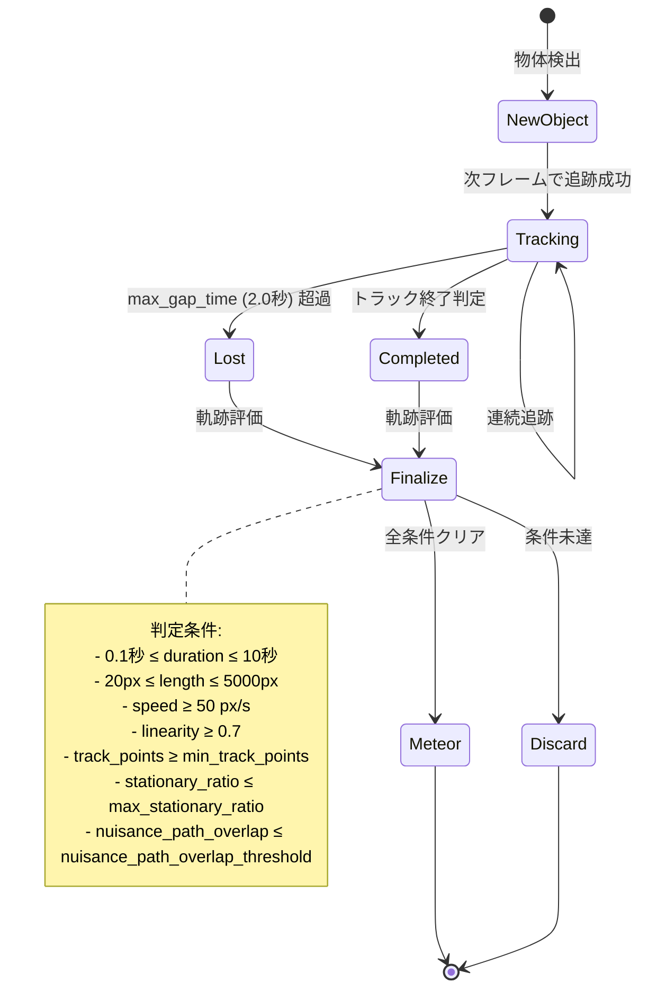

#### 検出パラメータ (DetectionParams)

| パラメータ | デフォルト値 | 説明 |
|-----------|------------|------|
| `diff_threshold` | 30 | 差分閾値 |
| `min_brightness` | 200 | 最小輝度 |
| `min_brightness_tracking` | min_brightness | 追跡時の最小輝度 |
| `min_length` | 20 px | 最小軌跡長 |
| `max_length` | 5000 px | 最大軌跡長 |
| `min_duration` | 0.1 秒 | 最小継続時間 |
| `max_duration` | 10.0 秒 | 最大継続時間 |
| `min_speed` | 50.0 px/s | 最小速度 |
| `min_linearity` | 0.7 | 最小直線性 (0-1) |
| `min_area` | 5 px² | 最小面積 |
| `max_area` | 10000 px² | 最大面積 |
| `max_gap_time` | 2.0 秒 | 最大トラッキング間隔 |
| `max_distance` | 80 px | 最大移動距離 |
| `merge_max_gap_time` | 1.5 秒 | イベント結合の最大間隔 |
| `merge_max_distance` | 80 px | イベント結合の最大距離 |
| `merge_max_speed_ratio` | 0.5 | イベント結合の最大速度比 |
| `exclude_bottom_ratio` | 1/16 | 画面下部除外率 |
| `nuisance_overlap_threshold` | 0.60 | ノイズ帯重なり閾値 |
| `nuisance_path_overlap_threshold` | 0.70 | ノイズ帯経路重なり閾値 |
| `min_track_points` | 4 | 最小追跡点数 |
| `max_stationary_ratio` | 0.40 | 静止率上限 |
| `small_area_threshold` | 40 | 小領域判定閾値 |

#### 除外マスク（固定カメラ向け）

- 事前生成済みマスク（`MASK_IMAGE`）がある場合は優先して適用
- `MASK_FROM_DAY` が設定されている場合は、昼間画像からマスクを生成
- ダッシュボードの「マスク更新」ボタンで現在フレームから再生成（永続化）

#### ノイズ帯マスク（電線・部分照明対策）

- `nuisance_mask` は除外マスクとは別の誤検出抑制マスク
- 設定方法:
  - `nuisance_mask_image`: 手動マスク画像
  - `nuisance_from_night`: 夜間基準画像から `Canny + HoughLinesP + dilate` で自動生成
- 小領域候補で `nuisance_overlap_threshold` を超える場合は候補段階で除外
- トラック確定時に `nuisance_path_overlap_threshold` を超える場合はイベント除外

#### 感度プリセット

| プリセット | diff_threshold | min_brightness | 用途 |
|-----------|----------------|----------------|------|
| `low` | 40 | 220 | 明るい流星のみ |
| `medium` (デフォルト) | 30 | 200 | バランス型 |
| `high` | 20 | 180 | 暗い流星も検出 |
| `fireball` | 15 | 150 | 火球専用（長時間OK） |

追跡中は `min_brightness_tracking` を使用し、RTSP Webでは `min_brightness` の80%に設定されます。

#### 信頼度計算

```python
def calculate_confidence(length, speed, linearity, brightness, duration) -> float:
    length_score = min(1.0, length / 100.0)         # 25%の重み
    speed_score = min(1.0, speed / 20.0)            # 20%の重み
    linearity_score = linearity                     # 25%の重み
    brightness_score = min(1.0, brightness / 255)   # 20%の重み
    duration_bonus = min(0.2, duration / 100.0 * 0.2)  # 最大20%のボーナス

    return min(1.0, length_score * 0.25 + speed_score * 0.2 +
               linearity_score * 0.25 + brightness_score * 0.2 + duration_bonus)
```

---

### 4. 共通ユーティリティ (meteor_detector_common.py)

RTSP/MP4検出で共通利用する補助関数群です。

- `calculate_linearity(xs, ys)`: 直線性の評価
- `calculate_confidence(...)`: 信頼度スコアの算出
- `open_video_writer(...)`: 利用可能なコーデックでVideoWriterを初期化

---

### 5. MeteorEvent

**責務**: 検出された流星イベントのデータクラス

#### クラス定義

```python
@dataclass
class MeteorEvent:
    timestamp: datetime          # 検出時刻
    start_time: float            # 開始時刻（相対）
    end_time: float              # 終了時刻（相対）
    start_point: Tuple[int, int] # 開始座標
    end_point: Tuple[int, int]   # 終了座標
    peak_brightness: float       # ピーク輝度
    confidence: float            # 信頼度 (0-1)
    frames: List[Tuple[float, np.ndarray]]  # フレームリスト
```

#### プロパティ

| プロパティ | 型 | 説明 |
|-----------|-----|------|
| `duration` | `float` | 継続時間（秒） |
| `length` | `float` | 軌跡長（ピクセル） |

#### JSON出力形式

```json
{
  "timestamp": "2026-02-02T06:55:33.411811",
  "start_time": 125.340,
  "end_time": 125.780,
  "duration": 0.440,
  "start_point": [320, 180],
  "end_point": [450, 220],
  "length_pixels": 135.6,
  "peak_brightness": 245.3,
  "confidence": 0.87
}
```

---

### 5. detection_thread_worker

**責務**: メイン検出ループを実行する（別スレッド）

#### 処理フロー

```mermaid
flowchart TD
    Start["スレッド開始"]
    Init["初期化<br/>RingBuffer, Detector"]

    Loop["フレーム取得ループ"]
    ReadFrame["RTSPReader.read()"]
    CheckTime{"天文薄暮<br/>時間帯?"}

    AddBuffer["RingBuffer.add()"]
    Resize["リサイズ<br/>(scale=0.5)"]
    Gray["グレースケール変換"]

    Detect["detect_bright_objects()"]
    Track["track_objects()"]

    CheckEvent{"MeteorEvent<br/>発生?"}
    SaveEvent["save_meteor_event()<br/>- 動画(オプション)<br/>- コンポジット画像<br/>- JSONL追記"]

    UpdatePreview["プレビューフレーム生成<br/>current_frame更新"]

    CheckStop{"stop_flag<br/>?"}
    Finalize["finalize_all()"]
    End["スレッド終了"]

    Start --> Init
    Init --> Loop
    Loop --> ReadFrame
    ReadFrame --> AddBuffer
    AddBuffer --> Resize
    Resize --> Gray
    Gray --> CheckTime

    CheckTime -->|"Yes"| Detect
    CheckTime -->|"No"| UpdatePreview

    Detect --> Track
    Track --> CheckEvent
    CheckEvent -->|"Yes"| SaveEvent
    CheckEvent -->|"No"| UpdatePreview
    SaveEvent --> UpdatePreview

    UpdatePreview --> CheckStop
    CheckStop -->|"No"| Loop
    CheckStop -->|"Yes"| Finalize
    Finalize --> End

    style Start fill:#16213e
    style SaveEvent fill:#2a3f6f
    style CheckTime fill:#ff8844
    style End fill:#16213e
```

#### グローバル変数（Webサーバー連携用）

| 変数名 | 型 | 説明 |
|-------|-----|------|
| `current_frame` | `np.ndarray` | 現在のプレビューフレーム |
| `current_frame_lock` | `Lock` | フレーム更新用ロック |
| `detection_count` | `int` | 検出数カウンター |
| `last_frame_time` | `float` | 最終フレーム受信時刻 |
| `is_detecting_now` | `bool` | 検出処理中フラグ |
| `current_settings` | `dict` | 設定情報 |

---

### 6. MJPEGHandler (Webサーバー)

**責務**: HTTP経由でプレビューストリームと統計情報を提供

#### エンドポイント

```mermaid
graph LR
    Browser["ブラウザ"]

    subgraph "MJPEGHandler"
        Root["/"]
        Stream["/stream"]
        Stats["/stats"]
    end

    HTML["HTML<br/>プレビューページ"]
    MJPEG["MJPEGストリーム<br/>multipart/x-mixed-replace"]
    JSON["統計情報<br/>application/json"]

    Browser -->|"GET /"| Root
    Root --> HTML

    Browser -->|"GET /stream"| Stream
    Stream --> MJPEG

    Browser -->|"GET /stats"| Stats
    Stats --> JSON

    style Root fill:#16213e
    style Stream fill:#16213e
    style Stats fill:#16213e
```

#### /stream 処理フロー

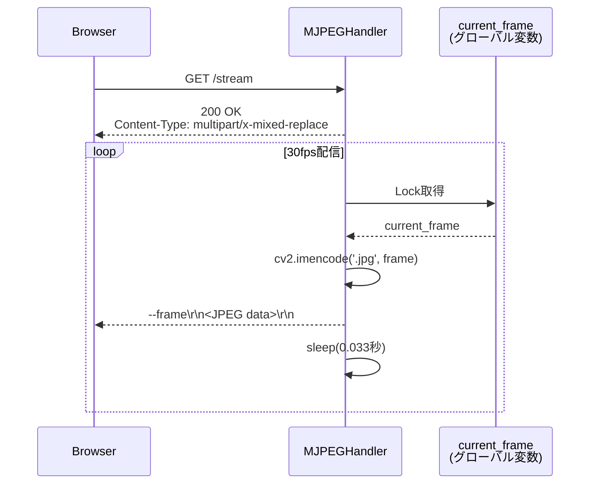

#### /stats レスポンス

```json
{
  "detections": 5,
  "elapsed": 3600.5,
  "camera": "camera1_10.0.1.25",
  "settings": {
    "sensitivity": "medium",
    "scale": 0.5,
    "buffer": 12.0,
    "extract_clips": true,
    "fb_normalize": false,
    "fb_delete_mov": false,
    "exclude_bottom": 0.0625,
    "nuisance_overlap_threshold": 0.6,
    "nuisance_path_overlap_threshold": 0.7,
    "min_track_points": 4,
    "max_stationary_ratio": 0.4,
    "small_area_threshold": 40,
    "mask_image": "",
    "mask_from_day": "",
    "mask_dilate": 5,
    "nuisance_mask_image": "",
    "nuisance_from_night": "",
    "nuisance_dilate": 3
  },
  "stream_alive": true,
  "time_since_last_frame": 0.03,
  "is_detecting": true
}
```

#### /apply_settings による運用時設定反映

- ダッシュボード設定ページまたはAPIから `POST /apply_settings` で反映可能
- 即時反映:
  - しきい値群、誤検出抑制パラメータ、マスク更新系
- 自動再起動で反映:
  - `sensitivity`, `scale`, `buffer`, `extract_clips`, `fb_normalize`, `fb_delete_mov`
- 起動時依存項目は `output/runtime_settings/<camera>.json` に保存され、再起動後も維持

---

## データフロー全体像

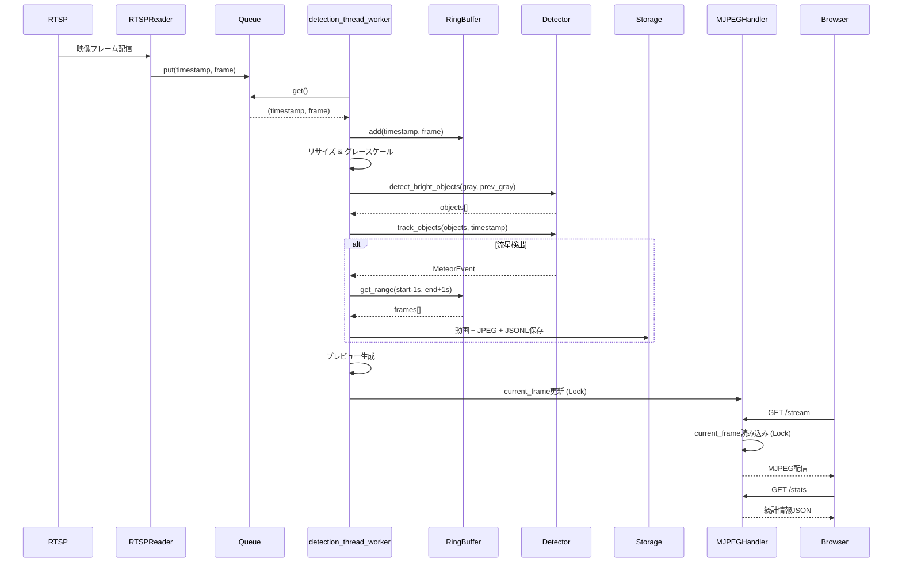

---

## 保存処理 (save_meteor_event)

### 保存ファイル構成

```mermaid
graph TD
    Event["MeteorEvent"]

    subgraph "save_meteor_event()"
        GetFrames["RingBuffer.get_range<br/>(start-1s, end+1s)"]

        Video["MOV動画<br/>meteor_YYYYMMDD_HHMMSS.mov"]
        Composite["コンポジット画像<br/>meteor_YYYYMMDD_HHMMSS_composite.jpg"]
        Original["オリジナル合成<br/>meteor_YYYYMMDD_HHMMSS_composite_original.jpg"]
        JSONL["検出ログ<br/>detections.jsonl"]
    end

    Event --> GetFrames
    GetFrames --> Video
    GetFrames --> Composite
    GetFrames --> Original
    Event --> JSONL

    style Video fill:#16213e
    style Composite fill:#2a3f6f
    style Original fill:#2a3f6f
    style JSONL fill:#ff8844
```

### コンポジット画像生成アルゴリズム

```python
# イベント期間中の全フレームの最大値合成
composite = event_frames[0][1].astype(np.float32)
for _, frame in event_frames[1:]:
    composite = np.maximum(composite, frame.astype(np.float32))
composite = np.clip(composite, 0, 255).astype(np.uint8)

# 軌跡をマーキング
cv2.line(composite, start_point, end_point, (0, 255, 255), 2)
cv2.circle(composite, start_point, 6, (0, 255, 0), 2)  # 開始点（緑）
cv2.circle(composite, end_point, 6, (0, 0, 255), 2)    # 終了点（赤）
```

---

## 環境変数による設定

| 環境変数 | デフォルト値 | 説明 |
|---------|------------|------|
| `ENABLE_TIME_WINDOW` | `false` | 天文薄暮時間帯制限の有効化 |
| `LATITUDE` | `35.3606` | 観測地の緯度（富士山頂） |
| `LONGITUDE` | `138.7274` | 観測地の経度（富士山頂） |
| `TIMEZONE` | `Asia/Tokyo` | タイムゾーン |
| `EXTRACT_CLIPS` | `true` | クリップ動画保存の有効化 |

---

## スレッド構成とロック

```mermaid
graph TB
    subgraph "プロセス: meteor_detector_rtsp_web.py"
        Main["メインスレッド"]
        Thread1["RTSPReaderスレッド"]
        Thread2["detection_thread_worker"]
        Thread3["MJPEGHandlerスレッド群"]

        Queue["Queue<br/>(スレッドセーフ)"]
        BufferLock["RingBuffer.lock"]
        DetectorLock["Detector.lock"]
        FrameLock["current_frame_lock"]

        Thread1 -->|"put"| Queue
        Thread2 -->|"get"| Queue
        Thread2 -->|"取得"| BufferLock
        Thread2 -->|"取得"| DetectorLock
        Thread2 -->|"取得"| FrameLock
        Thread3 -->|"取得"| FrameLock
    end

    style Main fill:#1e2a4a
    style Thread1 fill:#16213e
    style Thread2 fill:#16213e
    style Thread3 fill:#16213e
    style Queue fill:#2a3f6f
```

### ロック戦略

| ロック | 保護対象 | 取得スレッド |
|-------|---------|------------|
| `RingBuffer.lock` | `buffer: deque` | detection_thread_worker |
| `Detector.lock` | `active_tracks: dict` | detection_thread_worker |
| `current_frame_lock` | `current_frame: np.ndarray` | detection_thread_worker, MJPEGHandler |
| Queue内部ロック | キューの操作 | RTSPReader, detection_thread_worker |

---

## パフォーマンス最適化

### 1. 処理スケール調整

```python
# フレームを0.5倍にリサイズして処理負荷を削減
process_scale = 0.5  # デフォルト
proc_frame = cv2.resize(frame, (width*0.5, height*0.5), interpolation=cv2.INTER_AREA)

# 検出座標は元のスケールに戻す
for obj in objects:
    cx, cy = obj["centroid"]
    obj["centroid"] = (int(cx / process_scale), int(cy / process_scale))
```

### 2. キューサイズ制限

```python
# 最大30フレーム保持（約1秒分 @ 30fps）
self.queue = Queue(maxsize=30)

# キューが満杯の場合は古いフレームを削除
if self.queue.full():
    self.queue.get_nowait()
self.queue.put((timestamp, frame))
```

### 3. モルフォロジー処理

```python
# ノイズ除去と輪郭のスムージング
kernel = cv2.getStructuringElement(cv2.MORPH_ELLIPSE, (3, 3))
thresh = cv2.morphologyEx(thresh, cv2.MORPH_OPEN, kernel)   # 小さなノイズ除去
thresh = cv2.morphologyEx(thresh, cv2.MORPH_CLOSE, kernel)  # 小さな穴を埋める
```

---

## エラーハンドリング

### RTSP接続エラー

```python
# 自動再接続メカニズム
while not self.stopped.is_set():
    cap = cv2.VideoCapture(self.url)
    if not cap.isOpened():
        print(f"接続失敗: {self.url}")
        time.sleep(self.reconnect_delay)  # 5秒待機
        continue
    # ... 正常処理 ...
```

### フレーム読み込みエラー

```python
consecutive_failures = 0
while not self.stopped.is_set():
    ret, frame = cap.read()
    if not ret:
        consecutive_failures += 1
        if consecutive_failures > 30:  # 30回連続失敗で再接続
            break
        time.sleep(0.01)
        continue
    consecutive_failures = 0  # リセット
```

---

## テスト・デバッグ

### ログ出力

```python
# 1分ごとの稼働状況
if frame_count % (int(fps) * 60) == 0:
    elapsed = time.time() - start_time_global
    print(f"[{datetime.now().strftime('%H:%M:%S')}] 稼働: {elapsed/60:.1f}分, 検出: {detection_count}個")

# 流星検出時
print(f"\n[{event.timestamp.strftime('%H:%M:%S')}] 流星検出 #{detection_count}")
print(f"  長さ: {event.length:.1f}px, 時間: {event.duration:.2f}秒")
```

### プレビュー表示（検出状態の可視化）

- **緑丸**: 検出中の明るい物体
- **黄線**: 追跡中の軌跡
- **赤表示**: 流星検出完了

---

## 関連ファイル

- `astro_utils.py`: 天文薄暮期間の判定関数 `is_detection_active()`
- `DetectionParams`: 検出パラメータのデータクラス
- `docker-compose.yml`: コンテナ設定（環境変数、ポート、ボリューム）
