# 検出コンポーネント仕様書

**バージョン: v3.11.1**

---

**Copyright (c) 2026 Masanori Sakai**

Licensed under the MIT License

---


## 概要

RTSP ストリームから流星を検出し Web プレビューを提供するリアルタイム検出エンジンは、v3.6.2 のリファクタリングで以下のモジュールに分割されました。本ドキュメントはそれぞれのモジュールについて章立てで解説します。

| モジュール | 役割 |
|---|---|
| `meteor_detector_rtsp_web.py` | エントリポイント。`main()` と `detection_thread_worker` を持つ |
| `meteor_detector_realtime.py` | `RTSPReader` / `RingBuffer` / `RealtimeMeteorDetector` / `MeteorEvent`（変更禁止） |
| `meteor_detector_common.py` | RTSP/MP4 共通の数値演算・ビデオ書き出し等ユーティリティ（変更禁止） |
| `detection_state.py` | `DetectionState` dataclass。検出ループのグローバル状態 |
| `detection_filters.py` | `build_twilight_params` / `filter_dark_objects` / `apply_sensitivity_preset` |
| `recording_manager.py` | 手動録画ジョブの管理と `ffmpeg` サブプロセス制御 |
| `http_handlers.py` | `MJPEGHandler` / `ThreadedHTTPServer` |
| `astro_twilight_utils.py` | 薄明期間（civil / nautical / astronomical）判定 |
| `astro_utils.py` | 検出ウィンドウ（前夜の日没〜当日の日出）判定（変更禁止） |

> 変更禁止と記した 3 ファイル（`meteor_detector_common.py` / `meteor_detector_realtime.py` / `astro_utils.py`）は検出アルゴリズムの中核であり、修正時はレビュアー承認が必須です（詳細はリポジトリルートの `CLAUDE.md` を参照）。

## アーキテクチャ

### 全体構成図

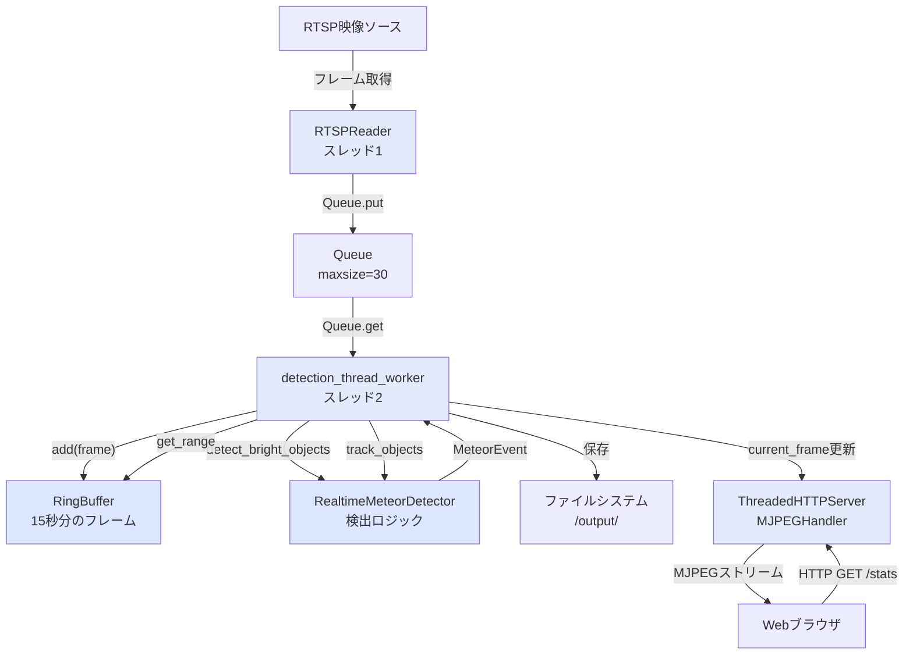
```mermaid
graph TB
    RTSP["RTSP映像ソース"]
    Reader["RTSPReader<br/>スレッド1"]
    Queue["Queue<br/>maxsize=30"]
    DetectionWorker["detection_thread_worker<br/>スレッド2"]
    RingBuffer["RingBuffer<br/>15秒分のフレーム"]
    Detector["RealtimeMeteorDetector<br/>検出ロジック"]
    Storage["ファイルシステム<br/>/output/"]
    WebServer["ThreadedHTTPServer<br/>MJPEGHandler"]
    Browser["Webブラウザ"]

    RTSP -->|"フレーム取得"| Reader
    Reader -->|"Queue.put"| Queue
    Queue -->|"Queue.get"| DetectionWorker
    DetectionWorker -->|"add(frame)"| RingBuffer
    DetectionWorker -->|"detect_bright_objects"| Detector
    DetectionWorker -->|"track_objects"| Detector
    Detector -->|"MeteorEvent"| DetectionWorker
    DetectionWorker -->|"get_range"| RingBuffer
    DetectionWorker -->|"保存"| Storage
    DetectionWorker -->|"current_frame更新"| WebServer
    WebServer -->|"MJPEGストリーム"| Browser
    Browser -->|"HTTP GET /stats"| WebServer

    style Reader fill:#e2eafc
    style DetectionWorker fill:#e2eafc
    style WebServer fill:#e2eafc
    style Detector fill:#dce6ff
    style RingBuffer fill:#dce6ff
```

## コアコンポーネント

### 1. RTSPReader

**責務**: RTSPストリームからフレームを読み込み、キューに供給する

#### クラス定義

```python
class RTSPReader:
    def __init__(self, url: str, reconnect_delay: float = 5.0, log_detail: bool = False)
    def start(self) -> RTSPReader
    def stop(self)
    def _read_loop(self)  # 内部スレッド
```

#### 状態管理

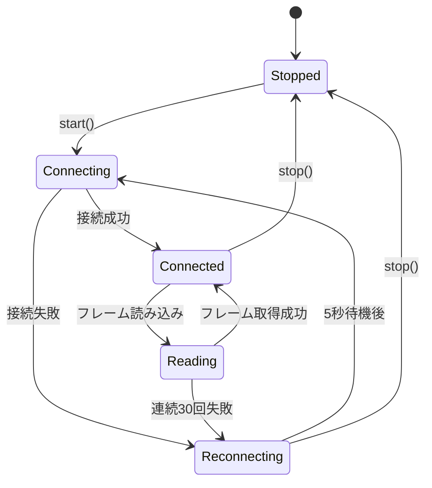
```mermaid
stateDiagram-v2
    [*] --> Stopped
    Stopped --> Connecting: start()
    Connecting --> Connected: 接続成功
    Connecting --> Reconnecting: 接続失敗
    Connected --> Reading: フレーム読み込み
    Reading --> Connected: フレーム取得成功
    Reading --> Reconnecting: 連続30回失敗
    Reconnecting --> Connecting: 5秒待機後
    Connected --> Stopped: stop()
    Reconnecting --> Stopped: stop()
```

#### 主要メソッド

| メソッド | 説明 | 戻り値 |
|---------|------|--------|
| `start()` | RTSPリーダースレッドを起動 | `self` |
| `stop()` | スレッドを停止 | なし |
| `_read_loop()` | 内部ループ（別スレッド） | なし |

#### プロパティ

| プロパティ | 型 | 説明 |
|-----------|-----|------|
| `queue` | `Queue[Tuple[float, np.ndarray]]` | フレームキュー（最大30フレーム） |
| `stopped` | `Event` | 停止フラグ |
| `connected` | `Event` | 接続状態フラグ |
| `fps` | `float` | ストリームのFPS |
| `width`, `height` | `int` | フレーム解像度 |

#### シーケンス図

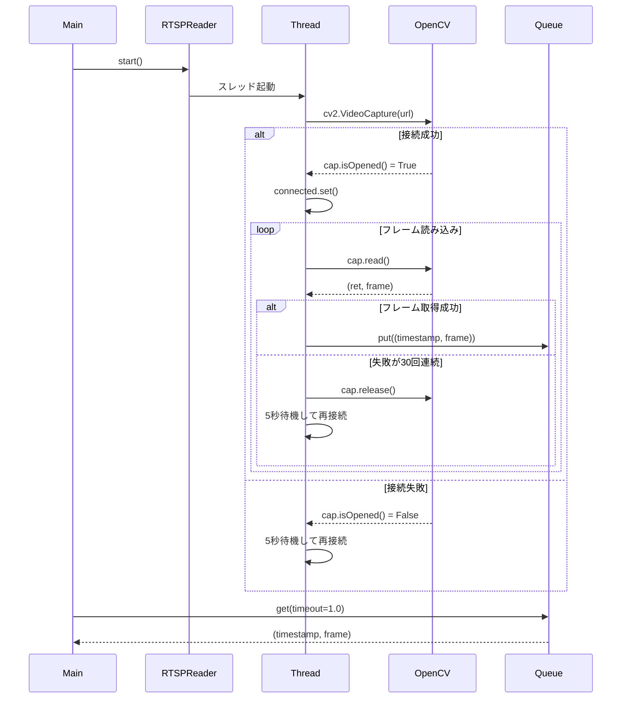
```mermaid
sequenceDiagram
    participant Main
    participant RTSPReader
    participant Thread
    participant OpenCV
    participant Queue

    Main->>RTSPReader: start()
    RTSPReader->>Thread: スレッド起動
    Thread->>OpenCV: cv2.VideoCapture(url)

    alt 接続成功
        OpenCV-->>Thread: cap.isOpened() = True
        Thread->>Thread: connected.set()
        loop フレーム読み込み
            Thread->>OpenCV: cap.read()
            OpenCV-->>Thread: (ret, frame)
            alt フレーム取得成功
                Thread->>Queue: put((timestamp, frame))
            else 失敗が30回連続
                Thread->>OpenCV: cap.release()
                Thread->>Thread: 5秒待機して再接続
            end
        end
    else 接続失敗
        OpenCV-->>Thread: cap.isOpened() = False
        Thread->>Thread: 5秒待機して再接続
    end

    Main->>Queue: get(timeout=1.0)
    Queue-->>Main: (timestamp, frame)
```

---

### 2. RingBuffer

**責務**: 過去N秒分のフレームをメモリに保持し、流星検出時に前後のフレームを提供

#### クラス定義

```python
class RingBuffer:
    def __init__(self, max_seconds: float, fps: float = 30)
    def add(self, timestamp: float, frame: np.ndarray)
    def get_range(self, start_time: float, end_time: float) -> List[Tuple[float, np.ndarray]]
```

#### データ構造

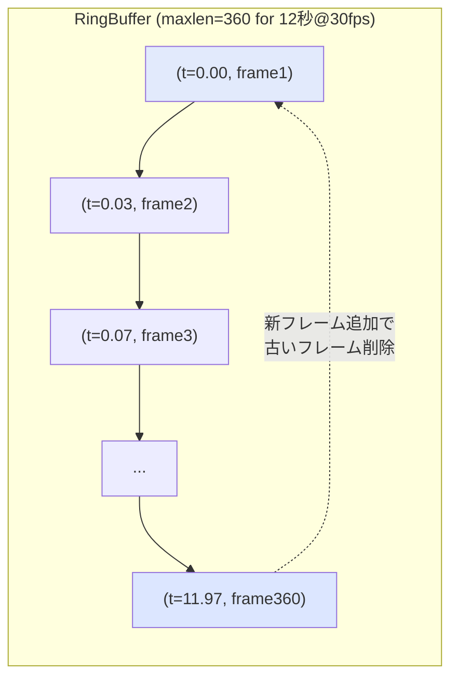
```mermaid
graph LR
    subgraph "RingBuffer (maxlen=360 for 12秒@30fps)"
        F1["(t=0.00, frame1)"]
        F2["(t=0.03, frame2)"]
        F3["(t=0.07, frame3)"]
        Dots["..."]
        F360["(t=11.97, frame360)"]
    end

    F1 --> F2
    F2 --> F3
    F3 --> Dots
    Dots --> F360
    F360 -.->|"新フレーム追加で<br/>古いフレーム削除"| F1

    style F1 fill:#e2eafc
    style F360 fill:#dce6ff
```

#### メソッド

| メソッド | 説明 | 戻り値 |
|---------|------|--------|
| `add(timestamp, frame)` | フレームを追加（スレッドセーフ） | なし |
| `get_range(start, end)` | 指定時間範囲のフレームを取得 | `List[Tuple[float, np.ndarray]]` |

#### 使用例

```python
# 初期化（12秒、30fps = 最大360フレーム）
ring_buffer = RingBuffer(max_seconds=12.0, fps=30.0)

# フレーム追加
ring_buffer.add(timestamp=0.0, frame=frame1)
ring_buffer.add(timestamp=0.033, frame=frame2)

# 流星検出時: 検出時刻の前後1秒を取得
event_frames = ring_buffer.get_range(
    start_time=event.start_time - 1.0,
    end_time=event.end_time + 1.0
)
```

RTSP Web版では `buffer_seconds` が `max_duration + 2.0` 秒を上限に自動調整されます。

---

### 3. RealtimeMeteorDetector

**責務**: フレームから明るい移動物体を検出し、流星かどうか判定する

#### クラス定義

```python
class RealtimeMeteorDetector:
    def __init__(
        self,
        params: DetectionParams,
        fps: float = 30,
        exclusion_mask: Optional[np.ndarray] = None,
        nuisance_mask: Optional[np.ndarray] = None,
    )
    def detect_bright_objects(self, frame, prev_frame) -> List[dict]
    def track_objects(self, objects, timestamp) -> List[MeteorEvent]
    def finalize_all(self) -> List[MeteorEvent]
    def update_exclusion_mask(self, new_mask: Optional[np.ndarray]) -> None
    def update_nuisance_mask(self, new_mask: Optional[np.ndarray]) -> None
```

#### 検出アルゴリズムフロー

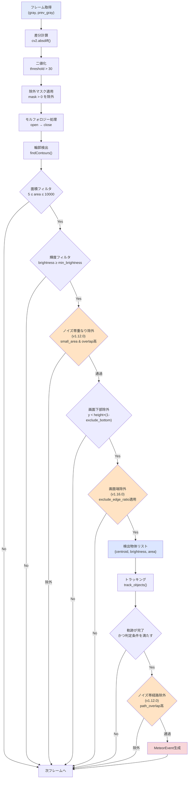
```mermaid
flowchart TD
    Start["フレーム取得<br/>(gray, prev_gray)"]
    Diff["差分計算<br/>cv2.absdiff()"]
    Thresh["二値化<br/>threshold > 30"]
    Mask["除外マスク適用<br/>mask > 0 を除外"]
    Morph["モルフォロジー処理<br/>open → close"]
    Contours["輪郭検出<br/>findContours()"]

    Filter1{"面積フィルタ<br/>5 ≤ area ≤ 10000"}
    Filter2{"輝度フィルタ<br/>brightness ≥ min_brightness"}
    Filter2b{"ノイズ帯重なり除外<br/>(v1.12.0)<br/>small_area & overlap高"}
    Filter3{"画面下部除外<br/>y < height×(1-exclude_bottom)"}
    Filter4{"画面端除外<br/>(v1.16.0)<br/>exclude_edge_ratio適用"}

    Objects["検出物体リスト<br/>{centroid, brightness, area}"]
    Track["トラッキング<br/>track_objects()"]

    Decision{"軌跡が完了<br/>かつ判定条件を満たす"}
    NuisanceCheck{"ノイズ帯経路除外<br/>(v1.12.0)<br/>path_overlap高"}
    Meteor["MeteorEvent生成"]
    End["次フレームへ"]

    Start --> Diff
    Diff --> Thresh
    Thresh --> Mask
    Mask --> Morph
    Morph --> Contours
    Contours --> Filter1
    Filter1 -->|"No"| End
    Filter1 -->|"Yes"| Filter2
    Filter2 -->|"No"| End
    Filter2 -->|"Yes"| Filter2b
    Filter2b -->|"除外"| End
    Filter2b -->|"通過"| Filter3
    Filter3 -->|"No"| End
    Filter3 -->|"Yes"| Filter4
    Filter4 -->|"No"| End
    Filter4 -->|"Yes"| Objects
    Objects --> Track
    Track --> Decision
    Decision -->|"No"| End
    Decision -->|"Yes"| NuisanceCheck
    NuisanceCheck -->|"除外"| End
    NuisanceCheck -->|"通過"| Meteor
    Meteor --> End

    style Start fill:#e2eafc
    style Meteor fill:#f8d7da
    style Objects fill:#dce6ff
    style Filter2b fill:#ffe3c4
    style Filter4 fill:#ffe3c4
    style NuisanceCheck fill:#ffe3c4
```

#### トラッキング状態管理

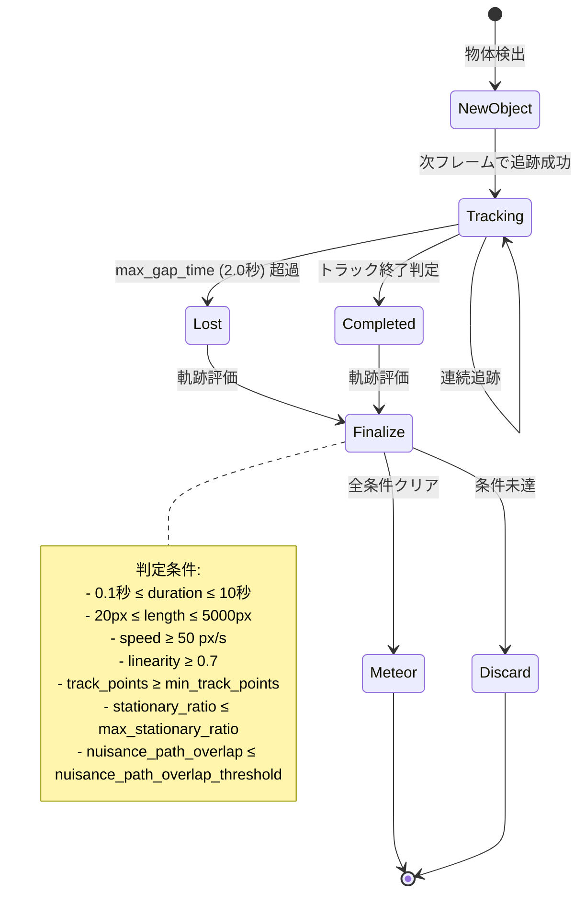
```mermaid
stateDiagram-v2
    [*] --> NewObject: 物体検出
    NewObject --> Tracking: 次フレームで追跡成功
    Tracking --> Tracking: 連続追跡
    Tracking --> Lost: max_gap_time (2.0秒) 超過
    Tracking --> Completed: トラック終了判定
    Lost --> Finalize: 軌跡評価
    Completed --> Finalize: 軌跡評価

    Finalize --> Meteor: 全条件クリア
    Finalize --> Discard: 条件未達

    Meteor --> [*]
    Discard --> [*]

    note right of Finalize
        判定条件:
        - 0.1秒 ≤ duration ≤ 10秒
        - 20px ≤ length ≤ 5000px
        - speed ≥ 50 px/s
        - linearity ≥ 0.7
        - track_points ≥ min_track_points
        - stationary_ratio ≤ max_stationary_ratio
        - nuisance_path_overlap ≤ nuisance_path_overlap_threshold
    end note
```

#### 検出パラメータ (DetectionParams)

| パラメータ | デフォルト値 | 説明 | 導入バージョン |
|-----------|------------|------|--------------|
| `diff_threshold` | 30 | 差分閾値 | v1.0.0 |
| `min_brightness` | 200 | 最小輝度 | v1.0.0 |
| `min_brightness_tracking` | min_brightness | 追跡時の最小輝度 | v1.0.0 |
| `min_length` | 20 px | 最小軌跡長 | v1.0.0 |
| `max_length` | 5000 px | 最大軌跡長 | v1.0.0 |
| `min_duration` | 0.1 秒 | 最小継続時間 | v1.0.0 |
| `max_duration` | 10.0 秒 | 最大継続時間 | v1.0.0 |
| `min_speed` | 50.0 px/s | 最小速度 | v1.0.0 |
| `min_linearity` | 0.7 | 最小直線性 (0-1) | v1.0.0 |
| `min_area` | 5 px² | 最小面積 | v1.0.0 |
| `max_area` | 10000 px² | 最大面積 | v1.0.0 |
| `max_gap_time` | 2.0 秒 | 最大トラッキング間隔 | v1.0.0 |
| `max_distance` | 80 px | 最大移動距離 | v1.0.0 |
| `merge_max_gap_time` | 1.5 秒 | イベント結合の最大間隔 | v1.0.0 |
| `merge_max_distance` | 80 px | イベント結合の最大距離 | v1.0.0 |
| `merge_max_speed_ratio` | 0.5 | イベント結合の最大速度比 | v1.0.0 |
| `exclude_bottom_ratio` | 1/16 | 画面下部除外率 | v1.0.0 |
| `nuisance_overlap_threshold` | 0.60 | ノイズ帯重なり閾値（候補段階） | v1.12.0 |
| `nuisance_path_overlap_threshold` | 0.70 | ノイズ帯経路重なり閾値（トラック確定時） | v1.12.0 |
| `min_track_points` | 4 | 最小追跡点数 | v1.12.0 |
| `max_stationary_ratio` | 0.40 | 静止率上限（停滞物体除外） | v1.12.0 |
| `small_area_threshold` | 40 | 小領域判定閾値（px²） | v1.12.0 |
| `clip_margin_before` | 1.0 秒 | 録画開始マージン（イベント前） | v1.14.0 |
| `clip_margin_after` | 1.0 秒 | 録画終了マージン（イベント後） | v1.14.0 |
| `exclude_edge_ratio` | 0.0 | 画面端除外率（0.0-0.5、0=無効） | v1.16.0 |

#### 除外マスク（固定カメラ向け）

- 事前生成済みマスク（`MASK_IMAGE`）がある場合は優先して適用
- `MASK_FROM_DAY` が設定されている場合は、昼間画像からマスクを生成
- ダッシュボードの「マスク更新」ボタンで現在フレームから再生成（永続化）

#### ノイズ帯マスク（電線・部分照明対策）(v1.12.0)

- `nuisance_mask` は除外マスクとは別の誤検出抑制マスク
- **目的**: 電線、街灯、部分照明など、静止しているが明滅する物体による誤検出を抑制
- **設定方法**:
  - `nuisance_mask_image`: 手動マスク画像パス
  - `nuisance_from_night`: 夜間基準画像から自動生成
- **自動生成アルゴリズム**:
  ```python
  # 1. Canny エッジ検出
  edges = cv2.Canny(reference_frame, 50, 150, apertureSize=3)

  # 2. HoughLinesP で直線検出（電線など）
  lines = cv2.HoughLinesP(edges, 1, np.pi/180, 50, minLineLength=30, maxLineGap=10)

  # 3. dilate で線を太くする（nuisance_dilate ピクセル）
  mask = cv2.dilate(line_mask, kernel, iterations=nuisance_dilate)
  ```

##### ノイズ帯除外の2段階フィルタリング

**1. 候補段階の除外** (`detect_bright_objects` 内)
- 小領域 (`area < small_area_threshold`) の候補のみ対象
- 候補バウンディングボックスとノイズ帯の重なり率を計算
- `nuisance_overlap_threshold` (デフォルト 0.60) を超える場合は候補を除外

```python
if area < params.small_area_threshold and nuisance_mask is not None:
    overlap_ratio = calculate_mask_overlap(bbox, nuisance_mask)
    if overlap_ratio > params.nuisance_overlap_threshold:
        continue  # 候補として採用しない
```

**2. トラック確定時の除外** (`track_objects` 内)
- 確定したトラックの全経路とノイズ帯の重なり率を計算
- `nuisance_path_overlap_threshold` (デフォルト 0.70) を超える場合はイベント除外
- 追加条件も評価:
  - `min_track_points`: 最小追跡点数（デフォルト 4点）
  - `max_stationary_ratio`: 停滞物体の除外（デフォルト 0.40）

```python
# トラック経路とノイズ帯の重なり計算
path_overlap = calculate_path_overlap(track.positions, nuisance_mask)

if path_overlap > params.nuisance_path_overlap_threshold:
    # 流星イベントとして採用しない
    continue
```

##### 関連パラメータ

| パラメータ | 用途 | デフォルト値 |
|-----------|------|------------|
| `nuisance_overlap_threshold` | 候補段階の重なり閾値 | 0.60 |
| `nuisance_path_overlap_threshold` | トラック確定時の経路重なり閾値 | 0.70 |
| `small_area_threshold` | 小領域判定の面積閾値（px²） | 40 |
| `min_track_points` | 最小追跡点数 | 4 |
| `max_stationary_ratio` | 停滞物体の除外閾値 | 0.40 |
| `nuisance_dilate` | マスク膨張イテレーション数 | 3 |

#### 感度プリセット

| プリセット | diff_threshold | min_brightness | 用途 |
|-----------|----------------|----------------|------|
| `low` | 40 | 220 | 明るい流星のみ |
| `medium` (デフォルト) | 30 | 200 | バランス型 |
| `high` | 20 | 180 | 暗い流星も検出 |
| `faint` | 16 | 150 | 短く暗い流星の取りこぼし低減 |
| `fireball` | 15 | 150 | 火球専用（長時間OK） |

追跡中は `min_brightness_tracking` を使用します。RTSP Webでは `faint` のみ `min_brightness` の80%に自動設定されるため、現行値では `120` になります。それ以外は `min_brightness` と同値です。

#### 信頼度計算

```python
def calculate_confidence(length, speed, linearity, brightness, duration) -> float:
    length_score = min(1.0, length / 100.0)         # 25%の重み
    speed_score = min(1.0, speed / 20.0)            # 20%の重み
    linearity_score = linearity                     # 25%の重み
    brightness_score = min(1.0, brightness / 255)   # 20%の重み
    duration_bonus = min(0.2, duration / 100.0 * 0.2)  # 最大20%のボーナス

    return min(1.0, length_score * 0.25 + speed_score * 0.2 +
               linearity_score * 0.25 + brightness_score * 0.2 + duration_bonus)
```

---

### 4. 共通ユーティリティ (meteor_detector_common.py)

RTSP/MP4検出で共通利用する補助関数群です。

- `calculate_linearity(xs, ys)`: 直線性の評価
- `calculate_confidence(...)`: 信頼度スコアの算出
- `open_video_writer(...)`: 利用可能なコーデックでVideoWriterを初期化

---

### 5. MeteorEvent

**責務**: 検出された流星イベントのデータクラス

#### クラス定義

```python
@dataclass
class MeteorEvent:
    timestamp: datetime          # 検出時刻
    start_time: float            # 開始時刻（相対）
    end_time: float              # 終了時刻（相対）
    start_point: Tuple[int, int] # 開始座標
    end_point: Tuple[int, int]   # 終了座標
    peak_brightness: float       # ピーク輝度
    confidence: float            # 信頼度 (0-1)
    frames: List[Tuple[float, np.ndarray]]  # フレームリスト
```

#### プロパティ

| プロパティ | 型 | 説明 |
|-----------|-----|------|
| `duration` | `float` | 継続時間（秒） |
| `length` | `float` | 軌跡長（ピクセル） |

#### JSON出力形式（to_dict）

`MeteorEvent.to_dict()` は**下記のフィールドのみ**を返します。`id` / `base_name` / `clip_path` / `image_path` / `composite_original_path` は `save_meteor_event()` 側で後付けされ、JSONL 行として書き出されます（実装: `meteor_detector_realtime.py:262-273` / `879-892`）。

```json
{
  "timestamp": "2026-02-02T06:55:33.411811",
  "start_time": 125.340,
  "end_time": 125.780,
  "duration": 0.440,
  "start_point": [320, 180],
  "end_point": [450, 220],
  "length_pixels": 135.6,
  "peak_brightness": 245.3,
  "confidence": 0.87
}
```

---

### 6. detection_thread_worker

**責務**: メイン検出ループを実行する（別スレッド）

#### 処理フロー

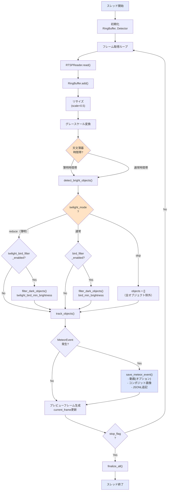
```mermaid
flowchart TD
    Start["スレッド開始"]
    Init["初期化<br/>RingBuffer, Detector"]

    Loop["フレーム取得ループ"]
    ReadFrame["RTSPReader.read()"]
    CheckTime{"天文薄暮<br/>時間帯?"}

    AddBuffer["RingBuffer.add()"]
    Resize["リサイズ<br/>(scale=0.5)"]
    Gray["グレースケール変換"]

    Detect["detect_bright_objects()"]
    CheckTwilightMode{"twilight_mode<br/>?"}
    SkipObjects["objects = []<br/>（全オブジェクト除外）"]
    CheckTwilightFilter{"twilight_bird_filter<br/>_enabled?"}
    FilterDarkTwilight["filter_dark_objects()<br/>twilight_bird_min_brightness"]
    CheckNormalFilter{"bird_filter<br/>_enabled?"}
    FilterDarkNormal["filter_dark_objects()<br/>bird_min_brightness"]
    Track["track_objects()"]

    CheckEvent{"MeteorEvent<br/>発生?"}
    SaveEvent["save_meteor_event()<br/>- 動画(オプション)<br/>- コンポジット画像<br/>- JSONL追記"]

    UpdatePreview["プレビューフレーム生成<br/>current_frame更新"]

    CheckStop{"stop_flag<br/>?"}
    Finalize["finalize_all()"]
    End["スレッド終了"]

    Start --> Init
    Init --> Loop
    Loop --> ReadFrame
    ReadFrame --> AddBuffer
    AddBuffer --> Resize
    Resize --> Gray
    Gray --> CheckTime

    CheckTime -->|"薄明時間帯"| Detect
    CheckTime -->|"通常時間帯"| Detect

    Detect --> CheckTwilightMode
    CheckTwilightMode -->|"skip"| SkipObjects
    CheckTwilightMode -->|"reduce（薄明）"| CheckTwilightFilter
    CheckTwilightMode -->|"通常"| CheckNormalFilter

    CheckTwilightFilter -->|"Yes"| FilterDarkTwilight
    CheckTwilightFilter -->|"No"| Track
    FilterDarkTwilight --> Track

    CheckNormalFilter -->|"Yes"| FilterDarkNormal
    CheckNormalFilter -->|"No"| Track
    FilterDarkNormal --> Track

    SkipObjects --> Track
    Track --> CheckEvent
    CheckEvent -->|"Yes"| SaveEvent
    CheckEvent -->|"No"| UpdatePreview
    SaveEvent --> UpdatePreview

    UpdatePreview --> CheckStop
    CheckStop -->|"No"| Loop
    CheckStop -->|"Yes"| Finalize
    Finalize --> End

    style Start fill:#e2eafc
    style SaveEvent fill:#dce6ff
    style CheckTime fill:#ffe3c4
    style CheckTwilightMode fill:#ffe3c4
    style End fill:#e2eafc
```

#### グローバル変数（Webサーバー連携用）

| 変数名 | 型 | 説明 |
|-------|-----|------|
| `current_frame` | `np.ndarray` | 現在のプレビューフレーム |
| `current_frame_lock` | `Lock` | フレーム更新用ロック |
| `detection_count` | `int` | 検出数カウンター |
| `last_frame_time` | `float` | 最終フレーム受信時刻 |
| `is_detecting_now` | `bool` | 検出処理中フラグ |
| `current_settings` | `dict` | 設定情報 |

---

### 7. MJPEGHandler (Webサーバー)

**責務**: HTTP経由でプレビューストリームと統計情報を提供

#### エンドポイント

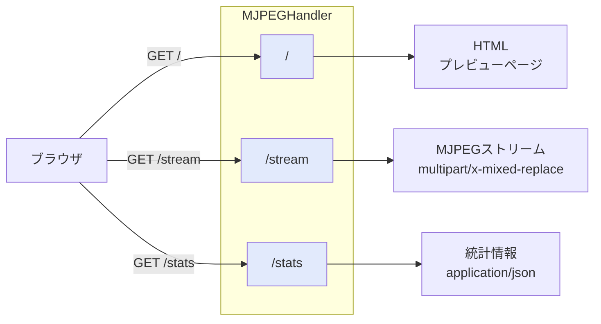
```mermaid
graph LR
    Browser["ブラウザ"]

    subgraph "MJPEGHandler"
        Root["/"]
        Stream["/stream"]
        Stats["/stats"]
    end

    HTML["HTML<br/>プレビューページ"]
    MJPEG["MJPEGストリーム<br/>multipart/x-mixed-replace"]
    JSON["統計情報<br/>application/json"]

    Browser -->|"GET /"| Root
    Root --> HTML

    Browser -->|"GET /stream"| Stream
    Stream --> MJPEG

    Browser -->|"GET /stats"| Stats
    Stats --> JSON

    style Root fill:#e2eafc
    style Stream fill:#e2eafc
    style Stats fill:#e2eafc
```

#### /stream 処理フロー

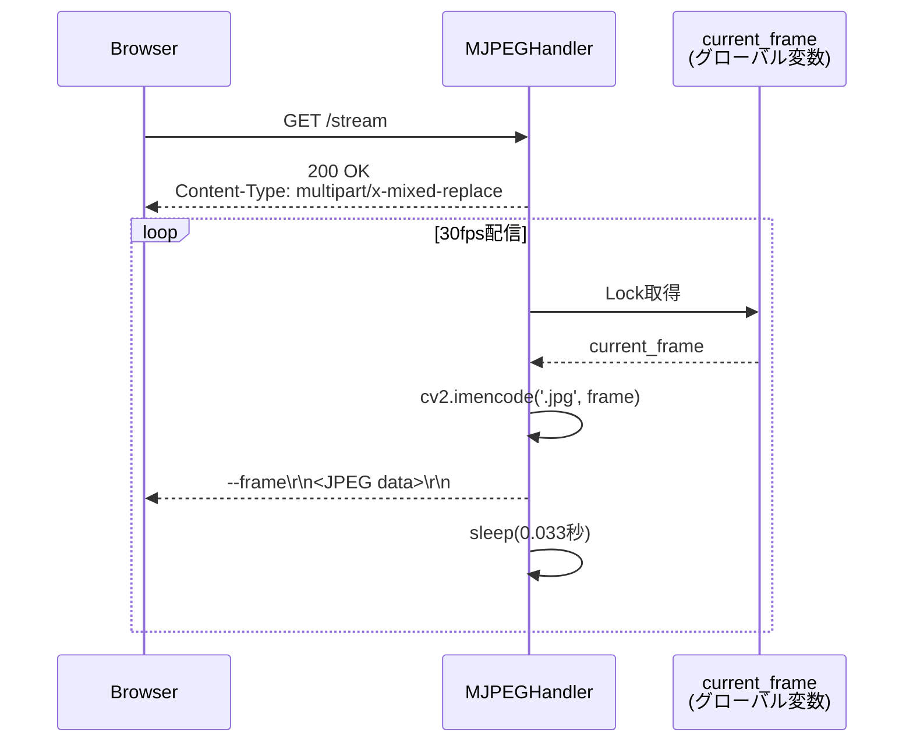
```mermaid
sequenceDiagram
    participant Browser
    participant MJPEGHandler
    participant GlobalFrame as current_frame<br/>(グローバル変数)

    Browser->>MJPEGHandler: GET /stream
    MJPEGHandler-->>Browser: 200 OK<br/>Content-Type: multipart/x-mixed-replace

    loop 30fps配信
        MJPEGHandler->>GlobalFrame: Lock取得
        GlobalFrame-->>MJPEGHandler: current_frame
        MJPEGHandler->>MJPEGHandler: cv2.imencode('.jpg', frame)
        MJPEGHandler-->>Browser: --frame\r\n<JPEG data>\r\n
        MJPEGHandler->>MJPEGHandler: sleep(0.033秒)
    end
```

#### /stats レスポンス

```json
{
  "detections": 5,
  "elapsed": 3600.5,
  "camera": "camera1",
  "settings": {
    "sensitivity": "medium",
    "scale": 0.5,
    "buffer": 15.0,
    "extract_clips": true,
    "exclude_bottom": 0.0625,
    "nuisance_overlap_threshold": 0.6,
    "nuisance_path_overlap_threshold": 0.7,
    "min_track_points": 4,
    "max_stationary_ratio": 0.4,
    "small_area_threshold": 40,
    "mask_image": "",
    "mask_from_day": "",
    "mask_dilate": 5,
    "nuisance_mask_image": "",
    "nuisance_from_night": "",
    "nuisance_dilate": 3,
    "clip_margin_before": 1.0,
    "clip_margin_after": 1.0
  },
  "runtime_fps": 19.83,
  "stream_alive": true,
  "time_since_last_frame": 0.03,
  "is_detecting": true,
  "detection_status": "DETECTING",
  "detection_window_enabled": true,
  "detection_window_active": true,
  "detection_window_start": "18:00:00",
  "detection_window_end": "05:00:00",
  "mask_active": true,
  "mask_update_pending": false,
  "recording": {
    "supported": true,
    "state": "idle",
    "start_at": "",
    "duration_sec": 0,
    "remaining_sec": 0,
    "output_path": "",
    "error": ""
  }
}
```

#### /apply_settings による運用時設定反映

- ダッシュボード設定ページまたはAPIから `POST /apply_settings` で反映可能
- 即時反映:
  - しきい値群、誤検出抑制パラメータ、マスク更新系
- 自動再起動で反映:
  - `sensitivity`, `scale`, `buffer`, `extract_clips`
- 起動時依存項目は `output/runtime_settings/<camera>.json` に保存され、再起動後も維持

---

### 8. detection_state.py — DetectionState dataclass（v3.6.2+）

検出ループと HTTP ハンドラが共有するグローバル状態を `DetectionState` という dataclass に集約したモジュールです。v3.6.2 の責務分割時に、旧実装のモジュールグローバル変数 60 個超をこの 1 クラスに束ねました。

#### 主要フィールド（抜粋）

| フィールド | 型 | 役割 |
|---|---|---|
| `current_frame` | `np.ndarray \| None` | プレビュー用の最新フレーム |
| `current_frame_lock` | `threading.Lock` | `current_frame` の読み書き排他 |
| `detection_count` | `int` | 当プロセスでの検出総数 |
| `camera_name` / `camera_display_name` | `str` | 内部名（v3.11 で `camera{i}`）と UI 表示名 |
| `current_detector` | `object` | `RealtimeMeteorDetector` インスタンス |
| `current_pending_exclusion_mask` | `np.ndarray \| None` | 保留中の除外マスク（確定待ち） |
| `current_recording_job` | `dict \| None` | 手動録画ジョブの状態 |
| `current_twilight_active` | `bool` | 現在が薄明期間内か |
| `current_settings` | `dict` | `/stats` 返却用の設定スナップショット |

#### シングルトンアクセス

```python
from detection_state import state

state.detection_count += 1
with state.current_frame_lock:
    frame = state.current_frame
```

#### 補助関数

- `_storage_camera_name(cam_name)`: 保存先に使う安全な識別子へ正規化（英数/ハイフン/アンダースコア以外を `_` に置換）
- `_runtime_override_paths(output_dir, cam_name)`: `runtime_settings/<camera>.json` の候補パスを返す（プライマリ + レガシー互換）
- `_load_runtime_overrides()` / `_save_runtime_overrides()`: ランタイム設定の JSON 読み書き（tmpfile 経由で原子的保存）

---

### 9. detection_filters.py — 感度プリセット・鳥フィルタ・薄明

検出ループから呼び出される純粋関数群で、設定値の変換と候補フィルタリングを担当します。

#### build_twilight_params(sensitivity, min_speed, base_params)

薄明期間中に差し替えるための `DetectionParams` を返す。`sensitivity`（`low` / `medium` / `high` / `faint`）と `min_speed` (px/s) を受け取り、base_params をコピーしてプリセット・最小速度のみ上書きします。

#### filter_dark_objects(objects, min_brightness)

`detect_bright_objects()` の結果リストから、`brightness` が `min_brightness` 未満のオブジェクトを除外します。鳥シルエット（逆光の黒い塊）を典型的なターゲットとして想定しています。

- 通常時: `BIRD_FILTER_ENABLED=true`（デフォルト OFF）で有効化。閾値は `BIRD_MIN_BRIGHTNESS` (デフォルト 80)
- 薄明時: `TWILIGHT_BIRD_FILTER_ENABLED=true`（デフォルト ON）で有効化。閾値は `TWILIGHT_BIRD_MIN_BRIGHTNESS` (デフォルト 80)

#### apply_sensitivity_preset(params, sensitivity)

`low` / `medium` / `high` / `faint` / `fireball` のプリセット値を `params` に上書きして返します。`meteor_detector_rtsp_web.py` の `main()` および設定反映 API から呼ばれます。

#### _to_bool(value, default)

環境変数の truthy 文字列（`1` / `true` / `yes` / `on` など）を bool に変換する内部ユーティリティ。空文字列や `None` は `default` に倒れます。

---

### 10. recording_manager.py — 手動録画ジョブ管理

v3.2.0 で導入された手動録画の内部実装を担当します。ffmpeg サブプロセスのライフサイクルを管理し、`detection_state.state.current_recording_job` を通じて状態を公開します。

#### 主要関数（すべて pragma: no cover — ffmpeg 実行を伴うためユニットテスト対象外）

- `_recordings_dir()`: 録画ファイルの保存ディレクトリを返す
- `_recording_supported()`: `ffmpeg` コマンドが利用可能か
- `_recording_snapshot_locked()`: `current_recording_job` を UI 用に整形して返す
- `_parse_recording_start_at(value)`: `POST /recording/schedule` の `start_at` を解析
- `_set_recording_job_state(job, job_state, *, error="")`: ジョブの状態遷移を記録
- `_stop_recording_process(job, *, reason)`: 実行中の ffmpeg を terminate → kill の順で停止
- `_recording_worker(job)`: スケジュール開始までの待機と ffmpeg 実行を行うワーカー

#### ffmpeg コマンド構成

実装上は `-re -rtsp_transport tcp -i {RTSP_URL} -t {duration_sec} -c copy -an {output_path}` を基本とし、RTSP 音声が pcm_alaw の場合は `-an` で音声を切り落として保存します（v3.2.1 での修正）。録画完了後は同名 JPEG サムネイルを自動生成します（v3.2.1+）。

---

### 11. http_handlers.py — MJPEGHandler と ThreadedHTTPServer

Python 標準 `http.server` ベースの HTTP ハンドラです。検出ループから独立した Web サーバースレッドで動作します。

#### クラス

- `MJPEGHandler(BaseHTTPRequestHandler)`: 全エンドポイント（`/` / `/stream` / `/snapshot` / `/mask` / `/stats` / `/recording/*` / `/update_mask` / `/confirm_mask_update` / `/discard_mask_update` / `/apply_settings` / `/restart`）を集約
- `ThreadedHTTPServer(ThreadingMixIn, HTTPServer)`: マルチクライアント対応の HTTP サーバー

#### マスク更新の 2 段階フロー

ダッシュボードから「マスク更新」を押した場合のフローは以下の通り。

1. `POST /update_mask` で現在フレームから生成した保留マスクを `state.current_pending_exclusion_mask` に保持
2. ユーザーがプレビューで確認
3. `POST /confirm_mask_update` で保留マスクを確定
   - `state.current_detector.update_exclusion_mask(new_mask)` で検出器に反映
   - `/output/masks/<camera>_mask.png` に永続化
   - `MASK_BUILD_DIR` 環境変数が設定されていれば、`_write_mask_to_build_dir()` でホスト側 `masks/` にも同期書き込み（v3.10.0+）

`_write_mask_to_build_dir()` ではパストラバーサル対策として、保存先パスを `Path.resolve()` で正規化し、`MASK_BUILD_DIR` 配下に収まっていることを確認しています（[SECURITY.md 参照](SECURITY.md)）。

#### STREAM_JPEG_QUALITY / STREAM_MAX_FPS

MJPEG ストリームの帯域・CPU 消費を抑えるための環境変数:

| 変数 | デフォルト | 範囲 | 用途 |
|---|---|---|---|
| `STREAM_JPEG_QUALITY` | `60` | `30` ～ `95` | JPEG エンコード品質 |
| `STREAM_MAX_FPS` | `12` | `1.0` ～ `30.0` | ストリーム配信上限 FPS |

---

### 12. astro_twilight_utils.py — 薄明期間判定（v3.5.0+）

`astro_utils.py`（検出ウィンドウ = 日没〜日出）とは別の独立モジュールで、夕方薄明（sunset → dusk）と朝方薄明（dawn → sunrise）の 2 区間を計算します。

#### get_twilight_window(target_date, latitude, longitude, timezone, twilight_type="nautical")

指定日の薄明期間を `((evening_start, evening_end), (morning_start, morning_end))` の 2 組の datetime タプルで返します。`twilight_type` は `civil` (6°) / `nautical` (12°) / `astronomical` (18°) のいずれか。無効値は `ValueError`。

#### is_twilight_active(latitude, longitude, timezone, twilight_type="nautical")

現在時刻が薄明期間内かを判定する真偽値を返します。深夜跨ぎを考慮して前日分の朝方薄明もチェックします。詳細は [ASTRO_UTILS.md](ASTRO_UTILS.md) の「astro_twilight_utils.py」節を参照。

---

## データフロー全体像

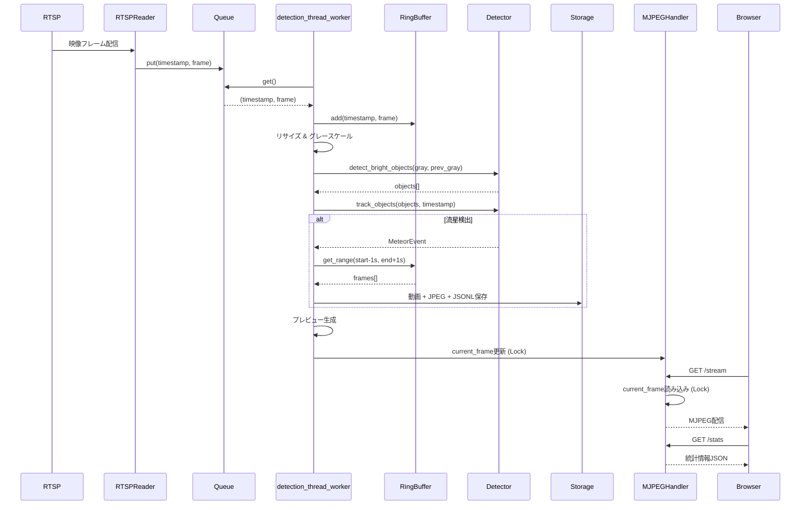
```mermaid
sequenceDiagram
    participant RTSP
    participant RTSPReader
    participant Queue
    participant Worker as detection_thread_worker
    participant Buffer as RingBuffer
    participant Detector
    participant Storage
    participant Web as MJPEGHandler
    participant Browser

    RTSP->>RTSPReader: 映像フレーム配信
    RTSPReader->>Queue: put(timestamp, frame)

    Worker->>Queue: get()
    Queue-->>Worker: (timestamp, frame)

    Worker->>Buffer: add(timestamp, frame)

    Worker->>Worker: リサイズ & グレースケール

    Worker->>Detector: detect_bright_objects(gray, prev_gray)
    Detector-->>Worker: objects[]

    Worker->>Detector: track_objects(objects, timestamp)

    alt 流星検出
        Detector-->>Worker: MeteorEvent
        Worker->>Buffer: get_range(start-1s, end+1s)
        Buffer-->>Worker: frames[]
        Worker->>Storage: 動画 + JPEG + JSONL保存
    end

    Worker->>Worker: プレビュー生成
    Worker->>Web: current_frame更新 (Lock)

    Browser->>Web: GET /stream
    Web->>Web: current_frame読み込み (Lock)
    Web-->>Browser: MJPEG配信

    Browser->>Web: GET /stats
    Web-->>Browser: 統計情報JSON
```

---

## 保存処理 (save_meteor_event)

### 保存ファイル構成

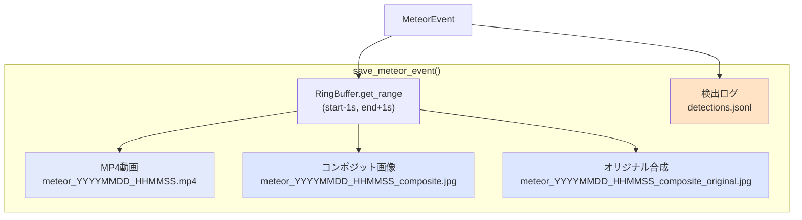
```mermaid
graph TD
    Event["MeteorEvent"]

    subgraph "save_meteor_event()"
        GetFrames["RingBuffer.get_range<br/>(start-1s, end+1s)"]

        Video["MP4動画<br/>meteor_YYYYMMDD_HHMMSS.mp4"]
        Composite["コンポジット画像<br/>meteor_YYYYMMDD_HHMMSS_composite.jpg"]
        Original["オリジナル合成<br/>meteor_YYYYMMDD_HHMMSS_composite_original.jpg"]
        JSONL["検出ログ<br/>detections.jsonl"]
    end

    Event --> GetFrames
    GetFrames --> Video
    GetFrames --> Composite
    GetFrames --> Original
    Event --> JSONL

    style Video fill:#e2eafc
    style Composite fill:#dce6ff
    style Original fill:#dce6ff
    style JSONL fill:#ffe3c4
```

### コンポジット画像生成アルゴリズム

```python
# イベント期間中の全フレームの最大値合成
composite = event_frames[0][1].astype(np.float32)
for _, frame in event_frames[1:]:
    composite = np.maximum(composite, frame.astype(np.float32))
composite = np.clip(composite, 0, 255).astype(np.uint8)

# 軌跡をマーキング
cv2.line(composite, start_point, end_point, (0, 255, 255), 2)
cv2.circle(composite, start_point, 6, (0, 255, 0), 2)  # 開始点（緑）
cv2.circle(composite, end_point, 6, (0, 0, 255), 2)    # 終了点（赤）
```

---

## 環境変数による設定

全一覧は [CONFIGURATION_GUIDE.md](CONFIGURATION_GUIDE.md) を参照してください。ここでは検出エンジンが読み取る代表的な環境変数のみ記載します。

### 基本

| 環境変数 | デフォルト値 | 説明 |
|---------|------------|------|
| `CAMERA_NAME` | `camera` | カメラ内部名（v3.11.0+ は `camera{i}` 固定） |
| `CAMERA_NAME_DISPLAY` | `""` | UI 表示名（ディレクトリ名には使われない） |
| `SENSITIVITY` | `medium` | 感度プリセット（`detection_filters.apply_sensitivity_preset`） |
| `SCALE` | `0.5` | 処理スケール |
| `BUFFER` | `15` | リングバッファ秒数 |
| `EXTRACT_CLIPS` | `true` | クリップ動画保存の有効化 |
| `RTSP_LOG_DETAIL` | `true` | RTSP 接続の詳細ログ出力 (v3.1.1+) |

### 検出ウィンドウ・薄明（v3.5.0+）

| 環境変数 | デフォルト値 | 関連モジュール |
|---------|------------|---|
| `ENABLE_TIME_WINDOW` | `false` | `astro_utils.is_detection_active` |
| `LATITUDE` | `35.3606` | `astro_utils` / `astro_twilight_utils` |
| `LONGITUDE` | `138.7274` | 同上 |
| `TIMEZONE` | `Asia/Tokyo` | 同上 |
| `TWILIGHT_DETECTION_MODE` | `reduce` | `detection_thread_worker`。`reduce` / `skip` |
| `TWILIGHT_TYPE` | `nautical` | `astro_twilight_utils.get_twilight_window` |
| `TWILIGHT_SENSITIVITY` | `low` | `detection_filters.build_twilight_params` |
| `TWILIGHT_MIN_SPEED` | `200` | 同上 (px/s) |

### 鳥シルエット除外（v3.5.0/v3.6.1）

| 環境変数 | デフォルト値 | 関連関数 |
|---------|------------|---|
| `BIRD_FILTER_ENABLED` | `false` | `detection_filters.filter_dark_objects`（通常時 opt-in） |
| `BIRD_MIN_BRIGHTNESS` | `80` | 同上の閾値 |
| `TWILIGHT_BIRD_FILTER_ENABLED` | `true` | 薄明時 opt-out |
| `TWILIGHT_BIRD_MIN_BRIGHTNESS` | `80` | 同上の閾値 |

### MJPEG ストリーム（http_handlers.py）

| 環境変数 | デフォルト値 | 用途 |
|---------|------------|---|
| `STREAM_JPEG_QUALITY` | `60` | `/stream` の JPEG 品質（30-95） |
| `STREAM_MAX_FPS` | `12` | `/stream` の最大 FPS（1.0-30.0） |
| `MASK_BUILD_DIR` | 自動設定 | ホスト側 `./masks/` のコンテナ内マウントパス（`/confirm_mask_update` で同期書き込みに使用。v3.10.0+） |

---

## スレッド構成とロック

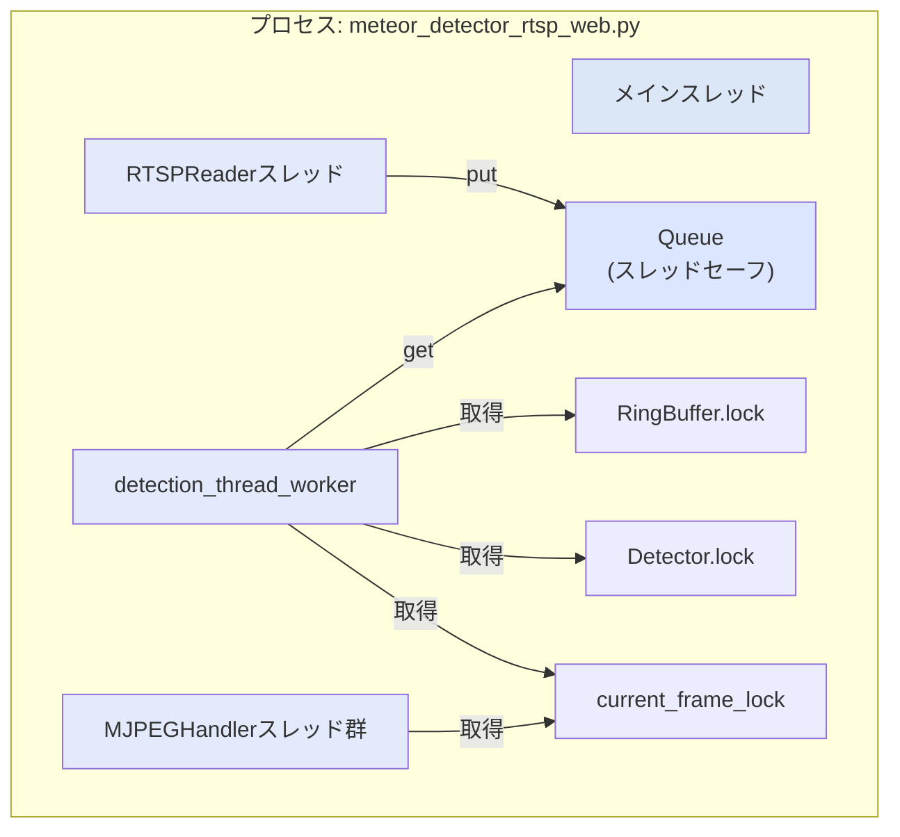
```mermaid
graph TB
    subgraph "プロセス: meteor_detector_rtsp_web.py"
        Main["メインスレッド"]
        Thread1["RTSPReaderスレッド"]
        Thread2["detection_thread_worker"]
        Thread3["MJPEGHandlerスレッド群"]

        Queue["Queue<br/>(スレッドセーフ)"]
        BufferLock["RingBuffer.lock"]
        DetectorLock["Detector.lock"]
        FrameLock["current_frame_lock"]

        Thread1 -->|"put"| Queue
        Thread2 -->|"get"| Queue
        Thread2 -->|"取得"| BufferLock
        Thread2 -->|"取得"| DetectorLock
        Thread2 -->|"取得"| FrameLock
        Thread3 -->|"取得"| FrameLock
    end

    style Main fill:#dbe7f6
    style Thread1 fill:#e2eafc
    style Thread2 fill:#e2eafc
    style Thread3 fill:#e2eafc
    style Queue fill:#dce6ff
```

### ロック戦略

| ロック | 保護対象 | 取得スレッド |
|-------|---------|------------|
| `RingBuffer.lock` | `buffer: deque` | detection_thread_worker |
| `Detector.lock` | `active_tracks: dict` | detection_thread_worker |
| `current_frame_lock` | `current_frame: np.ndarray` | detection_thread_worker, MJPEGHandler |
| Queue内部ロック | キューの操作 | RTSPReader, detection_thread_worker |

---

## パフォーマンス最適化

### 1. 処理スケール調整

```python
# フレームを0.5倍にリサイズして処理負荷を削減
process_scale = 0.5  # デフォルト
proc_frame = cv2.resize(frame, (width*0.5, height*0.5), interpolation=cv2.INTER_AREA)

# 検出座標は元のスケールに戻す
for obj in objects:
    cx, cy = obj["centroid"]
    obj["centroid"] = (int(cx / process_scale), int(cy / process_scale))
```

### 2. キューサイズ制限

```python
# 最大30フレーム保持（約1秒分 @ 30fps）
self.queue = Queue(maxsize=30)

# キューが満杯の場合は古いフレームを削除
if self.queue.full():
    self.queue.get_nowait()
self.queue.put((timestamp, frame))
```

### 3. モルフォロジー処理

```python
# ノイズ除去と輪郭のスムージング
kernel = cv2.getStructuringElement(cv2.MORPH_ELLIPSE, (3, 3))
thresh = cv2.morphologyEx(thresh, cv2.MORPH_OPEN, kernel)   # 小さなノイズ除去
thresh = cv2.morphologyEx(thresh, cv2.MORPH_CLOSE, kernel)  # 小さな穴を埋める
```

---

## エラーハンドリング

### RTSP接続エラー

```python
# 自動再接続メカニズム
while not self.stopped.is_set():
    cap = cv2.VideoCapture(self.url)
    if not cap.isOpened():
        print(f"接続失敗: {self.url}")
        time.sleep(self.reconnect_delay)  # 5秒待機
        continue
    # ... 正常処理 ...
```

### フレーム読み込みエラー

```python
consecutive_failures = 0
while not self.stopped.is_set():
    ret, frame = cap.read()
    if not ret:
        consecutive_failures += 1
        if consecutive_failures > 30:  # 30回連続失敗で再接続
            break
        time.sleep(0.01)
        continue
    consecutive_failures = 0  # リセット
```

---

## テスト・デバッグ

### ログ出力

```python
# 1分ごとの稼働状況
if frame_count % (int(fps) * 60) == 0:
    elapsed = time.time() - start_time_global
    print(f"[{datetime.now().strftime('%H:%M:%S')}] 稼働: {elapsed/60:.1f}分, 検出: {detection_count}個")

# 流星検出時
print(f"\n[{event.timestamp.strftime('%H:%M:%S')}] 流星検出 #{detection_count}")
print(f"  長さ: {event.length:.1f}px, 時間: {event.duration:.2f}秒")
```

### プレビュー表示（検出状態の可視化）

- **緑丸**: 検出中の明るい物体
- **黄線**: 追跡中の軌跡
- **赤表示**: 流星検出完了

---

## 関連ファイル

- `astro_utils.py`: 天文薄暮期間の判定関数 `is_detection_active()`
- `DetectionParams`: 検出パラメータのデータクラス
- `docker-compose.yml`: コンテナ設定（環境変数、ポート、ボリューム）
