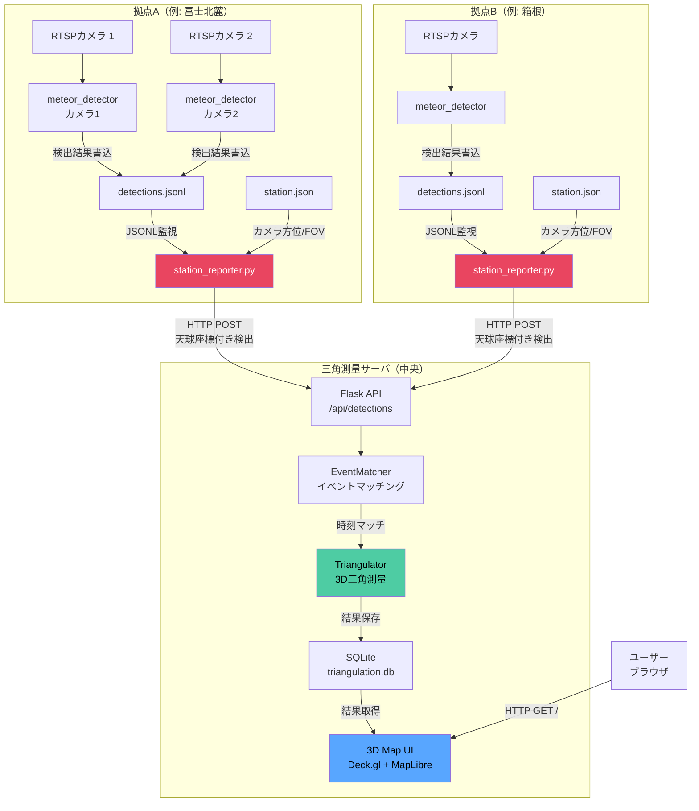
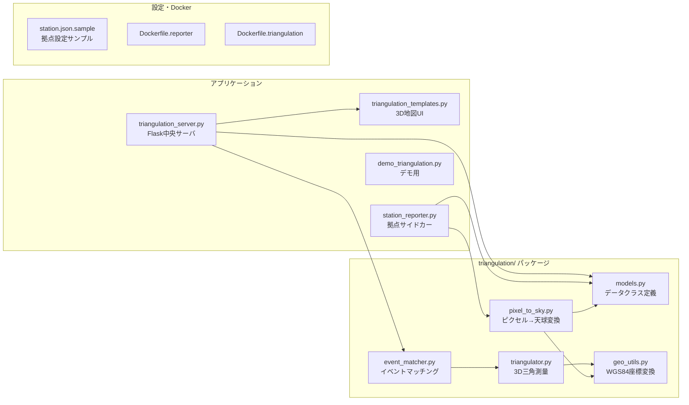
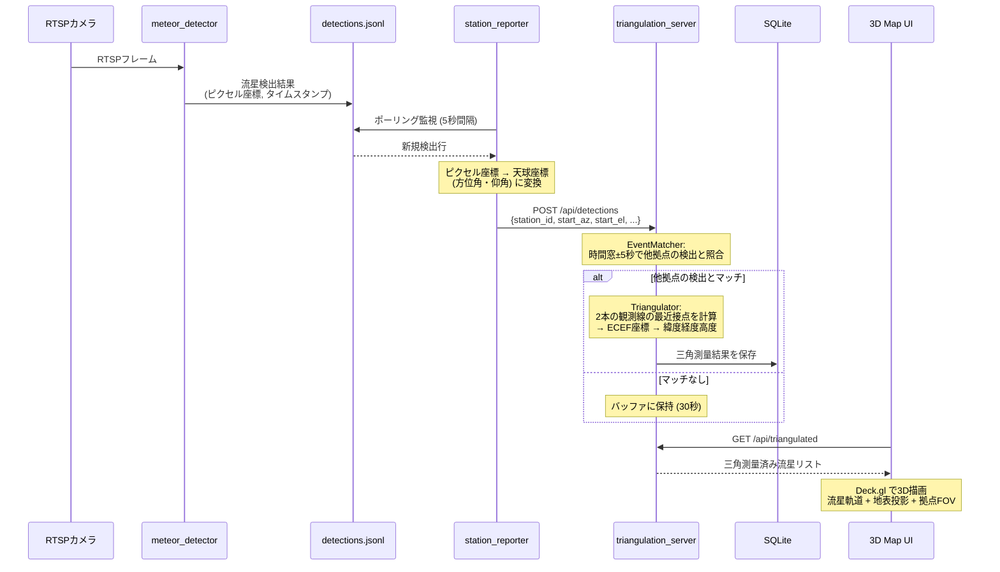
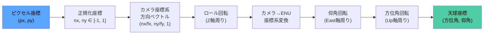
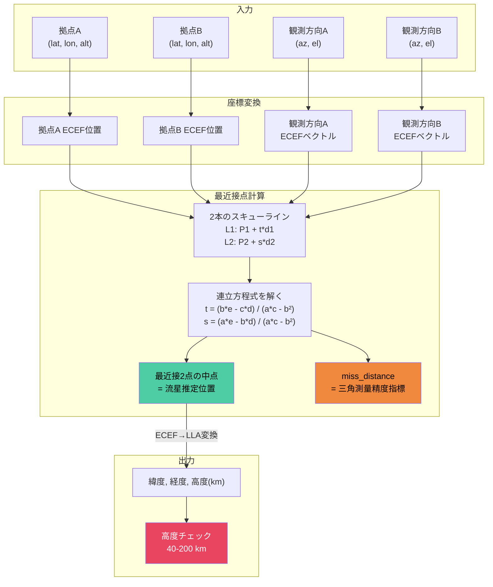
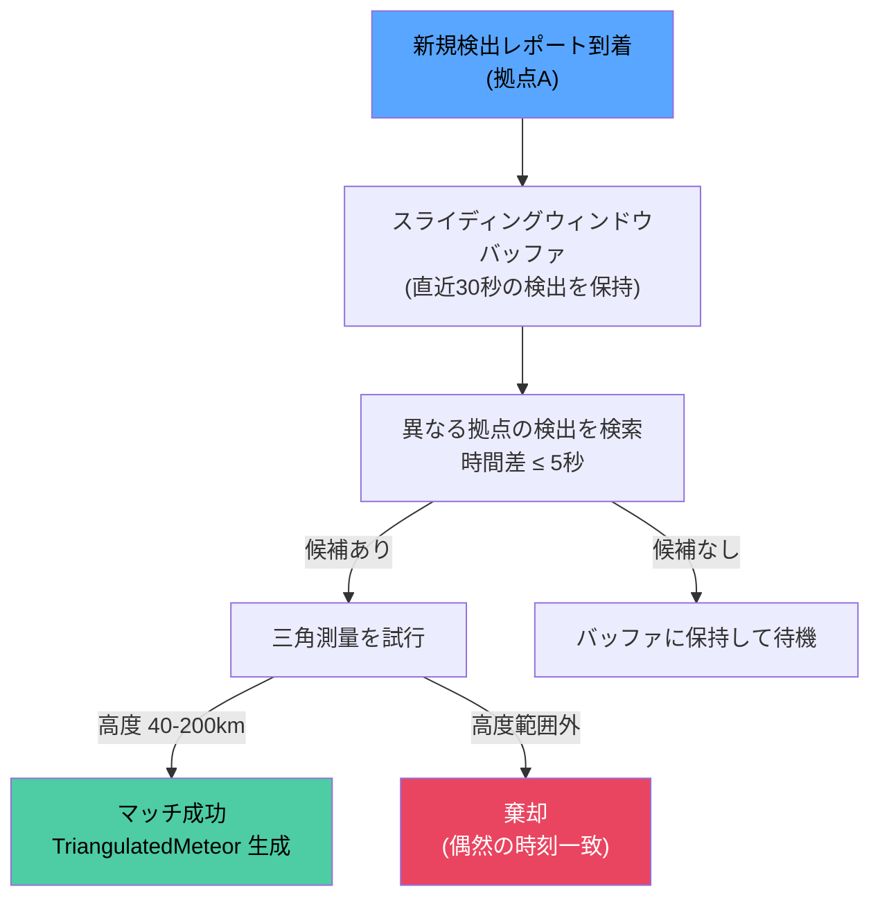
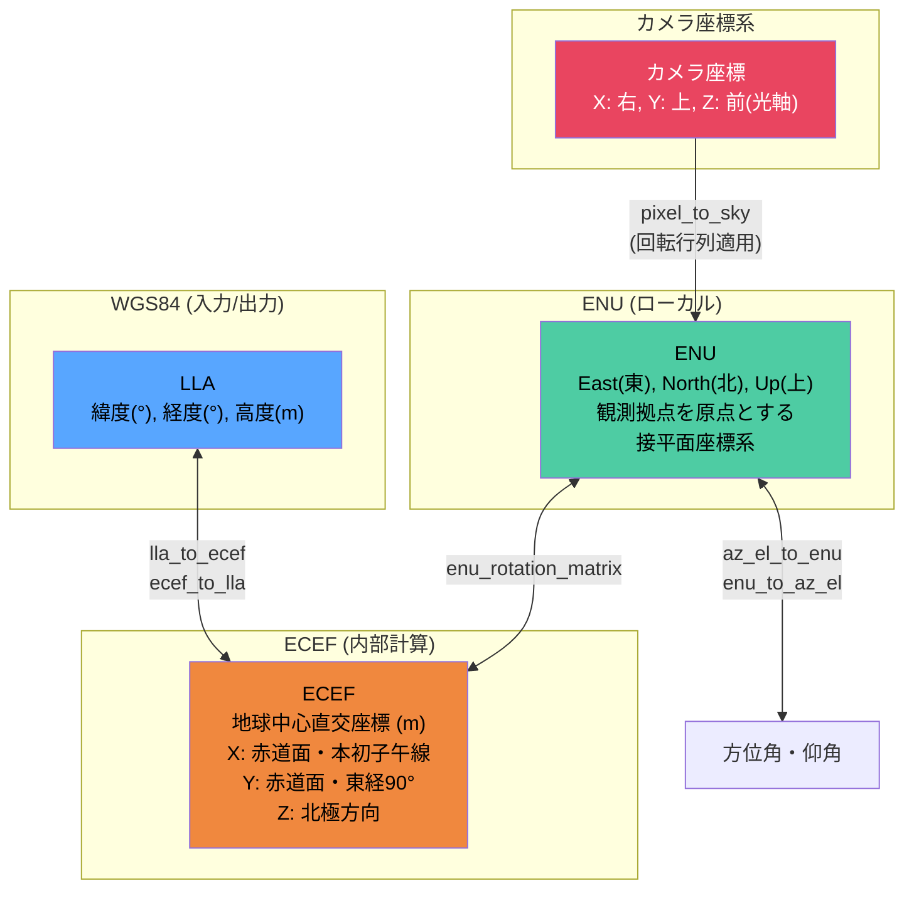

# 多地点流星三角測量システム

---

**Copyright (c) 2026 Masanori Sakai**

Licensed under the MIT License

---

## 概要

複数の観測拠点に配置した流星検出システムからの検出結果を統合し、同一流星を2拠点以上から同時観測した場合に三角測量を行い、流星の3D軌道（緯度・経度・高度）を算出するシステムです。

SonotaCo Network や Global Meteor Network (GMN) と同じ原理に基づいています。

## 全体アーキテクチャ



## ファイル構成



| ファイル | 役割 |
|---|---|
| `triangulation/__init__.py` | パッケージ初期化 |
| `triangulation/models.py` | StationConfig, CameraCalibration, DetectionReport, TriangulatedMeteor |
| `triangulation/geo_utils.py` | WGS84座標変換 (LLA↔ECEF, ENU↔ECEF, 方位仰角↔ENU) |
| `triangulation/pixel_to_sky.py` | ピクセル座標 → 方位角・仰角変換 |
| `triangulation/event_matcher.py` | 時間窓ベースのイベントマッチング |
| `triangulation/triangulator.py` | スキューライン最近接点法による3D位置決定 |
| `triangulation_server.py` | Flask中央サーバ (API + SQLite + 3D地図UI) |
| `triangulation_templates.py` | Deck.gl + MapLibre GL JS による3D地図 |
| `station_reporter.py` | 各拠点のサイドカー (JSONL監視 → 天球変換 → POST) |
| `demo_triangulation.py` | デモ用サーバ起動スクリプト（サンプルデータ投入） |
| `station.json.sample` | 拠点設定ファイルのサンプル |
| `Dockerfile.reporter` | station_reporter 用コンテナ |
| `Dockerfile.triangulation` | 三角測量サーバ用コンテナ |

## データフロー



## 核心アルゴリズム

### 1. ピクセル→天球座標変換 (pixel_to_sky.py)

カメラ画像上のピクセル座標を、天球上の方位角・仰角に変換します。



**ピンホールカメラモデル（直線射影）の処理手順:**

1. ピクセルを正規化: `nx = (px - W/2) / (W/2)`, `ny = (H/2 - py) / (H/2)`
2. FOVから焦点距離を算出: `fx = 1 / tan(FOV_h / 2)`
3. カメラ座標系で方向ベクトルを生成: `(nx/fx, ny/fy, 1)` → 正規化
4. ロール → カメラ→ENU変換 → 仰角回転 → 方位角回転を順に適用
5. 結果のENU方向ベクトルから `atan2` で方位角・仰角を算出

### 2. 三角測量 (triangulator.py)

2つの観測拠点からの観測線（方位角・仰角で定義される3D直線）の最近接点を求めます。



**スキューラインの最近接点（Closest Point of Approach）:**

2本の直線 `L1: P1 + t*d1` と `L2: P2 + s*d2` に対し:

```
w0 = P1 - P2
a = dot(d1, d1),  b = dot(d1, d2),  c = dot(d2, d2)
d = dot(d1, w0),  e = dot(d2, w0)
denom = a*c - b²

t = (b*e - c*d) / denom
s = (a*e - b*d) / denom

closest_1 = P1 + t*d1
closest_2 = P2 + s*d2
midpoint = (closest_1 + closest_2) / 2    ← 流星推定位置
miss_distance = |closest_1 - closest_2|   ← 精度指標
```

### 3. イベントマッチング (event_matcher.py)



**マッチング条件:**
1. **異なる拠点** からの検出であること
2. **時間差が±5秒以内** (NTP同期前提、流星持続0.1〜2秒)
3. **三角測量結果の高度が40〜200km** (典型的な流星の消滅高度範囲)

## 座標系



## 拠点設定ファイル (station.json)

各観測拠点に1つ配置する設定ファイル。`station.json.sample` を参考に作成してください。

```json
{
  "station_id": "fuji-north",
  "station_name": "富士北麓観測所",
  "latitude": 35.3606,
  "longitude": 138.7274,
  "altitude": 2400.0,
  "triangulation_server_url": "https://triangulation.example.com",
  "api_key": "your-secret-api-key-here",
  "cameras": {
    "camera1_10_0_1_25": {
      "azimuth": 90.0,
      "elevation": 45.0,
      "roll": 0.0,
      "fov_horizontal": 90.0,
      "fov_vertical": 60.0,
      "resolution": [960, 540]
    }
  }
}
```

| フィールド | 説明 |
|---|---|
| `station_id` | 拠点の一意な識別子 |
| `latitude`, `longitude` | WGS84緯度経度 (度) |
| `altitude` | WGS84楕円体高 (メートル) |
| `triangulation_server_url` | 三角測量サーバのURL |
| `api_key` | API認証キー |
| `cameras.{name}.azimuth` | カメラ光軸中心の方位角 (度, 0=北, 90=東) |
| `cameras.{name}.elevation` | カメラ光軸中心の仰角 (度, 0=水平, 90=天頂) |
| `cameras.{name}.roll` | 光軸周りの回転 (度, 通常0) |
| `cameras.{name}.fov_horizontal` | 水平視野角 (度) |
| `cameras.{name}.fov_vertical` | 垂直視野角 (度) |
| `cameras.{name}.resolution` | 検出処理時の解像度 [幅, 高さ] (SCALE適用後) |

## API仕様

### POST /api/detections

拠点からの検出レポートを受信する。

**リクエスト:**
```json
{
  "station_id": "fuji-north",
  "api_key": "your-secret-key",
  "detections": [
    {
      "camera_name": "camera1_10_0_1_25",
      "timestamp": "2026-02-10T00:11:08.844611+09:00",
      "start_az": 95.3,
      "start_el": 62.1,
      "end_az": 96.8,
      "end_el": 58.4,
      "duration": 0.483,
      "confidence": 0.65,
      "peak_brightness": 218.1,
      "detection_id": "det_649eeef920f7d2333025"
    }
  ]
}
```

**レスポンス:**
```json
{
  "status": "ok",
  "received": 1,
  "triangulated": 0
}
```

### GET /api/triangulated

三角測量結果を取得する。

**パラメータ:**
- `since` (任意): ISO8601日時。この日時以降の結果のみ返す
- `limit` (任意): 最大件数 (デフォルト100, 最大500)

### GET /api/stations

登録済み拠点の一覧を取得する。

### GET /api/stats

統計情報（総レポート数、三角測量数、拠点数）を取得する。

### GET /

3D地図UIを表示する。

## 3D地図UIの機能

Deck.gl + MapLibre GL JS による3Dインタラクティブ地図。

| 要素 | 説明 |
|---|---|
| 流星軌道ライン | 始点(緑)→終点(赤)の3Dライン。信頼度で色分け |
| 垂直ドロップライン | 地表から流星端点への灰色垂直線 (高度の視覚化) |
| 地表投影線 | 流星軌道を地表に投影した破線 (地上位置の確認) |
| 観測拠点マーカー | 各拠点の位置を赤いドットで表示 |
| 観測ライン | 拠点から流星への薄いピンク線 (どの拠点が観測したか) |
| FOV扇形 | 各カメラの視野範囲を扇形で表示 |
| ツールチップ | 流星にホバーで詳細情報 (時刻, 高度, 速度, 誤差, 信頼度) |

**操作:**
- ドラッグ: 地図移動
- Ctrl+ドラッグ: 3D傾斜
- 右ドラッグ: 回転
- 高度スケール スライダー: 高度の強調倍率 (1x〜100x)

## デプロイ構成

### 各観測拠点

既存の流星検出Docker環境に `station_reporter` サイドカーを追加する。

```bash
# station.json を作成した状態で
python generate_compose.py --station-config station.json
docker compose up -d
```

`generate_compose.py` は `station.json` が指定されている場合、自動的に `station-reporter` サービスを docker-compose.yml に追加します。

### 三角測量サーバ（中央）

```bash
# 全拠点の station.json を stations/ ディレクトリにまとめる
mkdir stations/
cp /path/to/fuji-north.json stations/
cp /path/to/hakone.json stations/

# サーバ起動
docker build -f Dockerfile.triangulation -t triangulation-server .
docker run -d -p 8090:8090 \
  -v ./stations:/app/stations \
  -v ./triangulation.db:/app/triangulation.db \
  triangulation-server
```

環境変数:
- `STATIONS_CONFIG`: 拠点設定ファイルのパスまたはディレクトリ (デフォルト: `stations/`)
- `DB_PATH`: SQLiteデータベースのパス (デフォルト: `triangulation.db`)
- `HOST`: バインドアドレス (デフォルト: `0.0.0.0`)
- `PORT`: ポート番号 (デフォルト: `8090`)

## 精度に関する考慮事項

### カメラキャリブレーション

三角測量精度の最大のボトルネックは**カメラの指向方位の精度**です。

| 方位精度 | 高度100kmでの位置誤差 |
|---|---|
| ±1° | 約±1.7 km |
| ±2° | 約±3.5 km |
| ±5° | 約±8.7 km |

コンパスと傾斜計による手動計測では2〜3°程度の精度になります。より高精度が必要な場合は、恒星の位置を使ったキャリブレーション（将来実装予定）を行ってください。

### 時刻同期

NTPによるシステム時刻同期が前提です。通常のLinux/Dockerサーバであればミリ秒精度のNTP同期が標準で行われます。流星の持続時間（0.1〜2秒）に対してマッチング時間窓（±5秒）は十分です。

### 拠点間距離

理想的な拠点間距離は **30〜200km** です。

- 近すぎる場合: 視差が小さく、三角測量の精度が低下（miss_distanceが大きくなる）
- 遠すぎる場合: 同一流星を両拠点で観測できる確率が低下

## テスト

```bash
# 三角測量関連の全テストを実行
python3 -m pytest tests/test_geo_utils.py tests/test_pixel_to_sky.py \
                   tests/test_triangulator.py tests/test_event_matcher.py -v

# デモサーバ起動（サンプルデータ付き）
python3 demo_triangulation.py
# → http://localhost:8090/ で3D地図を確認
```

テスト一覧 (40件):

| テストファイル | 件数 | 内容 |
|---|---|---|
| `tests/test_geo_utils.py` | 17 | LLA↔ECEF変換、方位仰角↔ENU変換、観測線計算 |
| `tests/test_pixel_to_sky.py` | 11 | ピクセル→天球変換の中心・端・対称性・ロール |
| `tests/test_triangulator.py` | 7 | 最近接点計算、既知位置の三角測量再現、高度範囲チェック |
| `tests/test_event_matcher.py` | 5 | 同一拠点排除、時間窓、マッチ成功、重複排除、プルーニング |
