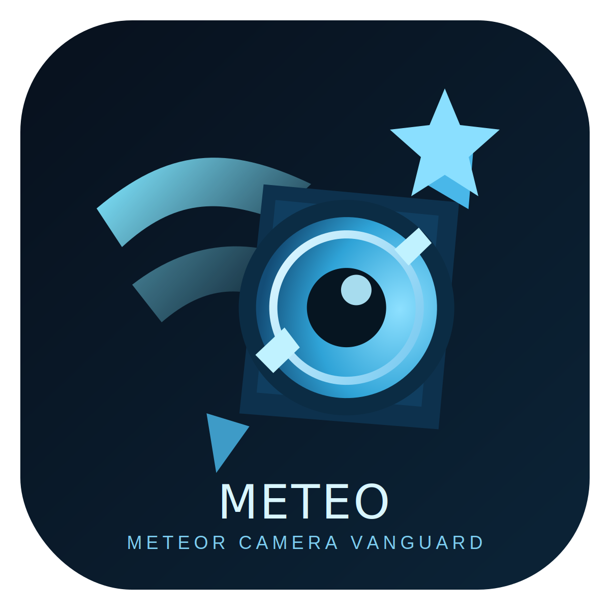
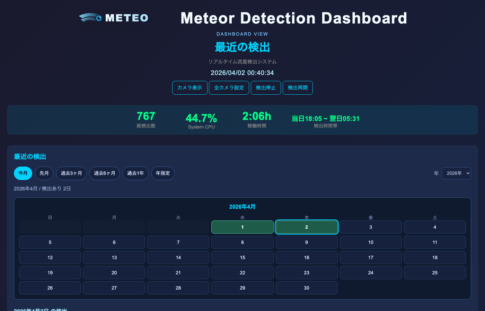
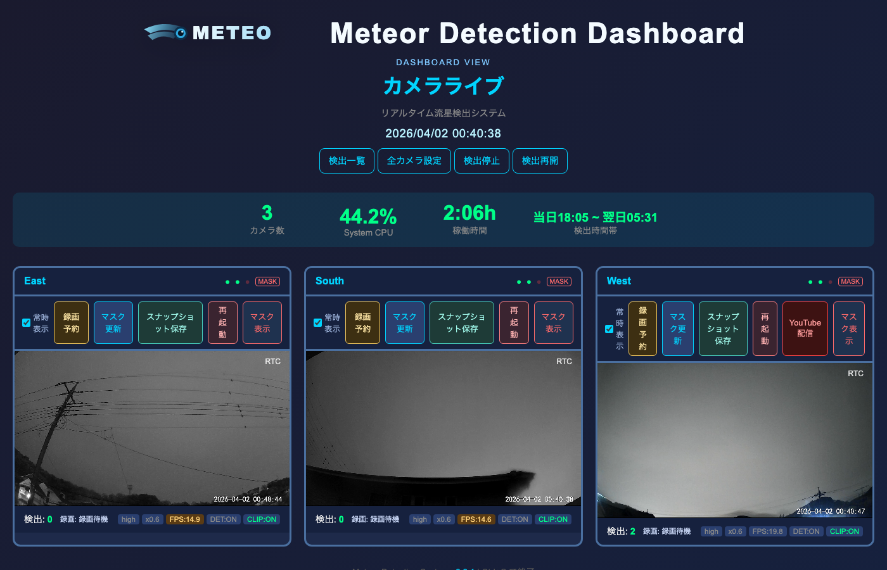
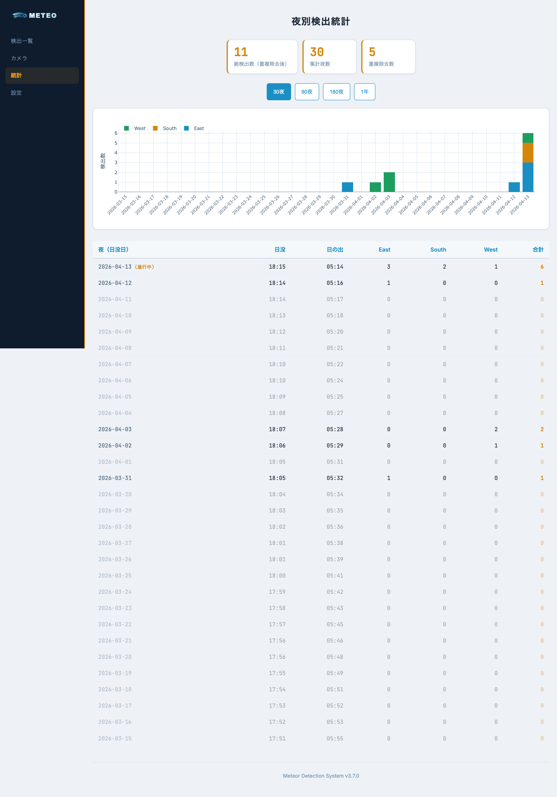
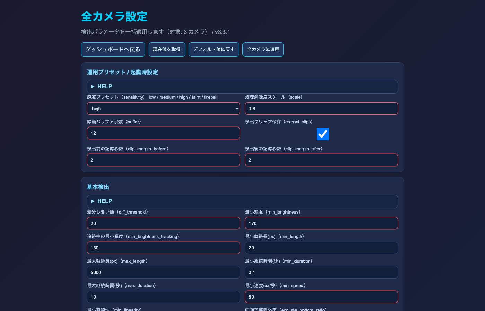

  
  

    
METEO DOCUMENTS

    
流星と空の観測を、リアルタイムで。

    
RTSPカメラを使った流星検出システムの導入、運用、内部構成をまとめた公式ドキュメントです。

  

# Meteo ドキュメントサイト

**バージョン: v3.9.0**

## サンプル画面

### 検出一覧画面

### カメラライブ画面

### 統計画面

### 設定画面

## まず読む

  

    <strong><a href="SETUP_GUIDE/">セットアップマニュアル</a></strong>
    初回構築と動作確認の手順。WebRTC ライブ表示と go2rtc 構成も含む。
  

  

    <strong><a href="CONFIGURATION_GUIDE/">設定ガイド</a></strong>
    検出精度と運用要件に合わせた設定（ダッシュボード `/settings` による一括設定を含む）。
  

  

    <strong><a href="OPERATIONS_GUIDE/">運用ガイド</a></strong>
    日常監視・保守・トラブル対応の流れ。
  

## 開発・運用向け

  

    <strong><a href="API_REFERENCE/">API リファレンス</a></strong>
    各エンドポイントとレスポンス仕様。
  

  

    <strong><a href="DETECTION_TUNING/">検出感度チューニング</a></strong>
    誤検出と見逃しを減らす調整ノウハウ。
  

  

    <strong><a href="SECURITY/">セキュリティガイド</a></strong>
    運用時に必要な保護と管理ルール。
  

## 内部設計

  

    <strong><a href="ARCHITECTURE/">アーキテクチャ</a></strong>
    システム全体の構成と責務分割。
  

  

    <strong><a href="DOCKER_ARCHITECTURE/">Docker 構成</a></strong>
    コンテナ構成とサービス連携。WebRTC 時の go2rtc と candidate 設定を含む。
  

  

    <strong><a href="DETECTOR_COMPONENTS/">検出コンポーネント</a></strong>
    検出処理の内部構成と役割。
  

  

    <strong><a href="ASTRO_UTILS/">天文計算モジュール</a></strong>
    日照・天体時刻計算の仕様。
  

